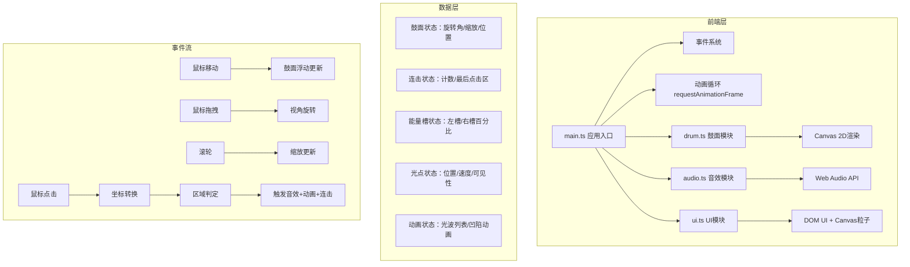

## 1. 架构设计



## 2. 技术栈说明

- **前端框架**：原生 TypeScript + Vite（无React/Vue，Canvas 2D渲染为主）
- **构建工具**：Vite 5.x
- **语言**：TypeScript 5.x（严格模式，ES模块）
- **渲染引擎**：HTML5 Canvas 2D API
- **音频引擎**：Web Audio API（原生合成，无第三方音频库）
- **开发服务器**：Vite 内置开发服务器（默认端口5173）

### 项目初始化
根据用户明确要求，使用以下指定文件结构，不使用Vite脚手架模板：

```
auto203/
├── package.json          # 依赖：typescript、vite
├── index.html            # 入口页面
├── vite.config.js        # 构建配置
├── tsconfig.json         # TypeScript配置
└── src/
    ├── main.ts           # 应用入口
    ├── drum.ts           # 鼓面类
    ├── audio.ts          # 音效模块
    └── ui.ts             # UI模块
```

## 3. 核心模块设计

### 3.1 Drum 类 (drum.ts)

```typescript
interface Sector {
  ring: number;      // 0-5 圆环索引
  index: number;     // 0-7 扇形索引
  color: string;     // 区域颜色
  angle: number;     // 起始角度
  angleRange: number;// 角度范围
  innerRadius: number;
  outerRadius: number;
}

class Drum {
  x: number;                    // 中心X
  y: number;                    // 中心Y  
  baseRadius: number;           // 基础半径
  rotation: number;             // 当前旋转角
  rotationSpeed: number;        // 旋转速度
  scale: number;                // 缩放比例
  floatOffset: { x: number; y: number }; // 浮动偏移
  sectors: Sector[];            // 48个扇形区域
  depressions: Map<number, { startTime: number; depth: number }>; // 凹陷动画
  lightWaves: LightWave[];      // 光波列表
  flashOverlays: FlashOverlay[]; // 闪白动画
  
  constructor(canvas: HTMLCanvasElement);
  update(dt: number, mouseX: number, mouseY: number): void;
  render(ctx: CanvasRenderingContext2D): void;
  handleClick(x: number, y: number): { sectorIndex: number; noteIndex: number } | null;
  getSectorAt(x: number, y: number): number;
  areSectorsAdjacent(idx1: number, idx2: number): boolean;
  addLightWave(sectorIndex: number, extraRadius: number): void;
  triggerShake(amplitude: number, frequency: number, duration: number): void;
}
```

### 3.2 AudioEngine 类 (audio.ts)

```typescript
class AudioEngine {
  audioContext: AudioContext | null;
  noteFrequencies: number[];    // 48个音高频率
  activeOscillators: Set<OscillatorNode>;
  
  constructor();
  init(): Promise<void>;       // 用户交互后初始化
  playNote(noteIndex: number): void;
  createNote(frequency: number, startTime: number, duration: number): void;
  stopAll(): void;
}

// 音高映射：C4(261.63Hz) 到 G6(1567.98Hz) 半音阶
// 48个区域 = 48个半音 = 4个八度
```

### 3.3 UIManager 类 (ui.ts)

```typescript
interface LightParticle {
  angle: number;       // 基础角度
  radius: number;      // 环绕半径
  size: number;        // 大小4-8px
  color: string;       // 颜色
  speed: number;       // 角速度
  offsetAngle: number; // 当前偏移角
  flying: boolean;     // 是否在飞冲
  flyProgress: number; // 飞冲进度0-1
  flyTarget: { x: number; y: number }; // 飞冲目标
}

interface EnergyBar {
  x: number;
  y: number;
  width: number;
  height: number;
  value: number;       // 0-100
  gradient: [string, string];
}

class UIManager {
  drum: Drum;
  particles: LightParticle[];     // 36颗光点
  leftEnergyBar: EnergyBar;
  rightEnergyBar: EnergyBar;
  combo: number;                  // 连击计数
  lastSectorIndex: number;        // 上一次点击区域
  fullscreenFlash: { active: boolean; startTime: number; duration: number };
  cameraRotation: number;         // 视角旋转Y轴
  targetScale: number;            // 目标缩放
  isDragging: boolean;
  dragStartX: number;
  
  constructor(drum: Drum, canvas: HTMLCanvasElement);
  update(dt: number): void;
  render(ctx: CanvasRenderingContext2D): void;
  handleDrumHit(sectorIndex: number, noteIndex: number): void;
  updateCombo(isAdjacent: boolean): void;
  triggerFullscreenFlash(): void;
  getNearbyParticles(sectorIndex: number, count: number): number[];
  flyParticlesToCenter(particleIndices: number[]): void;
  updateRightEnergyBar(amount: number): void;
  updateLeftEnergyBar(amount: number): void;
  handleDragStart(x: number): void;
  handleDragMove(x: number): void;
  handleDragEnd(): void;
  handleWheel(deltaY: number): void;
}
```

### 3.4 主入口 (main.ts)

```typescript
// 初始化流程
// 1. 创建Canvas并设置全屏
// 2. 初始化AudioEngine（等待用户交互）
// 3. 创建Drum实例
// 4. 创建UIManager实例
// 5. 绑定事件（click、mousemove、mousedown、mouseup、wheel）
// 6. 启动requestAnimationFrame循环
// 7. 每帧：update → render
```

## 4. 性能优化策略

1. **Canvas渲染优化**：
   - 离屏Canvas缓存静态鼓面图案
   - 仅更新变化区域，避免全量重绘
   - 使用requestAnimationFrame同步刷新率

2. **对象池管理**：
   - 光波、闪白等动画对象复用
   - 光点对象池避免频繁GC

3. **事件节流**：
   - mousemove事件节流（16ms）
   - wheel事件防抖

4. **音频管理**：
   - 限制同时播放的振荡器数量（最多8个）
   - 旧的振荡器自动淡出回收

## 5. 响应式适配

- 监听window.resize事件
- 动态计算鼓面半径：
  - 桌面：`max(viewportHeight * 0.45, 300px)`
  - 移动：`viewportWidth * 0.6`
- 能量槽位置根据视口宽度动态调整
