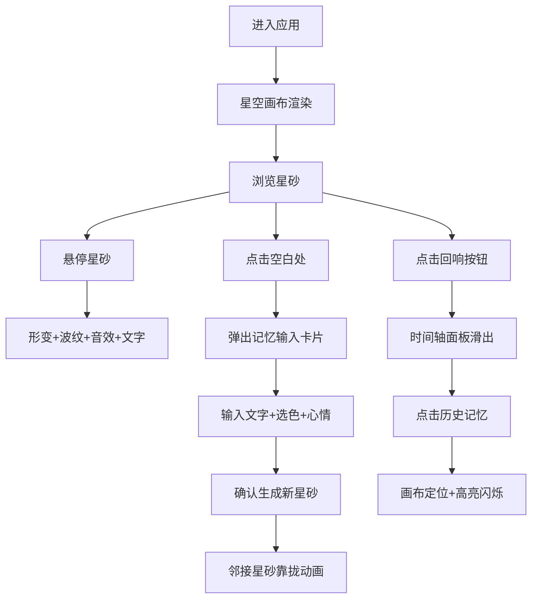

## 1. 产品概述

烬语·星砂编年史是一款沉浸式记忆创作Web应用，用户在深空调色的星空中创建和浏览承载个人记忆的星砂胶囊。每粒星砂保存用户的短句、色彩与心情，通过粒子动画、视听合成打造一个不断生长的虚拟记忆星图。

- 核心价值：将个人记忆可视化为流动的星空，让创作与回忆成为一场感官体验
- 目标用户：喜欢诗意化数字创作、追求沉浸式美学体验的用户群体

## 2. 核心功能

### 2.1 功能模块
1. **星砂画布**：深空背景下的数千粒动态星砂粒子，支持呼吸脉动、随机漂移、连线效果
2. **记忆创建**：点击空白处弹出输入卡片，录入文字、颜色、心情后生成新星砂
3. **星砂交互**：悬停变形、波纹扩散、音效合成、文字显现
4. **动态演化**：星砂随时间变化，每5分钟形成星座连线
5. **时间轴回响**：右侧抽屉面板按时间降序展示最近50条记忆，支持跳转高亮

### 2.2 页面详情
| 页面名称 | 模块名称 | 功能描述 |
|-----------|-------------|---------------------|
| 主画布 | 深空背景 | 垂直渐变 #0a0e27 → #1c1635，全屏覆盖 |
| 主画布 | 星砂粒子层 | 2000颗以内半透明发光圆形，呼吸脉动（1.05缩放），随机漂移（1-2px/s），偶发连线（透明度0.1，30-80px） |
| 主画布 | 记忆输入卡片 | 点击空白处弹出，包含500字文本框、12色选择器、1-10心情滑块 |
| 主画布 | 星砂悬停交互 | 圆→六边形形变（0.4s），5倍放大，显示文字，扩散波纹（60px，0.5→0透明度，1.2s），Web Audio音符 |
| 主画布 | 动态演化系统 | 颜色位置缓慢变更，每5分钟色差<15%星砂形成2秒星座 |
| 时间轴面板 | 回响按钮 | 右上角圆形按钮（#f72585，40px），悬停放大1.1倍+粉色光晕 |
| 时间轴面板 | 记忆列表 | 右侧滑出，320px宽，#0f0f1a背景，最近50条按时间降序，色点+20字摘要，点击跳转高亮闪烁3次 |

## 3. 核心流程

### 3.1 主用户流程
用户进入页面 → 深空星空加载完成 → 浏览星砂流动 → 悬停任意星砂触发视听反馈 → 点击空白处创建记忆 → 输入文字/选择颜色/调节心情 → 确认生成新星砂，邻接星砂被吸引 → 点击右上角"回响" → 时间轴展开 → 点击历史记忆 → 画布定位高亮对应星砂

## 4. 用户界面设计

### 4.1 设计风格
- **主色调**：深空色系 #0a0e27 → #1c1635 垂直渐变
- **强调色**：霓虹粉 #f72585、霓虹紫 #7209b7、钴蓝 #4361ee、电光青 #4cc9f0、深紫 #3a0ca3
- **色板**：#f72585 / #7209b7 / #3a0ca3 / #4361ee / #4cc9f0 + 12色虹色盘用于创建
- **按钮**：圆形，悬停放大1.1倍 + 发光光晕，cubic-bezier缓动
- **字体**：无衬线简洁字体，白色#ffffff，星砂内文字12px
- **动效**：所有交互 0.3-0.6s cubic-bezier 平滑过渡，禁止硬切换

### 4.2 页面设计概览
| 页面名称 | 模块名称 | UI元素 |
|-----------|-------------|-------------|
| 主画布 | 深空背景 | 全屏Canvas，垂直渐变，无噪点 |
| 主画布 | 星砂粒子 | 半透明发光圆形，直径3-8px随机，呼吸缩放 |
| 主画布 | 输入卡片 | #1a1a2e 半透明(0.9)，圆角12px，1px白色边框 |
| 主画布 | 文本输入框 | 淡蓝色#4361ee描边，focus发光 |
| 主画布 | 心情滑块 | 渐变色圆点滑块，1-10分 |
| 主画布 | 悬停星砂 | 六边形形变，5倍直径，波纹扩散，Web Audio合成音 |
| 时间轴面板 | 回响按钮 | 右上角圆形40px #f72585，悬停发光 |
| 时间轴面板 | 记忆列表 | 右侧320px抽屉，#0f0f1a背景，色点+摘要列表 |

### 4.3 响应式设计
- **桌面端优先**：完整2000颗星砂，悬停在星砂上显示文字
- **移动端 (<768px)**：星砂数量减半至1000颗，最小直径增大到5px，悬停文字改为底部固定浮层显示
- **触摸优化**：单击创建/悬停，长按触发悬停效果

## 4.4 性能指标
- 星砂总数 ≤ 2000
- 目标帧率 ≥ 50fps
- 使用 requestAnimationFrame 驱动动画
- Canvas 批处理绘制避免过度重绘
