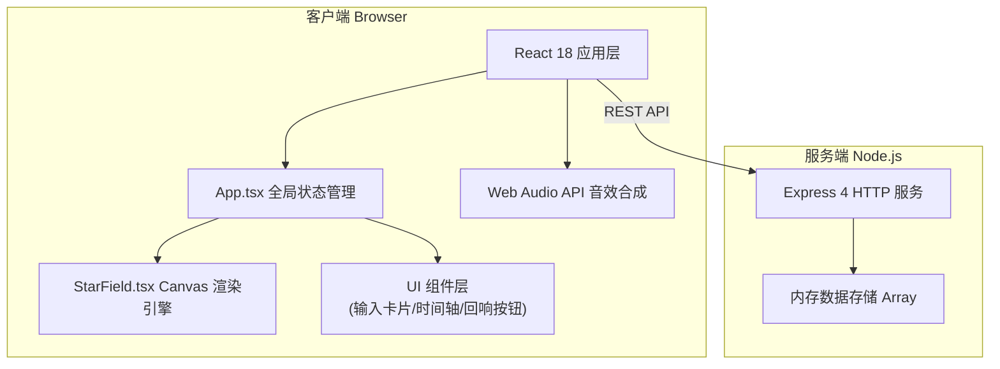
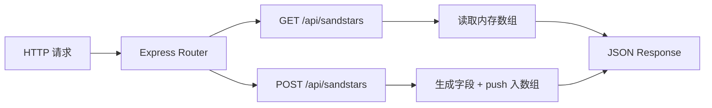
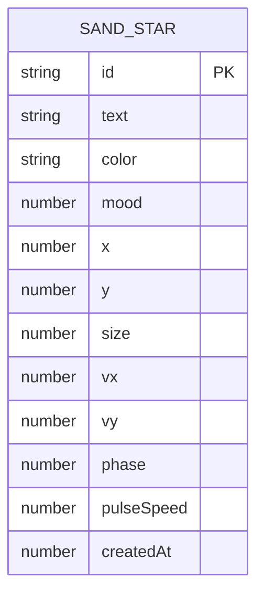

## 1. 架构设计



## 2. 技术选型说明

- **前端框架**：React@18 + TypeScript
- **构建工具**：Vite + vite-plugin-react
- **后端框架**：Express@4
- **渲染层**：HTML5 Canvas 2D（2000粒子高性能）
- **音频**：Web Audio API（纯前端音调合成，无需音频文件）
- **状态管理**：React useState/useReducer（轻量级，避免引入 zustand/redux）
- **数据存储**：内存数组（后端进程内，符合需求"内存存储"）
- **运行脚本**：tsx 执行后端 TypeScript，concurrently 同时启动前后端

## 3. 路由定义

| 路由 | 用途 |
|-------|-------|
| GET / | Vite 提供的前端入口 index.html |
| GET /api/sandstars | 获取所有星砂数据（JSON Array） |
| POST /api/sandstars | 创建新星砂（请求体：{text, color, mood, x, y}） |
| GET /api/sandstars?sort=recent | 获取最近50条记忆，按创建时间降序 |

## 4. API 定义

### 4.1 TypeScript 类型

```typescript
interface SandStar {
  id: string;
  text: string;
  color: string;
  mood: number; // 1-10
  x: number;
  y: number;
  createdAt: number;
  size: number;
  vx: number;
  vy: number;
  phase: number;
  pulseSpeed: number;
}

interface CreateStarRequest {
  text: string;
  color: string;
  mood: number;
  x: number;
  y: number;
}
```

### 4.2 接口详情

**GET /api/sandstars**
- 响应: `200 OK` → `SandStar[]`

**GET /api/sandstars?sort=recent**
- 响应: `200 OK` → `SandStar[]` (最多50条，按 createdAt DESC)

**POST /api/sandstars**
- 请求头: `Content-Type: application/json`
- 请求体: `CreateStarRequest`
- 响应: `201 Created` → `SandStar` (服务端补全 id/createdAt/size 等字段)

## 5. 服务端架构



后端采用极简内存存储架构：
- `server/index.ts` 单文件实现所有路由
- 星砂数据存储在模块级 `let sandStars: SandStar[] = []` 中
- 初始启动时生成约1500颗随机种子星砂
- 所有写入操作同步完成，无需异步/数据库

## 6. 数据模型

### 6.1 实体关系

本项目为单实体设计，无关系型数据。



### 6.2 字段说明
| 字段 | 类型 | 说明 |
|------|------|------|
| id | string | UUID v4，唯一标识 |
| text | string | 记忆短句，最大500字 |
| color | string | HEX颜色值，如 "#f72585" |
| mood | number | 心情指数，整数 1-10 |
| x, y | number | 画布坐标（0-1 比例值，适配响应式） |
| size | number | 基础直径像素 |
| vx, vy | number | 漂移速度 px/s |
| phase | number | 呼吸脉动相位 0-2π |
| pulseSpeed | number | 呼吸频率 rad/s |
| createdAt | number | 创建时间戳 ms |

## 7. 项目文件结构

```
auto205/
├── package.json
├── vite.config.js
├── tsconfig.json
├── index.html
├── server/
│   └── index.ts
└── src/
    ├── main.tsx
    ├── App.tsx
    ├── StarField.tsx
    └── utils.ts
```
