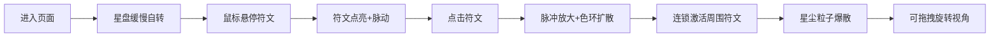

## 1. 产品概述
符语·星仪是一款3D交互式星盘遗迹可视化应用，为数字考古学家提供沉浸式的星盘遗迹体验。用户可以通过鼠标与悬浮的石制星盘互动，探索发光符文的奥秘。

- **核心目的**：在浏览器中虚拟重建被遗忘的星图遗迹，提供沉浸式的考古探索体验
- **目标用户**：数字考古学家、历史爱好者、3D交互艺术欣赏者
- **产品价值**：将古老的星盘遗迹以数字化形式保存和呈现，通过交互式体验让用户感受古代星图的神秘魅力

## 2. 核心功能

### 2.1 功能模块
1. **星盘主体**：悬浮的石制星盘，含风化石材纹理和铜锈色金属包边，支持缓慢自转
2. **发光符文系统**：40-50个随机分布的发光符文，支持悬停点亮和脉动动画
3. **点击共鸣连锁**：点击符文触发脉冲放大、色环扩散和连锁激活反应
4. **粒子系统**：环绕星盘的星尘粒子，点击时产生爆散效果
5. **相机控制**：OrbitControls支持鼠标拖拽旋转视角

### 2.2 页面详情
| 页面名称 | 模块名称 | 功能描述 |
|-----------|-------------|---------------------|
| 主页面 | 3D场景容器 | 全屏canvas渲染，深空渐变背景，无UI控件 |
| 主页面 | 星盘主体 | 石制圆盘纹理、金属包边、Y轴自转 |
| 主页面 | 符文系统 | 随机分布、悬停点亮、脉动发光、点击连锁 |
| 主页面 | 粒子系统 | 星尘环绕公转、点击爆散效果 |
| 主页面 | 交互控制 | 鼠标悬停十字光标、OrbitControls视角控制 |

## 3. 核心流程

用户进入页面后，星盘缓缓自转，符文保持暗沉状态。用户移动鼠标悬停于符文之上，符文逐渐点亮并产生脉动。点击已点亮的符文，触发脉冲放大和色环扩散，同时连锁激活周围符文，产生星尘爆散效果。用户可拖拽鼠标旋转视角，从不同角度观察星盘。

## 4. 用户界面设计

### 4.1 设计风格
- **主色调**：深空渐变 #040720 → #0a0e27
- **符文色彩**：青蓝 #00e5ff、紫色 #a64dff、红色 #ff6b6b、黄色 #ffcc00
- **星盘材质**：风化石材 #4a3b32 到 #2d231c，铜锈包边 #7a5c3a
- **交互风格**：鼠标悬停为十字准星光标（crosshair）
- **字体**：无UI文字，纯视觉体验

### 4.2 页面设计概述
| 页面名称 | 模块名称 | UI元素 |
|-----------|-------------|-------------|
| 主页面 | 背景 | 深空垂直渐变，营造被遗忘星空氛围 |
| 主页面 | 星盘 | 悬浮居中，石材质感，金属包边，缓慢自转 |
| 主页面 | 符文 | 随机分布的发光曲线，四色随机，悬停点亮脉动 |
| 主页面 | 粒子 | 白色星尘环绕公转，点击时彩色爆散 |
| 主页面 | 光照 | 下方微弱蓝色聚光灯，营造考古探照灯效果 |

### 4.3 响应式设计
- **桌面端**：星盘直径为视口高度的45%（最小320px）
- **移动端**（<768px）：星盘直径缩小至视口宽度的60%
- **交互优化**：移动端支持触摸悬停和点击

### 4.4 3D场景设计
- **环境**：深空渐变背景，无HDRI，营造神秘幽暗氛围
- **光照设置**：环境光 + 底部蓝色聚光灯（强度0.3，距离5单位）
- **相机设置**：初始位置星盘正前方偏上20度，距离3单位，OrbitControls阻尼0.05
- **核心元素**：星盘主体为视觉焦点，符文为交互核心，粒子增强氛围感
- **交互动画**：符文点亮过渡0.6s，脉冲周期1.5s，连锁延迟0.3s，色环扩散1.2s
- **后处理**：无额外后处理，依靠材质自发光实现效果
- **性能预算**：60Hz显示器维持≥50FPS，帧率<45FPS时粒子降至120颗
