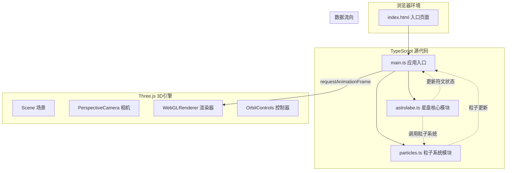

## 1. 架构设计



## 2. 技术描述
- **前端框架**：原生 TypeScript + Three.js 0.160
- **构建工具**：Vite 5.x
- **动画库**：GSAP 3.x
- **类型支持**：@types/three
- **初始化方式**：Vite vanilla-ts 模板

## 3. 模块调用关系

### 3.1 文件结构
```
├── index.html           # 入口HTML，深空背景色，引入main.ts
├── package.json         # 依赖配置：three, @types/three, typescript, vite, gsap
├── vite.config.js       # Vite构建配置
├── tsconfig.json        # TypeScript配置（严格模式）
└── src/
    ├── main.ts          # 应用入口：初始化场景→导入星盘→动画循环
    ├── astrolabe.ts     # 星盘模块：创建Mesh→处理交互→回调动画
    └── particles.ts     # 粒子模块：创建星尘→响应激活→更新位置
```

### 3.2 数据流向
1. **main.ts → astrolabe.ts**：传入scene、camera、renderer，创建星盘实例
2. **main.ts → particles.ts**：传入scene，创建粒子系统实例
3. **astrolabe.ts → particles.ts**：符文激活时调用`triggerBurst(position, color, intensity)`
4. **astrolabe.ts → 回调**：符文状态变化时触发`onRuneStateChange(rune, state)`
5. **main.ts 动画循环**：每帧调用 `astrolabe.update(deltaTime)` 和 `particles.update(deltaTime)`

## 4. 接口定义

### 4.1 Astrolabe 星盘类
```typescript
interface RuneData {
  id: number;
  position: THREE.Vector2;
  rotation: number;
  color: string;
  curves: THREE.CatmullRomCurve3[];
  mesh: THREE.Group;
  material: THREE.MeshBasicMaterial;
  state: 'idle' | 'hover' | 'active' | 'chain';
  brightness: number;
  pulsePhase: number;
}

interface AstrolabeOptions {
  scene: THREE.Scene;
  camera: THREE.Camera;
  renderer: THREE.WebGLRenderer;
  diameter: number;
  onRuneActivate?: (rune: RuneData) => void;
}

class Astrolabe {
  constructor(options: AstrolabeOptions);
  update(deltaTime: number): void;
  onRaycast(intersects: THREE.Intersection[]): void;
  onClick(intersects: THREE.Intersection[]): void;
  dispose(): void;
}
```

### 4.2 ParticleSystem 粒子系统类
```typescript
interface OrbitParticle {
  mesh: THREE.Mesh;
  radius: number;
  speed: number;
  angle: number;
  inclination: number;
  baseOpacity: number;
}

interface BurstParticle {
  mesh: THREE.Mesh;
  velocity: THREE.Vector3;
  life: number;
  maxLife: number;
  initialScale: number;
}

interface ParticleSystemOptions {
  scene: THREE.Scene;
  orbitCount?: number;
  astrolabeCenter: THREE.Vector3;
}

class ParticleSystem {
  constructor(options: ParticleSystemOptions);
  update(deltaTime: number): void;
  triggerBurst(position: THREE.Vector3, color: string, intensity: number): void;
  adjustParticleCount(targetCount: number): void;
  dispose(): void;
}
```

## 5. 核心常量配置

```typescript
// 星盘配置
const ASTROLABE_CONFIG = {
  DIAMETER_RATIO_DESKTOP: 0.45,
  DIAMETER_RATIO_MOBILE: 0.6,
  MIN_DIAMETER: 320,
  THICKNESS_RATIO: 0.08,
  ROTATION_SPEED: 0.01,
  EDGE_THICKNESS: 4,
  STONE_COLOR_FROM: 0x4a3b32,
  STONE_COLOR_TO: 0x2d231c,
  EDGE_COLOR: 0x7a5c3a,
};

// 符文配置
const RUNE_CONFIG = {
  MIN_COUNT: 40,
  MAX_COUNT: 50,
  CURVES_PER_RUNE: [2, 3],
  COLORS: [0x00e5ff, 0xa64dff, 0xff6b6b, 0xffcc00],
  IDLE_COLOR: 0x8a8a8a,
  IDLE_OPACITY: 0.3,
  ACTIVE_OPACITY: 1.0,
  HOVER_TRANSITION: 0.6,
  PULSE_PERIOD: 1.5,
  PULSE_MIN: 0.8,
  PULSE_MAX: 1.2,
  PULSE_SCALE: 1.5,
  CHAIN_DISTANCE: 80,
  CHAIN_DELAY: 0.3,
  CHAIN_MIN_COUNT: 3,
  CHAIN_MAX_COUNT: 5,
  RING_WIDTH: 6,
  RING_MAX_RADIUS: 150,
  RING_DURATION: 1.2,
};

// 粒子配置
const PARTICLE_CONFIG = {
  ORBIT_COUNT: 200,
  ORBIT_COUNT_LOW: 120,
  ORBIT_RADIUS_MIN: 150,
  ORBIT_RADIUS_MAX: 300,
  ORBIT_PERIOD_MIN: 8,
  ORBIT_PERIOD_MAX: 15,
  ORBIT_SIZE_MIN: 2,
  ORBIT_SIZE_MAX: 4,
  ORBIT_OPACITY_MIN: 0.2,
  ORBIT_OPACITY_MAX: 0.6,
  BURST_COUNT: 50,
  BURST_SPEED_MIN: 50,
  BURST_SPEED_MAX: 120,
  BURST_LIFE: 1.5,
  LOW_FPS_THRESHOLD: 45,
};

// 相机配置
const CAMERA_CONFIG = {
  INITIAL_DISTANCE: 3,
  INITIAL_ANGLE_X: 20,
  DAMPING: 0.05,
};

// 光照配置
const LIGHT_CONFIG = {
  SPOTLIGHT_COLOR: 0x4466ff,
  SPOTLIGHT_INTENSITY: 0.3,
  SPOTLIGHT_DISTANCE: 5,
};
```

## 6. 性能优化策略

### 6.1 FPS监控
- 使用`performance.now()`计算每帧耗时
- 连续3帧低于45FPS时触发粒子数量降级
- 恢复至50FPS以上并保持1秒后恢复粒子数量

### 6.2 渲染优化
- 复用Geometry和Material实例
- 符文使用`THREE.Line`而非`THREE.Mesh`减少面数
- 粒子使用`THREE.Points`（备选方案，根据性能需求切换）
- 禁用不必要的阴影计算

### 6.3 动画优化
- 所有动画使用`requestAnimationFrame`驱动
- 使用GSAP处理复杂的缓动动画
- 避免在动画循环中创建新对象
- 暂停不可见元素的动画更新
