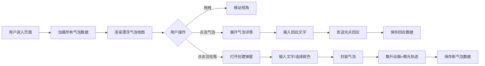

## 1. 产品概述

"絮语·风痕邮局"是一款在虚拟世界中存留转瞬即逝温暖片段的全栈 Web 应用。用户将语音转文字或键盘输入的絮语封装成发光气泡，漂浮在手绘地图风格的虚空中，其他用户可点击拆阅并留下光点回应。

- **目标用户**：追求情感表达、喜欢温暖治愈风格数字产品的年轻用户群体
- **产品价值**：在冷冰冰的社交消息之外，提供一个带有呼吸感和温度的虚拟记忆空间

## 2. 核心功能

### 2.1 用户角色

| 角色 | 注册方式 | 核心权限 |
|------|----------|----------|
| 普通用户 | 无需注册，直接使用 | 浏览气泡、拆阅详情、发布絮语、留下回应光点 |

### 2.2 功能模块

1. **气泡地图主页**：羊皮纸背景、漂浮气泡、拖拽视角、悬停高亮、点击展开
2. **气泡详情卡片**：完整文字展示、回应光点列表、输入框发送回应
3. **创建气泡弹窗**：文字输入、麦克风模拟按钮、颜色选择、封装动画

### 2.3 页面详情

| 页面名称 | 模块名称 | 功能描述 |
|----------|----------|----------|
| 气泡地图主页 | 羊皮纸背景 | 垂直渐变 #f4e4c1→#dac292，1px 半透明网格线 |
| 气泡地图主页 | 漂浮气泡 | 直径 30-80px，5 种预设颜色，呼吸式上下浮动，缩略模糊文字 |
| 气泡地图主页 | 气泡交互 | 点击膨胀至 180px、文字渐显、涟漪光晕、悬停描边高亮 |
| 气泡地图主页 | 点击计数/时间戳 | 气泡底部极小字体显示（10px，#8e7f6e） |
| 气泡详情卡片 | 完整文字 | 透明度渐变显示 |
| 气泡详情卡片 | 回应输入 | 圆角 12px 输入框，最多 50 字 |
| 气泡详情卡片 | 光点回应 | 6px 彩色光点从输入处飞向气泡壁，脉动 3 次后浮动 |
| 创建气泡弹窗 | 文字输入 | 文本域 + 麦克风模拟按钮 |
| 创建气泡弹窗 | 颜色选择 | 6 个预设色块（24px 圆形） |
| 创建气泡弹窗 | 封装动画 | 气泡从卡片飘升并带微光轨迹 |

## 3. 核心流程

### 3.1 浏览与拆阅气泡
用户进入页面 → 加载所有气泡数据并渲染漂浮 → 鼠标拖拽移动视角 → 悬停气泡显示高亮描边 → 点击气泡 → 气泡膨胀、文字渐显、涟漪光晕 → 展示详情卡片与回应输入框

### 3.2 回应气泡
用户在详情卡片输入回应文字（≤50字） → 点击发送 → 彩色光点从输入处飞向气泡壁 → 光点脉动 3 次 → 光点加入气泡周围浮动列表 → 后端保存回应数据

### 3.3 创建新气泡
用户点击右上角羽毛笔按钮 → 中央弹出创建卡片 → 输入文字（或点击麦克风模拟按钮） → 选择气泡颜色 → 点击封装 → 气泡从卡片位置飘升至随机位置并带微光轨迹 → 后端保存新气泡数据

## 4. 用户界面设计

### 4.1 设计风格

- **主色调**：泛黄羊皮纸米色渐变（#f4e4c1 → #dac292）
- **气泡色板**：#ff6b6b（珊瑚红）、#ffd93d（琥珀黄）、#6bcb77（薄荷绿）、#4d96ff（天空蓝）、#9b59b6（梦幻紫）
- **点缀色**：羽毛笔按钮深色（#3d405b → #2d2e3e）、高亮描边金色（#f1c40f）
- **字体**：衬线字体营造手写复古感，标题用宋体/楷体风格
- **按钮风格**：圆形羽毛笔悬浮按钮、胶囊形色块选择按钮
- **布局风格**：全屏沉浸式画布，气泡自由分布，弹窗居中浮动
- **图标风格**：手绘风格 SVG 图标（羽毛笔、麦克风等）

### 4.2 页面设计概览

| 页面名称 | 模块名称 | UI 元素 |
|----------|----------|---------|
| 气泡地图主页 | 背景层 | 垂直渐变 + 1px 网格线、全屏铺满 |
| 气泡地图主页 | 气泡层 | 随机大小/颜色/位置、blur 缩略文字、呼吸浮动动画、悬停描边、点击涟漪 |
| 气泡地图主页 | 悬浮按钮 | 右上角 50px 圆形羽毛笔、深色渐变、悬停白色光晕 |
| 气泡详情卡片 | 文字区 | 180px 气泡内清晰文字、底部计数/时间戳 |
| 气泡详情卡片 | 输入区 | 圆角 12px 半透明白输入框、棕色边框 |
| 创建气泡弹窗 | 中央卡片 | 320×300px、圆角 16px、半透明白暖色背景 |
| 创建气泡弹窗 | 交互区 | 文本域、麦克风图标按钮、6 个圆形色块、封装按钮 |

### 4.3 响应式适配

- **设计原则**：桌面优先，移动端自适应
- **屏幕 < 768px**：
  - 气泡整体缩小 20%
  - 羽毛笔悬浮按钮移至左上角
  - 创建气泡卡片尺寸调整为触控友好（宽度自适应屏幕 90%）
  - 输入框增大内边距便于触控

### 4.4 动效设计

- **气泡呼吸浮动**：translateY 幅度 5-15px，周期 2-4s，缓动函数 ease-in-out
- **点击展开**：气泡直径从原值过渡到 180px，0.6s ease-out；文字透明度 0.1→1.0，0.8s
- **涟漪光晕**：box-shadow 半径 120px→200px，透明度渐消，1.5s
- **光点飞行**：从点击位置贝塞尔曲线飞向气泡壁，0.5s；到达后 scale 脉动 3 次
- **气泡飘升**：从卡片位置 translateY 到目标位置，带 opacity 渐显 + 微光轨迹，1s
