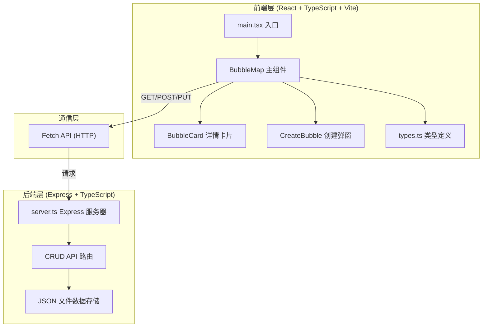
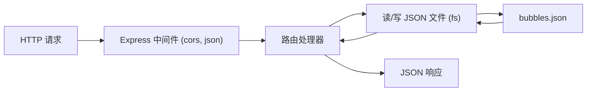
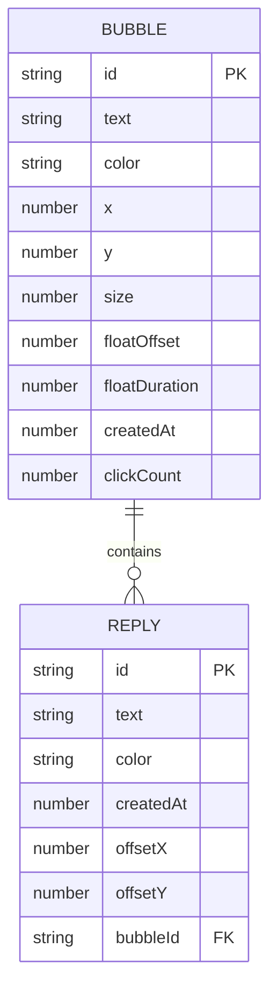

## 1. 架构设计



## 2. 技术选型说明

- **前端框架**：React 18 + TypeScript，严格模式
- **构建工具**：Vite 5.x，使用 @vitejs/plugin-react
- **后端框架**：Express 4.x + TypeScript（使用 tsx 运行）
- **数据存储**：JSON 文件（data/bubbles.json），简单 CRUD 持久化
- **通信方式**：前端通过 Fetch API 调用后端 REST 接口
- **状态管理**：React useState/useEffect 管理本地状态，无需额外状态库

## 3. 目录结构

```
auto209/
├── index.html              # Vite 入口 HTML
├── package.json            # 依赖与脚本
├── vite.config.js          # Vite 构建配置
├── tsconfig.json           # TypeScript 严格模式配置
├── server/
│   └── server.ts           # Express 后端服务器
├── data/
│   └── bubbles.json        # JSON 数据存储（运行时创建）
└── src/
    ├── main.tsx            # React 应用入口
    ├── types.ts            # Bubble / Reply 类型定义
    └── components/
        ├── BubbleMap.tsx   # 主组件：气泡地图、拖拽、交互
        ├── BubbleCard.tsx  # 详情卡片：文字、回应列表、输入框
        └── CreateBubble.tsx# 创建弹窗：输入、颜色、封装动画
```

## 4. API 接口定义

| 方法 | 路径 | 说明 | 请求体 | 响应 |
|------|------|------|--------|------|
| GET | /api/bubbles | 获取所有气泡列表 | 无 | Bubble[] |
| POST | /api/bubbles | 创建新气泡 | { text, color, x, y } | Bubble |
| PUT | /api/bubbles/:id/replies | 为气泡添加回应 | { text, color } | Bubble（更新后） |

### 4.1 类型定义

```typescript
interface Reply {
  id: string;
  text: string;
  color: string;
  createdAt: number;
  offsetX: number;
  offsetY: number;
}

interface Bubble {
  id: string;
  text: string;
  color: string;
  x: number;
  y: number;
  size: number;
  floatOffset: number;
  floatDuration: number;
  createdAt: number;
  clickCount: number;
  replies: Reply[];
}
```

## 5. 服务端架构



- **入口文件**：server/server.ts，监听端口 3001
- **中间件**：cors 跨域、express.json 解析 body
- **数据层**：使用 Node.js fs 模块同步读写 JSON 文件
- **ID 生成**：使用 uuid 库生成唯一 ID

## 6. 数据模型

### 6.1 实体关系



### 6.2 初始数据

首次启动时，自动在 data/bubbles.json 中生成 15-20 条示例气泡数据，覆盖不同颜色、位置、大小和浮动参数，以便用户首次进入即可看到丰富效果。
