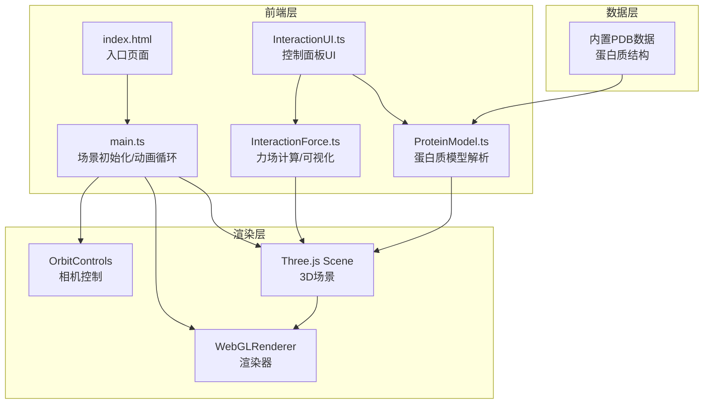

## 1. 架构设计



## 2. 技术说明

- 前端：Three.js@0.160.0 + TypeScript + Vite
- 初始化工具：Vite
- 后端：无（纯前端项目）
- 数据库：无（内置PDB格式数据）
- 颜色计算：d3-color（用于渐变和颜色空间转换）

### 2.1 依赖列表

| 依赖 | 版本 | 用途 |
|------|------|------|
| three | 0.160.0 | 3D渲染引擎 |
| @types/three | latest | Three.js类型定义 |
| d3-color | latest | 颜色空间转换和渐变计算 |
| typescript | latest | 类型安全 |
| vite | latest | 构建工具和开发服务器 |

## 3. 文件结构与调用关系

```
├── package.json          # 依赖和脚本配置
├── vite.config.js        # Vite构建配置
├── tsconfig.json         # TypeScript严格模式配置
├── index.html            # 入口HTML，全屏Canvas容器
└── src/
    ├── main.ts           # 场景初始化，模块管理，动画循环
    ├── ProteinModel.ts   # PDB解析，主链/侧链模型生成
    ├── InteractionForce.ts # 氢键/疏水作用计算和可视化
    └── InteractionUI.ts  # 右侧控制面板，交互事件
```

### 数据流向

```
PDB数据 → ProteinModel.ts → Three.js Group（主链+侧链）
ProteinModel.ts → InteractionForce.ts → 辅助线/球体（氢键+疏水）
InteractionUI.ts → ProteinModel.ts（模式切换）
InteractionUI.ts → InteractionForce.ts（力场开关）
InteractionUI.ts → main.ts（残基聚焦→相机动画）
main.ts → 事件分发 → ProteinModel / InteractionForce / 相机
```

## 4. 核心模块设计

### 4.1 ProteinModel.ts

- 输入：PDB格式字符串
- 输出：Three.js Group（包含主链管状线条 + 侧链球体）
- 主链：沿Cα原子轨迹的CatmullRomCurve3，生成TubeGeometry，颜色蓝→红渐变
- 侧链：每个残基一个球体（SphereGeometry），20种氨基酸类型各一种颜色
- 显示模式：线条模式（LineSegments）、球棍模式（球+柱）、填充模式（CPK球体）
- 双击交互：Raycaster检测残基球体，高亮闪烁+放大1.2倍

### 4.2 InteractionForce.ts

- 输入：蛋白质模型（残基坐标列表）
- 氢键计算：基于供体-受体距离（<3.5Å）和角度阈值（>120°）简化计算
- 氢键可视化：LineDashedMaterial青色虚线 + 两端小球
- 疏水作用计算：疏水残基（ALA/VAL/LEU/ILE/PHE/TRP/PRO/MET）间距离<7Å
- 疏水可视化：半透明淡黄色球壳 + 缓慢脉动缩放动画
- 箭头指示：ArrowHelper指向作用方向

### 4.3 InteractionUI.ts

- 右侧浮动面板，280px宽
- 模式切换按钮：线条/球棍/填充，当前模式光晕动画
- 残基下拉菜单：列出所有残基（如ALA1、GLY2），选中后相机缓动聚焦
- 力场开关：氢键/疏水作用分别开关
- 毛玻璃效果：backdrop-filter: blur(12px)

### 4.4 main.ts

- 场景初始化：Scene、PerspectiveCamera、WebGLRenderer
- 模块加载：创建ProteinModel、InteractionForce、InteractionUI实例
- 动画循环：requestAnimationFrame，更新渲染和脉动动画
- 事件处理：鼠标/触摸事件分发，双击残基检测
- 相机动画：残基聚焦时缓动动画0.8秒

## 5. 性能约束

- 几何体上限：2000个
- 帧率目标：≥50FPS
- 交互响应延迟：≤100ms
- 使用BufferGeometry和InstancedMesh优化渲染
- 力场可视化按需显示，关闭时不参与渲染
