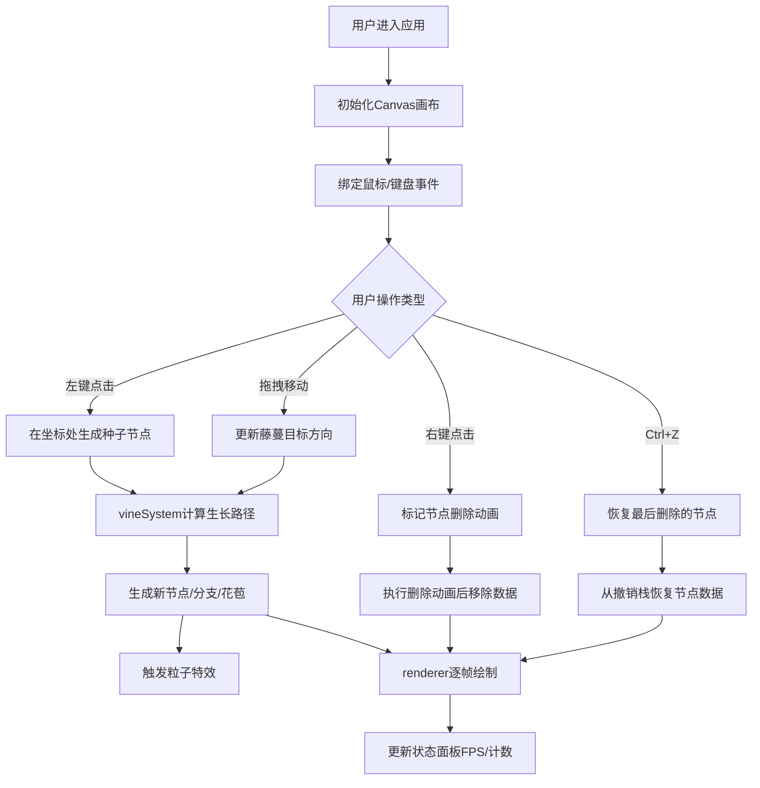

## 1. 产品概述

"蔓光·幽谷"是一款面向数字植物学家和创意爱好者的浏览器端交互式藤蔓生长模拟应用。用户可以通过点击、拖拽等简单交互在画布上种植会发光、会生长的虚拟藤蔓，藤蔓会跟随鼠标路径自然攀爬，绽放出彩色花朵，形成独特的发光植物雕塑艺术作品。

- 目标用户：数字艺术家、创意爱好者、植物学爱好者、教育场景用户
- 核心价值：提供低门槛的创意表达工具，通过实时物理模拟和绚丽视觉效果，让用户体验虚拟园艺的乐趣和创作成就感

## 2. 核心特性

### 2.1 用户角色

| 角色 | 注册方式 | 核心权限 |
|------|----------|----------|
| 普通用户 | 无需注册，直接访问 | 种植藤蔓、引导生长、删除节点、撤销操作、查看实时状态 |

### 2.2 功能模块

1. **主画布区域**：藤蔓种植与生长的核心交互区，深色渐变背景带光晕边界
2. **藤蔓生长系统**：种子萌发、节点生长、分支生成、花朵绽放与凋谢的完整生命周期管理
3. **Canvas渲染引擎**：逐帧绘制藤蔓线条、叶片、花朵、发光效果和粒子动画
4. **实时状态面板**：显示藤蔓数量、节点总数、FPS帧率等性能指标
5. **操作交互系统**：点击种植、拖拽引导方向、右键删除、Ctrl+Z撤销
6. **粒子特效系统**：新节点生成时的彩色飘散粒子效果

### 2.3 页面详情

| 页面名称 | 模块名称 | 功能描述 |
|----------|----------|----------|
| 主页面 | 画布容器 | 深色渐变背景（#1a1a2e→#14142b→#0f0f23），尺寸占视口90%宽、85%高，最小800x600px，外围1px亮蓝色光晕边界 |
| 主页面 | 种子节点 | 点击生成直径12px淡蓝色(#a0d8ff)发光种子，脉动缩放1.0-1.15，周期1.5秒，1秒后开始生长 |
| 主页面 | 藤蔓生长 | 节点间距40-60px随机，连接线3px宽渐变线（#a0d8ff→#66ff99），生长速度20px/秒，拖尾光效（透明度0.3，长20px），拖拽弯曲角度±30度/秒 |
| 主页面 | 分支系统 | 藤蔓达150px时30%概率分支，初始45度夹角，分支持续生长 |
| 主页面 | 花朵系统 | 分支节点15%概率生成淡粉色(#ff99cc)花苞（脉动周期1.2秒），2秒后绽放为5瓣花（每瓣6x12px，#ff6699→#ffcc00渐变，金色描边），存在10秒后3秒凋谢 |
| 主页面 | 容量控制 | 最多5棵藤蔓，每棵不超过30节点，超量时最早藤蔓枯萎（褐色#8b7355，缩至50%后消失） |
| 主页面 | 删除与撤销 | 右键删除节点及后续分支（闪烁3次+缩小消失，0.8秒），Ctrl+Z撤销最后删除（逆序动画恢复） |
| 主页面 | 状态面板 | 右下角显示藤蔓数量/最大、活跃节点/最大、FPS（每秒刷新），半透明深色背景(#0d0d2e,0.75)，圆角8px，灰白字体(#cccccc,14px) |
| 主页面 | 粒子系统 | 新节点生成6-8个彩色粒子（2-4px，颜色随机：#a0d8ff/#66ff99/#ffcc00/#ff6699），速度30-60px/秒，0.5秒消散，最多50个 |
| 主页面 | 操作提示栏 | 底部固定50px高，背景#1a1a2e透明度0.85，字体#bbbbbb 13px，居中提示文字，与画布间2px间隔线(#333355) |

## 3. 核心流程

用户打开应用→进入深色渐变画布界面→
- 点击空白处：生成发光种子→种子萌发→藤蔓按鼠标位置生长→随机分支→节点生成粒子→可能开花→花朵凋谢
- 拖拽鼠标：藤蔓弯曲跟随鼠标路径→形成蛇形攀爬曲线
- 右键点击节点：节点闪烁→缩小消失→分支同步渐隐
- 按Ctrl+Z：撤销最后删除→节点逆序恢复
- 实时观察右下角：藤蔓数量、节点数、FPS变化

## 4. 用户界面设计

### 4.1 设计风格

- **整体风格**：深色梦幻、神秘幽谷、发光生物、自然有机
- **主色调**：深蓝紫渐变背景（#1a1a2e / #14142b / #0f0f23）
- **强调色**：
  - 种子/根部：淡蓝发光 #a0d8ff
  - 藤蔓主体/叶片：亮绿 #66ff99
  - 花苞：淡粉 #ff99cc
  - 花心：金色 #ffcc00
  - 花瓣尖：玫红 #ff6699
  - 枯萎色：褐色 #8b7355
  - 边界光晕：亮蓝 #4488ff
- **发光效果**：所有元素使用Canvas shadowBlur=12px实现发光光晕
- **动画风格**：GSAP easeOutCubic缓动，流畅自然过渡
- **字体**：无衬线系统字体，灰白配色，简洁不干扰视觉

### 4.2 页面设计概览

| 页面名称 | 模块名称 | UI元素 |
|----------|----------|--------|
| 主页面 | 画布背景 | 垂直三色渐变，顶部#1a1a2e→中间#14142b→底部#0f0f23，外围16px处1px半透明蓝光晕边界(#4488ff,0.3) |
| 主页面 | 种子节点 | 圆形12px，填充#a0d8ff，shadowBlur=12同色发光，GSAP脉动缩放1.0↔1.15（周期1.5s） |
| 主页面 | 藤蔓连接线 | 3px宽线性渐变描边，shadowBlur发光，生长端带20px半透明拖尾(alpha=0.3) |
| 主页面 | 普通节点 | 圆形6-8px，颜色渐变过渡，shadowBlur发光 |
| 主页面 | 分支节点 | 圆形8px，填充#88dd88，shadowBlur=12绿色发光 |
| 主页面 | 花苞节点 | 圆形8px，填充#ff99cc，GSAP脉动缩放1.0↔1.1（周期1.2s），shadowBlur粉色发光 |
| 主页面 | 绽放花朵 | 5瓣放射状，每瓣椭圆6x12px，径向渐变#ffcc00→#ff6699，1px金色(#ffd700)描边，alpha=0.8 |
| 主页面 | 凋谢花朵 | GSAP渐变alpha:0.8→0，scale:1→0.6，耗时3秒 |
| 主页面 | 粒子效果 | 小圆形2-4px，随机色，shadowBlur发光，匀速飘散+alpha衰减，0.5秒消失 |
| 主页面 | 状态面板 | 固定右下角，16px边距，#0d0d2e背景rgba(0.75)，圆角8px，内边距12px，三行文字藤蔓数/节点数/FPS，#cccccc 14px |
| 主页面 | 操作提示栏 | 固定底部，高50px，背景#1a1a2e alpha=0.85，上方2px间隔线#333355，文字#bbbbbb 13px居中，内容：'点击种植藤蔓 拖拽引导方向 右键删除节点 Ctrl+Z撤销' |
| 主页面 | 删除动画 | 节点3次闪烁（可见→不可见循环）后GSAP缩至0，连接线同时渐变透明，总时长0.8秒 |

### 4.3 响应式

- **桌面端优先**：画布默认占视口90%宽、85%高，最小尺寸强制800x600px
- **画布自适应**：监听window resize事件，Canvas元素尺寸随容器变化，绘制坐标系同步更新
- **状态面板定位**：固定在画布容器右下角，使用绝对定位+right/bottom:16px
- **提示栏定位**：fixed定位视口底部，宽度100%

### 4.4 Canvas场景优化

- **离屏缓冲**：考虑使用双缓冲避免画面撕裂
- **脏矩形渲染**：只重绘变化区域（根据需要实现）
- **对象池**：粒子对象复用，避免频繁GC
- **帧率控制**：requestAnimationFrame驱动，每帧计算耗时监控，目标60FPS
- **数量限制**：最多5棵藤蔓、每棵30节点、最多50粒子，超量自动淘汰最早对象
