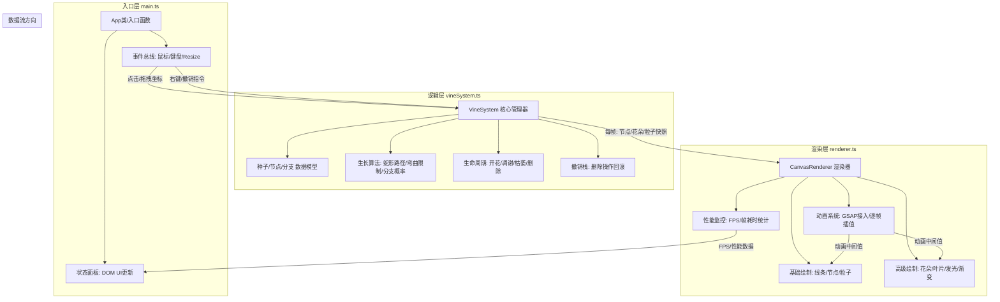

## 1. 架构设计

本项目为纯前端Canvas应用，采用模块化分层架构，将数据/逻辑层与渲染层严格分离，通过明确的数据流向实现高内聚低耦合。



## 2. 技术选型说明

- **构建工具**: Vite@5 — 轻量快速的ES模块开发服务器，原生支持TypeScript
- **语言**: TypeScript@5 — 严格模式(strict)类型安全，目标ES2020，ES模块输出
- **动画库**: GSAP@3 — 高性能JavaScript动画库，提供easeOutCubic等丰富缓动，TweenMax/TimelineMax精确控制复杂动画序列
- **渲染技术**: HTML5 Canvas 2D Context — 像素级绘制控制，适合大量动态元素的实时渲染场景
- **无后端/无数据库**：所有状态保存在浏览器内存中，刷新即重置（符合纯前端创意工具定位）

## 3. 目录结构与模块职责

```
e:\solo\VersionFast\tasks\auto210\
├── package.json          # 依赖声明+启动脚本 (dev/build)
├── vite.config.js        # Vite构建配置(指向index.html)
├── tsconfig.json         # TS严格模式+ES模块目标
├── index.html            # 入口HTML(深色渐变背景+画布容器+提示栏)
└── src/
    ├── main.ts           # 应用入口(组装各模块,绑定事件,状态面板)
    ├── vineSystem.ts     # 核心生长逻辑(数据模型+算法+撤销)
    ├── renderer.ts       # Canvas渲染(绘制+GSAP动画+FPS监控)
    └── types.ts          # 共享类型定义(可选,按需内联)
```

### 模块间调用关系

1. **main.ts** → 创建VineSystem实例 → 创建CanvasRenderer实例
2. **main.ts** → 监听鼠标/键盘事件 → 调用VineSystem的方法：
   - `plantSeed(x, y)` 种植种子
   - `updateTarget(x, y)` 更新生长目标方向
   - `deleteNode(nodeId)` 删除节点
   - `undoDelete()` 撤销删除
3. **main.ts** → requestAnimationFrame循环：
   - 调用 `vineSystem.update(deltaTime)` 推进逻辑
   - 调用 `renderer.render(snapshot)` 绘制画面
   - 调用 `renderer.getFPS()` 并更新DOM状态面板
4. **vineSystem.ts** 内部：
   - 维护vines数组（每棵含nodes数组、branches数组、flowers数组）
   - update()中执行生长计算、分支判定、开花判定、粒子生成
   - 输出可序列化的快照对象给Renderer
5. **renderer.ts** 内部：
   - 接收快照 → 遍历绘制
   - 对新对象调用GSAP创建动画（脉动、缩放、透明度）
   - 维护活动粒子池（最多50，FIFO淘汰）
   - 统计帧耗时与FPS

## 4. 核心数据模型定义

```typescript
// ===== src/vineSystem.ts 内部类型 =====

interface Point { x: number; y: number; }

interface VineNode {
  id: string;               // 唯一标识 (ULID或自增)
  position: Point;          // 当前坐标
  prevPosition?: Point;     // 上一节点（连成线）
  radius: number;           // 显示半径（枯萎时缩小）
  color: string;            // 当前颜色（生长/枯萎阶段不同）
  createdAt: number;        // 创建时间戳
  isBranchNode: boolean;    // 是否为分支起点
  isSeed: boolean;          // 是否为种子
  isWilting: boolean;       // 是否正在枯萎
  wiltProgress: number;     // 枯萎进度 0→1
  deleteProgress: number;   // 删除进度 0→1 (闪烁+缩小)
  parentVineId: string;     // 所属藤蔓
  children: string[];       // 子节点ID列表（用于删除级联）
}

interface Bud {
  id: string;
  nodeId: string;           // 依附的节点
  state: 'bud' | 'blooming' | 'open' | 'fading';
  progress: number;         // 0→1 对应各阶段进度
  colorInner: string;       // #ffcc00
  colorOuter: string;       // #ff6699
  createdAt: number;
}

interface Vine {
  id: string;
  seedNode: VineNode;
  nodes: VineNode[];        // 含种子、主干、分支的所有节点（扁平化）
  totalLength: number;      // 累计生长长度（用于分支判定）
  createdAt: number;
  growthDirection: number;  // 当前生长角度（弧度）
  targetDirection: number;  // 目标方向（受鼠标影响）
  isWilting: boolean;       // 整株枯萎（超量淘汰）
}

interface Particle {
  id: string;
  position: Point;
  velocity: Point;          // dx/dy per second
  color: string;
  radius: number;
  life: number;             // 剩余生命0→1
  maxLife: number;
}

interface VineSystemSnapshot {
  vines: Vine[];
  particles: Particle[];
  activeNodeCount: number;
  activeVineCount: number;
}

// ===== 系统常量 =====
const CONSTANTS = {
  MAX_VINES: 5,
  MAX_NODES_PER_VINE: 30,
  NODE_DISTANCE_MIN: 40,
  NODE_DISTANCE_MAX: 60,
  GROWTH_SPEED: 20,         // px/sec
  BRANCH_CHANCE_AT_150: 0.30,
  BUD_CHANCE: 0.15,
  BRANCH_ANGLE_OFFSET: Math.PI / 4,  // 45度
  CURVATURE_RATE_LIMIT: (30 * Math.PI) / 180,  // ±30度/秒
  SEED_GROWTH_DELAY: 1000,  // ms
  BUD_BLOOM_DELAY: 2000,    // ms
  FLOWER_LIFETIME: 10000,   // ms
  FLOWER_FADE_DURATION: 3000, // ms
  DELETE_ANIM_DURATION: 800,  // ms
  PARTICLE_COUNT_MIN: 6,
  PARTICLE_COUNT_MAX: 8,
  PARTICLE_SPEED_MIN: 30,
  PARTICLE_SPEED_MAX: 60,
  PARTICLE_LIFETIME: 500,   // ms
  MAX_PARTICLES: 50,
  PARTICLE_COLORS: ['#a0d8ff', '#66ff99', '#ffcc00', '#ff6699'],
} as const;
```

## 5. 关键算法说明

### 5.1 藤蔓生长算法
```
每帧update(deltaTime):
  对每株未枯萎的藤蔓:
    1. 若为种子且delay未到 → return
    2. 从末端节点开始, 沿当前direction前进 distance = GROWTH_SPEED * deltaTime
    3. 根据鼠标位置修正目标方向 targetDirection = atan2(mouse - tip)
    4. 当前方向平滑趋近目标: clamp(角度差, ±CURVATURE_RATE_LIMIT * deltaTime)
    5. 累计已走距离, 若累计 >= 随机(40-60):
       a. 创建新节点连接
       b. totalLength += 该段距离
       c. 若 totalLength >= 150 且随机 < BRANCH_CHANCE_AT_150:
            - 在该节点创建分支（新的 Vine? 或同一vine的分支节点？采用同一vine扁平管理）
            - 新分支初始方向 = 当前方向 ± BRANCH_ANGLE_OFFSET（随机正负）
       d. 若为分支节点 且 随机 < BUD_CHANCE → 创建Bud
       e. 生成 6-8 个粒子从新节点散射
    6. 若藤蔓节点数 > MAX_NODES_PER_VINE → 标记isWilting=true
  后处理:
    若vines.length > MAX_VINES → 标记createdAt最早的isWilting=true
    枯萎藤蔓: wiltProgress += deltaTime / 枯萎总时长; progress>=1则移除
```

### 5.2 删除与撤销栈
```
删除节点(nodeId):
  1. BFS收集该节点及其所有后代节点ID集合 = deletedSet
  2. 对集合内所有节点置 deleteProgress=0，启动GSAP动画0→1 (0.8秒闪烁+缩小)
  3. 动画完成后从vines中移除节点，关联bud一并移除
  4. 将 { snapshotBeforeDelete, deletedSet } 压入 undoStack (最多保留最近20条)

Ctrl+Z撤销:
  1. 若undoStack为空 → return
  2. pop最后一条记录，恢复deletedSet中所有节点到vines中
  3. 触发恢复动画：deleteProgress从1→0，GSAP 0.5秒
```

### 5.3 渲染管线（每帧）
```
render(snapshot):
  1. 清屏 + 背景渐变填充（或预渲染缓存背景）
  2. 画边界光晕（4条描边线，shadowBlur）
  3. 遍历所有未枯萎藤蔓的节点对 → 画连接线（线性渐变 + 拖尾）
  4. 遍历所有节点 → 画节点（圆形 + shadowBlur发光 + 按deleteProgress/wiltProgress缩放/变色）
  5. 遍历buds → 按阶段画花苞/花朵
     - bud阶段: 圆形脉动
     - blooming阶段: scale 0→1插值
     - open阶段: 5瓣花朵 + 金色描边
     - fading阶段: alpha渐变 + 轻微缩小
  6. 遍历particles → 画小圆（颜色随life衰减透明度）
  7. 返回渲染耗时给main.ts用于FPS计算
```

## 6. 性能保障策略

| 策略 | 实现方式 |
|------|----------|
| FPS监控 | 每帧记录timestamp，滑动窗口平均FPS，DOM每秒更新 |
| 帧耗时限制 | VineSystem.update目标<1ms，Renderer.render目标<1ms，总目标<2ms/帧 |
| 粒子上限 | 50个，超出时shift移除最早的（FIFO队列） |
| 对象数量上限 | MAX_VINES=5，MAX_NODES_PER_VINE=30 → 理论最多150节点 |
| 数学运算 | 预计算三角函数查表？无需，JS引擎已足够；角度统一用弧度避免频繁转换 |
| 背景缓存 | 渐变背景离屏Canvas或CSS background渲染，每帧不清或只清脏区（可先全清验证正确性后优化） |
| GC优化 | 粒子对象复用（对象池），避免每帧新对象分配，坐标Point尽量复用 |

## 7. 运行方式

```bash
npm install     # 安装 typescript / vite / gsap
npm run dev     # 启动Vite开发服务器 (默认 http://localhost:5173)
# 浏览器打开后即可交互体验
```
