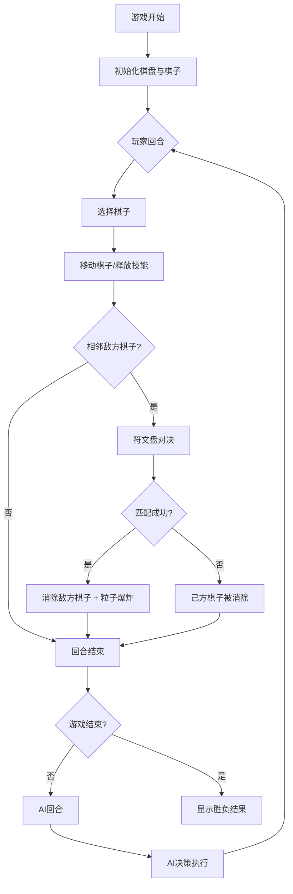

# 晶核·符文对决 - 产品需求文档

## 1. 产品概述

晶核·符文对决是一款基于浏览器的回合制策略对战游戏，玩家在六边形棋盘上操控符文棋子与AI展开对决，通过符文连锁、能量管理和技能释放获得胜利。

- **目标用户**：喜欢策略对战、视觉效果丰富的网页游戏玩家
- **核心价值**：提供结合视觉爆炸、符文连锁和能量管理的沉浸式策略对战体验

## 2. 核心功能

### 2.1 功能模块
1. **对战系统**：六边形棋盘、符文棋子移动、对决判定、胜负判定
2. **符文盘对决**：8色扇形符文盘、限时点击匹配、粒子爆炸效果
3. **能量技能系统**：能量积累、护盾/冰封/星裂三大技能
4. **AI对战系统**：优先级策略AI、红色提示光晕
5. **视觉特效系统**：波纹扩散、旋转光环、光痕拖尾、屏幕震动
6. **音效系统**：Web Audio API合成8种音效

### 2.2 页面详情
| 页面名称 | 模块名称 | 功能描述 |
|-----------|-------------|---------------------|
| 游戏主界面 | 六边形棋盘 | 37格棋盘，深蓝渐变背景，3层发光边框 |
| 游戏主界面 | 符文棋子 | 冰蓝/火焰橙阵营棋子，动态流光纹理 |
| 游戏主界面 | 对决符文盘 | 8色扇形区域，1.5秒限时点击匹配 |
| 游戏主界面 | 能量槽 | 5格能量条，渐变色填充 |
| 游戏主界面 | 玩家信息面板 | 头像、姓名、生命值条 |
| 游戏主界面 | 回合状态条 | 霓虹灯条显示回合数和当前状态 |
| 游戏主界面 | 粒子特效系统 | 爆炸粒子、波纹扩散、光痕拖尾 |

## 3. 核心流程

玩家进入游戏 → 初始棋盘布局 → 玩家回合（选择棋子→移动/释放技能/对决）→ AI回合（AI决策→执行操作）→ 循环直到一方棋子全灭 → 显示胜负结果

## 4. 用户界面设计

### 4.1 设计风格
- **主色调**：深空渐变背景（#0d0f1e 到 #1a1c3a）
- **玩家阵营色**：冰蓝 #48dbfb
- **AI阵营色**：火焰橙 #ff6b35
- **能量色**：青蓝渐变（#00f2fe 到 #4facfe）
- **字体**：科技感无衬线字体，霓虹发光效果
- **整体风格**：暗黑赛博朋克风格，霓虹光效，粒子特效丰富

### 4.2 页面设计概述
| 页面名称 | 模块名称 | UI元素 |
|-----------|-------------|-------------|
| 游戏主界面 | 棋盘区域 | 六边形网格、发光边框、波纹选中效果 |
| 游戏主界面 | 棋子 | 圆形流光棋子、选中旋转光环、移动光痕 |
| 游戏主界面 | 符文盘 | 8色扇形、倒计时指示、点击反馈 |
| 游戏主界面 | 能量槽 | 5格分段、渐变色填充、发光效果 |
| 游戏主界面 | 信息面板 | 圆形头像框、发光边框、生命值条 |
| 游戏主界面 | 状态条 | 霓虹灯条、渐变颜色、回合数显示 |

### 4.3 响应式
- 桌面优先设计，适配 1920x1080 和 1366x768 分辨率
- 棋盘和UI元素等比缩放，保持视觉比例
- viewport meta 标签适配移动端查看

### 4.4 动效设计
- 棋子选中：同心圆波纹扩散动画
- 棋子移动：半透明光痕拖尾
- 对决成功：全屏颜色爆炸粒子（80个，飞散半径150px）
- 屏幕震动：位移2-5px，持续0.1秒
- 棋盘边框：3层发光，2秒闪烁周期
- 回合状态条：颜色随回合数渐变（每10回合变化一次）
