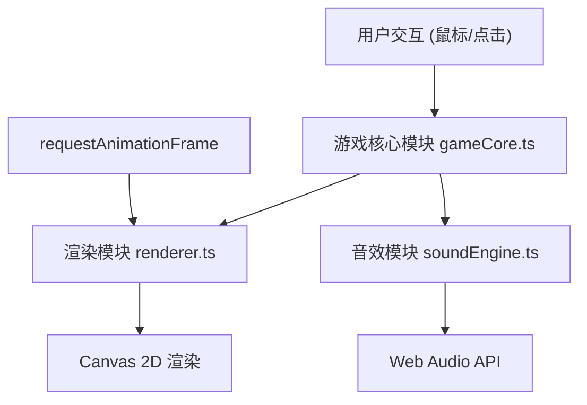

# 晶核·符文对决 - 技术架构文档

## 1. 架构设计



## 2. 技术描述

- **前端框架**：TypeScript + Vite
- **动画库**：GSAP (GreenSock Animation Platform)
- **渲染技术**：Canvas 2D API
- **音效技术**：Web Audio API (程序化合成)
- **构建工具**：Vite
- **语言**：TypeScript (严格模式，ES2020)

## 3. 文件结构

| 文件路径 | 职责描述 |
|----------|----------|
| `package.json` | 项目依赖配置，启动脚本 |
| `vite.config.js` | Vite 构建配置 |
| `tsconfig.json` | TypeScript 编译配置 |
| `index.html` | 入口页面，Canvas 容器 |
| `src/gameCore.ts` | 游戏核心逻辑：棋盘状态、棋子移动、对决、AI决策 |
| `src/renderer.ts` | Canvas 渲染模块：棋盘、棋子、粒子、UI绘制 |
| `src/soundEngine.ts` | 音效合成模块：Web Audio API 生成8种音效 |

## 4. 核心数据模型

### 4.1 六边形坐标系统
采用轴坐标系统 (axial coordinates) q + r + s = 0，37个格子组成的蜂巢布局。

### 4.2 棋子状态
```typescript
interface RunePiece {
  id: string;
  faction: 'player' | 'ai';
  position: { q: number; r: number };
  attribute: RuneAttribute;  // 8种符文属性
  isFrozen: boolean;
  frozenUntil: number;
  hasShield: boolean;
  isEliminated: boolean;
}
```

### 4.3 游戏状态
```typescript
interface GameState {
  turn: number;
  currentPlayer: 'player' | 'ai';
  phase: 'select' | 'move' | 'battle' | 'skill' | 'end';
  playerEnergy: number;
  aiEnergy: number;
  pieces: RunePiece[];
  selectedPieceId: string | null;
  battleInfo: BattleInfo | null;
  particles: Particle[];
}
```

## 5. 性能优化策略

### 5.1 渲染性能
- Canvas 2D 批量绘制，减少状态切换
- requestAnimationFrame 驱动，目标 60fps
- 粒子池对象复用，减少 GC
- 粒子数量上限 150 个，超量淘汰旧粒子

### 5.2 AI 性能
- 决策响应时间 ≤ 200ms
- 简单优先级策略，避免复杂计算
- 预计算相邻格子和移动范围

### 5.3 资源管理
- 无外部资源依赖，全部程序化生成
- Web Audio API 实时合成音效
- 粒子按时间戳淘汰机制

## 6. 模块接口定义

### 6.1 GameCore 接口
- `initGame()`: 初始化游戏
- `selectPiece(pieceId)`: 选择棋子
- `movePiece(targetPos)`: 移动棋子
- `battleClick(sectorIndex)`: 对决时点击扇形区域
- `useSkill(skillType)`: 使用技能
- `endTurn()`: 结束回合
- `getState()`: 获取当前游戏状态
- `subscribe(callback)`: 状态变更订阅

### 6.2 Renderer 接口
- `init(canvas, gameCore)`: 初始化渲染器
- `render(time)`: 每帧渲染
- `handleClick(x, y)`: 处理画布点击

### 6.3 SoundEngine 接口
- `init()`: 初始化音频上下文
- `play(eventName)`: 播放对应音效
- 音效类型：select、move、battle_win、battle_lose、skill_shield、skill_freeze、skill_starcrack、victory
