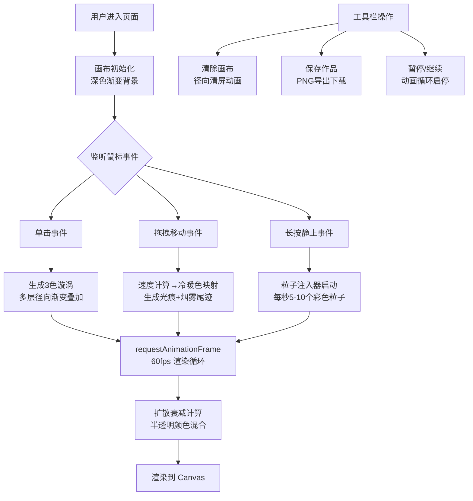

## 1. 产品概述

流韵·墨染是一款基于 Canvas 2D 的交互式数字流体画布应用，为插画师和创意爱好者提供沉浸式的水墨流体创作体验。用户通过鼠标点击、拖拽等操作，在深色画布上生成绚丽的彩色流体漩涡、光痕尾迹和粒子效果，创作出独一无二的抽象数字画作。

- 核心价值：将传统水墨美学与现代数字交互结合，零门槛创作抽象流体艺术
- 目标用户：插画师、数字艺术家、创意爱好者、设计师

## 2. 核心功能

### 2.1 功能模块

1. **流体画布系统**：全屏 Canvas 画布，实时渲染动态流体效果
2. **交互输入系统**：处理鼠标点击、拖拽、长按等事件并转化为流体数据
3. **流体渲染引擎**：多层径向渐变叠加、半透明混合、扩散衰减算法
4. **工具栏系统**：清除画布、保存作品、暂停/继续三个操作按钮
5. **动画循环系统**：基于 requestAnimationFrame 的 60fps 稳定渲染

### 2.2 页面详情

| 页面名称 | 模块名称 | 功能描述 |
|-----------|-------------|---------------------|
| 主画布页 | 全屏画布层 | 深色渐变背景，承载所有流体效果绘制 |
| 主画布页 | 漩涡生成模块 | 点击位置生成3色混合多层渐变圆环，2-3秒自然扩散 |
| 主画布页 | 拖拽光痕模块 | 鼠标移动产生速度感知的冷暖色光痕，4-5秒烟雾尾迹 |
| 主画布页 | 粒子注入模块 | 点击静止时每秒5-10个彩色粒子，缓慢飘散融合 |
| 主画布页 | 工具栏模块 | 右下角磨砂玻璃按钮组：清除/保存/暂停 |
| 主画布页 | 清屏动画模块 | 中心向外径向清除，1.5秒过渡 |
| 主画布页 | 导出模块 | PNG导出带时间戳文件名自动下载 |

## 3. 核心流程

用户进入页面 → 看到全屏深色渐变画布 → 鼠标操作触发流体效果：
- 单击 → 生成彩色漩涡 → 自然扩散融合
- 拖拽移动 → 生成速度感流光痕 → 烟雾尾迹渐隐
- 长按静止 → 持续注入粒子 → 飘散形成色块

用户可随时：
- 点击清除 → 径向清屏动画 → 画布恢复初始
- 点击保存 → 导出PNG → 自动下载
- 点击暂停 → 定格画面 → 切换图标 → 再次点击恢复

## 4. 用户界面设计

### 4.1 设计风格

- **主色调**：深色渐变背景（顶部 #0a0e27 → 底部 #1a1a3e），营造深邃宇宙感
- **流体色盘**：12色预设 — #ff6b6b、#feca57、#48dbfb、#ff9ff3、#54a0ff、#a29bfe、#fd79a8、#00cec9、#e17055、#6c5ce7、#0984e3、#fdcb6e
- **按钮风格**：半透明磨砂玻璃（rgba(255,255,255,0.1) + 1px rgba(255,255,255,0.2)边框，圆角12px）
- **悬停效果**：背景加深至 rgba(255,255,255,0.2)，轻微上移2px，GSAP弹簧动画
- **点击反馈**：scale(0.95) 缩放
- **视觉调性**：沉浸式数字水墨，色彩饱和柔和，扩散轨迹清晰，边缘羽毛状模糊

### 4.2 页面设计

| 页面名称 | 模块名称 | UI元素 |
|-----------|-------------|-------------|
| 主画布页 | 背景层 | 全屏径向渐变，无滚动，100vw × 100vh |
| 主画布页 | Canvas层 | 覆盖全屏，z-index: 1，pointer-events 穿透按钮区 |
| 主画布页 | 工具栏 | position: fixed，右下角（right: 24px，bottom: 24px），z-index: 10，flex 布局，gap: 8px |
| 主画布页 | 按钮 | 尺寸 48px×48px，Lucide图标，GSAP微交互 |

### 4.3 响应式设计

- **桌面端**（≥768px）：按钮 48px×48px，间距 8px，距边 24px
- **移动端**（<768px）：按钮 40px×40px，间距 6px，距边 16px，图标缩小
- **画布自适应**：监听 resize 事件，Canvas 尺寸随 window.innerWidth/Height 实时调整
- **触摸支持**：兼容 touchstart/touchmove/touchend 事件

### 4.4 动效设计

- **漩涡扩散**：2-3秒线性扩散半径，透明度指数衰减，多层圆环错位叠加
- **光痕尾迹**：基于鼠标速度的冷暖色插值（慢速暖色/快速冷色），4-5秒烟雾状渐隐
- **粒子飘散**：随机初速度 + 布朗运动模拟，相互叠加混合
- **清屏动画**：从点击中心开始的径向遮罩扩大，1.5秒内完全覆盖
- **按钮微交互**：GSAP Elastic.easeOut 弹簧悬停，Back.easeIn 按下反馈
