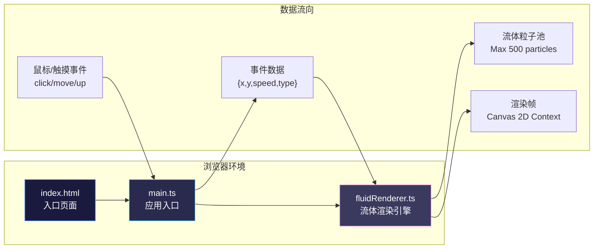

## 1. 架构设计



**调用关系：**
- `index.html` → 引入 `main.ts`（ESM 模块）
- `main.ts` → 实例化 `FluidRenderer`，监听 DOM 事件，启动动画循环
- `main.ts` → 调用 `FluidRenderer` 方法：`addVortex()` / `addTrail()` / `addParticle()` / `clear()` / `togglePause()` / `exportImage()`
- `FluidRenderer` → 内部维护粒子对象池，通过 `renderFrame()` 每帧更新并绘制到 Canvas

## 2. 技术栈描述

- **前端核心**：TypeScript@5（严格模式，ES2020 目标）+ Vite@5（热更新开发服务器）
- **动画库**：gsap@3（按钮弹簧动画、值插值、缓动函数）
- **渲染技术**：HTML5 Canvas 2D Context（createRadialGradient、globalCompositeOperation = 'lighter'）
- **无后端、无数据库、无路由**：纯前端单文件应用

## 3. 文件结构说明

```
auto216/
├── package.json              # 依赖与脚本（typescript, vite, gsap）
├── vite.config.js            # Vite 构建配置（root: ., entry: index.html）
├── tsconfig.json             # TS 配置（strict: true, target: ES2020, module: ESNext）
├── index.html                # 入口 HTML，深色渐变背景，全屏适配，按钮容器
└── src/
    ├── main.ts               # 入口：Canvas 初始化、事件监听、按钮绑定、动画循环
    └── fluidRenderer.ts      # 核心类 FluidRenderer：粒子系统、渲染算法、工具方法
```

## 4. 核心类型定义

```typescript
// 粒子基础类型
interface Particle {
  id: number;
  x: number;
  y: number;
  vx: number;
  vy: number;
  radius: number;
  color: string;       // hex → rgba 转换
  opacity: number;     // 0.0 ~ 1.0
  life: number;        // 当前生命
  maxLife: number;     // 总生命时长(ms)
  type: 'vortex' | 'trail' | 'particle';
  blendMode: GlobalCompositeOperation;
}

// 漩涡扩展（多层圆环）
interface VortexParticle extends Particle {
  type: 'vortex';
  rings: {
    radiusRatio: number;  // 相对主半径比例
    opacityRatio: number; // 相对不透明度比例
    colorOffset: string;  // 偏移颜色
  }[];
  expansionRate: number;  // 每秒半径增量
}

// 渲染配置常量
const COLOR_PALETTE: string[];  // 12色预设
const MAX_PARTICLES = 500;
const VORTEX_LIFE_MIN = 2000;
const VORTEX_LIFE_MAX = 3000;
const TRAIL_LIFE = 4500;
const PARTICLE_INJECT_RATE = 7; // 每秒平均数量
```

## 5. 核心算法说明

### 5.1 漩涡生成算法
```
1. 从调色盘随机抽取3种颜色 C1, C2, C3
2. 随机直径 D ∈ [60, 100]px，初始半径 R = D/2 * 0.2
3. 创建 5 层圆环，每层 radiusRatio = [0.4, 0.6, 0.8, 1.0, 1.2]
4. 每层颜色在 (C1, C2, C3) 之间三线性插值
5. 每层使用 createRadialGradient，内圈透明度 0.7 → 外圈 0.0
6. 渲染时：globalCompositeOperation = 'lighter'，实现颜色加色混合
7. 每帧更新：radius += expansionRate * dt，opacity 按 life 衰减
```

### 5.2 光痕与速度感知颜色映射
```
1. 记录 lastX, lastY，计算速度 v = sqrt(dx² + dy²) / dt
2. 速度阈值 v_min = 50px/s（暖色 #ff6b6b），v_max = 800px/s（冷色 #48dbfb）
3. 使用 GSAP interpolate 或手动线性插值：t = clamp((v - v_min) / (v_max - v_min), 0, 1)
4. 宽度 w ∈ [8, 15] 也随速度线性插值
5. 光痕由连续圆点叠加模拟，每 10ms 采样一个位置
6. 尾迹使用 globalCompositeOperation = 'source-over' + 半透明 + blur(4px)
7. 4.5 秒内 opacity 从 0.6 → 0.05，radius 缓慢扩散 1.8 倍
```

### 5.3 粒子池管理（500 上限）
```
1. 维护 particles: Particle[] 数组，严格 length <= 500
2. 新增粒子时：
   - 若 length < 500：直接 push
   - 若 length >= 500：
     a. 遍历找到 life 剩余最小（最旧）的 2 个同色粒子
     b. 合并：位置取加权平均，radius 取平均，life 取较大值
     c. 删除被合并粒子，加入新粒子
3. 每帧遍历：过滤 life <= 0 的粒子（自动回收）
```

### 5.4 径向清屏动画
```
1. 记录 clearCenter = {x, y}，clearStartTime = now
2. 持续 1500ms，最大半径 = sqrt(W² + H²)（覆盖全屏）
3. 每帧：
   - t = (now - clearStartTime) / 1500
   - r = EaseOutCubic(t) * maxRadius
   - 临时离屏 Canvas 保存当前画面
   - 主 Canvas 重绘背景
   - 主 Canvas 上绘制离屏内容 + destination-in 径向渐变遮罩
     （内圈 r-20 不透明，外圈 r 完全透明）
4. t >= 1 时：清空 particles 数组，结束清屏状态
```

## 6. 性能优化策略

1. **Canvas 双缓冲**：主 Canvas 直接绘制（清屏动画才用离屏），避免额外拷贝
2. **requestAnimationFrame + dt 时间步长**：帧率波动时速度稳定，使用时间差计算
3. **批量绘制**：相同 blendMode 的粒子分组批量绘制，减少 ctx 状态切换
4. **粒子上限 500**：强制合并/淘汰，避免内存与绘制爆炸
5. **鼠标采样节流**：mousemove 使用 RAF 同步采样，不绑定原生高频事件
6. **颜色缓存**：hex → rgba + opacity 组合做 Map 缓存，每帧节省字符串拼接
7. **Canvas 尺寸变化时**：使用 backingStore 缩放，不重建 ImageData

## 7. 工具函数（fluidRenderer.ts 内部导出）

| 函数名 | 签名 | 用途 |
|--------|------|------|
| `hexToRgba` | `(hex: string, alpha: number) => string` | 十六进制颜色转 rgba |
| `lerpColor` | `(c1: string, c2: string, t: number) => string` | 颜色线性插值 |
| `samplePalette` | `(n: number) => string[]` | 从调色盘随机取 n 种不重复颜色 |
| `easeOutCubic` | `(t: number) => number` | 三次缓出函数 |
| `clamp` | `(v: number, min: number, max: number) => number` | 值截断 |
| `formatTimestamp` | `(date: Date) => string` | 生成保存文件名时间戳 |
