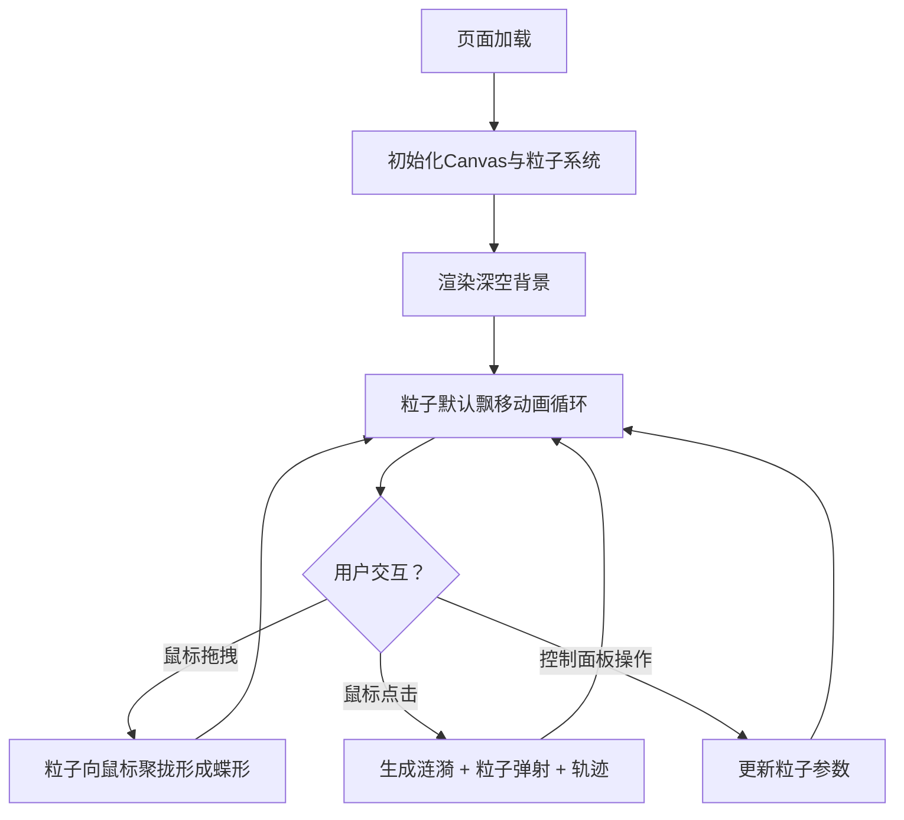

## 1. 产品概述

星尘·幻蝶是一款基于浏览器 Canvas 2D 的交互式粒子视觉应用，让用户通过鼠标拖拽和点击在虚拟3D空间中操控由数百个发光粒子构成的梦幻蝶群。主要解决用户无法在网页中获得随手势飞舞、聚散和留下光痕的梦幻蝶群视觉体验的问题。

- 目标用户：追求视觉美感的网页体验爱好者、数字艺术欣赏者
- 核心价值：提供沉浸式的粒子蝶群交互体验，融合拖拽聚散、点击涟漪、光痕尾迹等多层动态效果

## 2. 核心功能

### 2.1 功能模块

1. **粒子场景页**：深空渐变背景、400个发光粒子默认飘移、鼠标拖拽聚蝶、点击涟漪弹射、粒子连线脉络、控制面板

### 2.2 页面详情

| 页面名称 | 模块名称 | 功能描述 |
|---------|---------|---------|
| 粒子场景页 | 深空背景 | 三色渐变背景（#0f0c29 → #302b63 → #24243e），视口自适应，最小800x600px |
| 粒子场景页 | 粒子系统 | 400个发光粒子，随机路径飘移，直径2-5px，6色随机选取，透明度0.5-0.9动态变化，8px柔光光晕 |
| 粒子场景页 | 拖拽聚蝶 | 鼠标拖拽时150px内粒子朝鼠标聚拢加速，形成半透明发光蝶形轮廓，颜色短暂变为粉色系 |
| 粒子场景页 | 点击涟漪 | 点击产生2秒彩虹渐变涟漪（10px→80px），范围内粒子弹开并2倍加速，粒子留下1.5秒渐隐轨迹 |
| 粒子场景页 | 粒子连线 | 距离<30px的粒子间产生半透明发光连线，上限200条，颜色取两粒子均值 |
| 粒子场景页 | 控制面板 | 粒子数量滑块(200-600)、速度滑块(0.5-3x)、连线开关、重置按钮 |

## 3. 核心流程

用户打开页面 → 观看粒子默认飘移动画 → 鼠标拖拽触发粒子聚蝶效果 → 鼠标点击触发涟漪弹射效果 → 通过控制面板调节参数 → 重置恢复初始状态

## 4. 用户界面设计

### 4.1 设计风格

- 主色调：深空蓝紫（#0f0c29、#302b63、#24243e）
- 强调色：粒子色盘（#ff6b6b、#48dbfb、#feca57、#ff9ff3、#54a0ff、#a29bfe）+ 粉色系交互态（#ff9ff3→#f8a5c2）
- 按钮风格：圆角12px，半透明深色背景，悬停0.2s发光过渡
- 字体：系统默认无衬线字体，控制面板文字14px
- 布局：全屏Canvas + 浮动控制面板

### 4.2 页面设计概览

| 页面名称 | 模块名称 | UI元素 |
|---------|---------|--------|
| 粒子场景页 | 深空背景 | 三段式线性渐变，全屏覆盖 |
| 粒子场景页 | 粒子本体 | 2-5px圆形 + 8px模糊光晕 + 动态透明度 |
| 粒子场景页 | 蝶形效果 | 粉色系粒子密集区 + 扩散轨迹翅膀 |
| 粒子场景页 | 涟漪波纹 | 彩虹渐变圆环，10px→80px扩张 |
| 粒子场景页 | 粒子连线 | 1px半透明线段，颜色取均值 |
| 粒子场景页 | 控制面板 | 浮动右下角，#1a1a2e背景0.85透明度，#3a3a5c边框，圆角12px |

### 4.3 响应式适配

- **桌面端（≥1024px）**：全屏Canvas + 右下角浮动控制面板
- **平板端（768-1023px）**：控制面板折叠为右下角图标，点击展开
- **手机端（<768px）**：控制面板改为底部浮层（200px高度可滚动），粒子自动降至300个

### 4.4 2D场景指导

- 背景：深空三色渐变营造宇宙深空氛围
- 粒子光晕：使用Canvas shadowBlur实现柔光效果
- 连线脉络：半透明细线模拟蝴蝶翅膀脉络
- 动画缓动：GSAP处理颜色过渡和位置缓动
- 性能预算：30fps以上，粒子≤600，连线≤200，交互延迟<100ms
