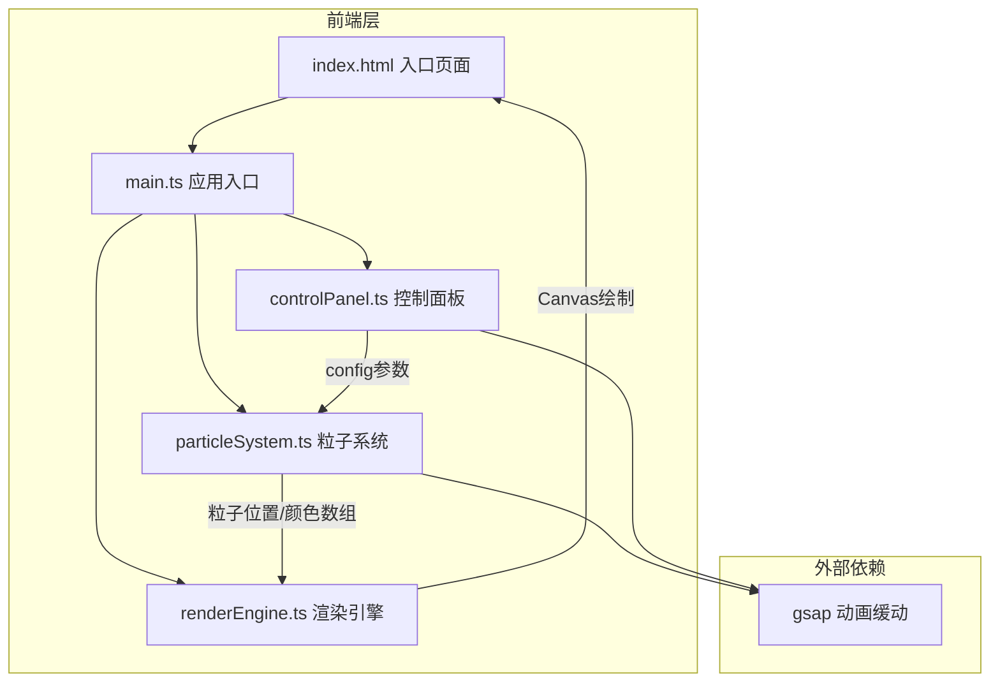

## 1. 架构设计



## 2. 技术说明

- 前端框架：无框架，原生 TypeScript + Canvas 2D
- 构建工具：Vite
- 动画库：GSAP（缓动与颜色过渡）
- 语言：TypeScript（严格模式，ES模块目标）
- 无后端、无数据库

## 3. 模块职责

| 模块 | 职责 | 数据流向 |
|------|------|---------|
| main.ts | 初始化场景、粒子系统、渲染引擎、事件绑定 | 调用所有模块 |
| particleSystem.ts | 粒子创建、运动逻辑、鼠标交互检测、连线计算、轨迹管理 | 接收鼠标坐标/点击事件 → 更新粒子状态 → 输出渲染数据给renderEngine |
| renderEngine.ts | Canvas初始化、尺寸调整、粒子/光晕/连线/轨迹/涟漪绘制、动画循环 | 接收particleSystem数据 → 绘制Canvas → requestAnimationFrame循环 |
| controlPanel.ts | 创建控制面板DOM、绑定滑块/按钮事件、导出config对象 | 接收用户操作 → 更新config → 通知particleSystem |

## 4. 核心数据结构

### 4.1 粒子（Particle）

```typescript
interface Particle {
  x: number;
  y: number;
  vx: number;
  vy: number;
  baseVx: number;
  baseVy: number;
  radius: number;
  color: string;
  alpha: number;
  targetAlpha: number;
  originalColor: string;
  isAttracted: boolean;
  trail: Array<{ x: number; y: number; alpha: number }>;
  speedMultiplier: number;
  phaseOffset: number;
}
```

### 4.2 涟漪（Ripple）

```typescript
interface Ripple {
  x: number;
  y: number;
  radius: number;
  maxRadius: number;
  alpha: number;
  startTime: number;
  duration: number;
  hue: number;
}
```

### 4.3 配置（Config）

```typescript
interface Config {
  particleCount: number;
  speedMultiplier: number;
  showLines: boolean;
}
```

## 5. 文件结构

```
├── package.json
├── vite.config.js
├── tsconfig.json
├── index.html
└── src/
    ├── main.ts
    ├── particleSystem.ts
    ├── renderEngine.ts
    └── controlPanel.ts
```

## 6. 性能策略

- requestAnimationFrame驱动的渲染循环，目标30fps+
- 粒子上限600，连线上限200
- 空间分区优化连线计算（网格划分减少O(n²)检测）
- 粒子轨迹点数限制（最多10个点）
- Canvas离屏缓冲（如需要）
- 涟漪自动回收（2秒后移除）
- 手机端自动降低粒子数至300

## 7. 交互事件映射

| 事件 | 触发条件 | 粒子系统响应 | 渲染引擎响应 |
|------|---------|-------------|-------------|
| mousemove | 鼠标移动 | 记录鼠标位置 | 无 |
| mousedown + mousemove | 鼠标拖拽 | 150px内粒子朝鼠标聚拢加速，变色 | 绘制蝶形轮廓 |
| mouseup | 停止拖拽 | 粒子恢复初始运动和颜色 | 无 |
| click | 鼠标点击 | 生成涟漪，范围内粒子弹开+加速+轨迹 | 绘制涟漪波纹和粒子轨迹 |
| resize | 窗口变化 | 更新粒子边界 | 调整Canvas尺寸 |
| 滑块变化 | 控制面板操作 | 更新粒子数量/速度 | 无 |
| 连线开关 | 控制面板操作 | 启用/禁用连线计算 | 启用/禁用连线绘制 |
| 重置按钮 | 控制面板操作 | 所有粒子恢复初始位置 | 无 |
