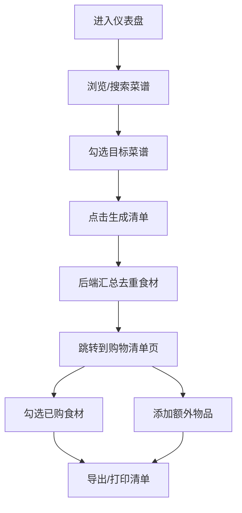

## 1. 产品概述

家庭食谱管理与智能采购清单生成应用，帮助用户上传管理菜谱、按食材自动生成购物清单，并支持多人协作编辑。目标用户为家庭主妇/主夫、美食爱好者，解决家庭日常采购计划混乱、菜谱管理分散的问题。

- 核心价值：将菜谱管理与智能采购结合，一键生成去重购物清单，节省家庭采购时间
- 目标市场：中国家庭用户，特别是25-45岁有家庭烹饪需求的用户

## 2. 核心功能

### 2.1 用户角色
无需注册登录，本地存储数据，支持家庭多人共享使用同一设备。

| 角色 | 核心权限 |
|------|----------|
| 家庭用户 | 创建/编辑/删除菜谱、生成购物清单、导出清单 |

### 2.2 功能模块
1. **仪表盘页面**：菜谱卡片列表展示、搜索过滤、按标签筛选、选择菜谱生成清单
2. **菜谱编辑器页面**：标题编辑、食材拖拽排序、步骤描述、封面图上传、校验提交
3. **购物清单页面**：食材自动汇总去重、勾选完成、添加额外物品、导出/打印
4. **导航布局组件**：侧边栏导航、毛玻璃效果、响应式底部标签栏

### 2.3 页面详情
| 页面名称 | 模块名称 | 功能描述 |
|-----------|-------------|---------------------|
| 仪表盘 | 搜索栏 | 按菜谱名称实时搜索，支持模糊匹配 |
| 仪表盘 | 标签过滤器 | 按"家常""快手""素食"等标签过滤菜谱 |
| 仪表盘 | 菜谱卡片列表 | 卡片展示封面、名称、标签，悬停放大阴影，多选框用于生成清单 |
| 仪表盘 | 生成清单按钮 | 选中菜谱后点击跳转到购物清单页并自动汇总 |
| 菜谱编辑器 | 封面上传区 | 支持jpg/png/webp上传，最大5MB，圆形进度环，淡入显示 |
| 菜谱编辑器 | 标题输入 | 必填项，带校验提示 |
| 菜谱编辑器 | 食材列表 | 可拖拽排序，带数量单位，新增时焦点放大绿色边框 |
| 菜谱编辑器 | 步骤描述 | 多行文本输入，支持多条步骤 |
| 菜谱编辑器 | 标签选择 | 多选预设标签，支持自定义标签 |
| 菜谱编辑器 | 保存按钮 | 校验必填项，提交成功动画 |
| 购物清单 | 食材汇总列表 | 自动去重相同食材，数量相加，复选框勾选 |
| 购物清单 | 额外物品添加 | 手动添加调料、日用品等，自动滚动高亮闪烁 |
| 购物清单 | 导出功能 | 导出为纯文本，进度条动画，下载提示 |
| 购物清单 | 打印功能 | 打印友好布局 |
| Layout | 侧边导航 | 图标导航，当前页下划线动画，毛玻璃背景 |
| Layout | 响应式 | <768px收起为底部标签栏 |

## 3. 核心流程

### 3.1 菜谱创建流程
用户进入仪表盘 → 点击"新建菜谱" → 进入编辑器 → 填写标题/食材/步骤 → 上传封面图 → 选择标签 → 校验通过保存 → 返回仪表盘查看新菜谱

### 3.2 购物清单生成流程
用户在仪表盘勾选多道菜谱 → 点击"生成清单" → 系统自动汇总去重食材 → 跳转到购物清单页 → 用户勾选已购物品 → 添加额外物品 → 导出/打印清单

## 4. 用户界面设计

### 4.1 设计风格
- **主色调**：橙红色(#E07A5F) - 用于标题、按钮、强调元素
- **背景色**：米白色(#FAF5EF) - 页面主背景
- **卡片背景**：奶油色(#FFF8F0) - 卡片、面板背景
- **文字颜色**：深灰色(#3D405B) - 主要文字
- **辅助色**：柔和绿色(#81B29A) - 成功状态、边框高亮
- **按钮风格**：圆角8px，悬停时背景渐变+轻微上浮(translateY:-2px)
- **卡片风格**：圆角16px，浅阴影(0 4px 20px rgba(0,0,0,0.06))
- **字体**：标题使用"Noto Serif SC"衬线字体，正文使用"Noto Sans SC"无衬线字体
- **图标**：Lucide图标库，线性风格，统一20px尺寸

### 4.2 页面设计概述
| 页面名称 | 模块名称 | UI元素 |
|-----------|-------------|-------------|
| 仪表盘 | 顶部搜索区 | 搜索输入框+标签筛选 chips 横向排列 |
| 仪表盘 | 卡片网格 | 响应式网格(桌面3列/平板2列/移动1列)，stagger加载动画 |
| 仪表盘 | 菜谱卡片 | 封面图(4:3比例)+名称+标签chips+多选框，悬停scale(1.05)+柔和阴影 |
| 仪表盘 | 底部操作栏 | 浮动fixed，显示选中数量+生成清单按钮，loading旋转动画 |
| 菜谱编辑器 | 封面区 | 大圆角上传区域，拖拽上传支持，圆形SVG进度环，图片fadeIn |
| 菜谱编辑器 | 食材列表 | react-beautiful-dnd拖拽，半透明预览，弹性回弹动画 |
| 菜谱编辑器 | 新增食材输入 | focus时scale(1.02)+绿色边框过渡，输入框+数量+单位三联 |
| 菜谱编辑器 | 保存按钮 | 提交时收缩+对号动画，失败时shake抖动 |
| 购物清单 | 食材项 | 复选框+食材名+数量，勾选时strikethrough+opacity(0.6)+火花粒子 |
| 购物清单 | 新增物品 | 输入框聚焦高亮，新增后scrollIntoView+闪烁两次背景 |
| 购物清单 | 导出进度条 | 顶部进度条动画(0→100%)，完成后出现下载链接 |
| Layout | 侧边栏 | 固定宽度240px，backdrop-filter:blur(8px)，rgba(255,255,255,0.7)背景 |
| Layout | 导航项 | 图标+文字，激活项底部橙色下划线宽度0→100%动画 |
| Layout | 移动端 | <768px隐藏侧边栏，底部56px高度标签栏 |

### 4.3 响应式
- 桌面优先设计(≥1024px)，侧边栏固定+内容区自适应
- 平板(768-1023px)：卡片2列，侧边栏收起为抽屉式
- 移动(<768px)：卡片1列，侧边栏变底部标签栏，字体缩小1px，间距缩减25%
- 触控优化：所有可点击区域≥44x44px，按钮触摸反馈ripple效果

### 4.4 动效规范
- **FadeIn页面过渡**：opacity 0→1 + translateY(10px→0)，持续0.3s，ease-out
- **Stagger列表加载**：每个列表项animation-delay递增50ms，累计最大300ms
- **按钮悬停**：background-color过渡0.2s + translateY(-2px) + box-shadow增强
- **拖拽动画**：拖拽项opacity(0.8)+scale(1.02)，放置位置有占位指示
- **火花粒子**：勾选时生成10个3-5px圆形粒子，随机方向扩散+opacity淡出，持续0.6s
- **闪烁高亮**：新增项背景色从#81B29A(30%)→透明，交替两次，每次0.4s
