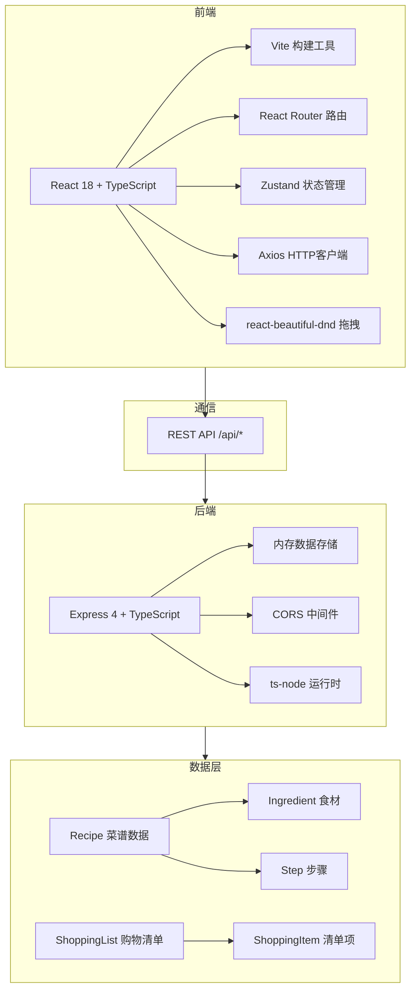
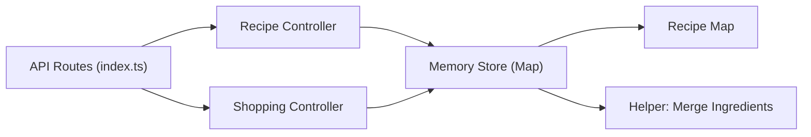

## 1. 架构设计



## 2. 技术描述

- **前端**：React 18 + TypeScript 5 + Vite 5 + React Router 6 + Zustand 4 + Axios 1 + react-beautiful-dnd 13
- **后端**：Express 4 + TypeScript 5 + ts-node 10 + CORS 2 + uuid 9
- **初始化工具**：Vite 官方脚手架 react-ts 模板，手动配置 Express 后端
- **数据库**：内存存储(Map对象)，进程重启数据重置（演示用途）
- **样式方案**：CSS Modules + 全局CSS变量，不使用 Tailwind（用户未指定）
- **图标**：lucide-react 图标库
- **端口分配**：前端 Vite 5173，后端 Express 3001，Vite 代理 /api → 后端

## 3. 路由定义

### 3.1 前端路由 (React Router)
| 路由 | 页面组件 | 用途 |
|-------|---------|------|
| / | Dashboard | 仪表盘，菜谱列表与搜索 |
| /recipes/new | RecipeEditor | 新建菜谱 |
| /recipes/:id | RecipeEditor | 编辑已有菜谱 |
| /shopping | ShoppingList | 购物清单页面 |

### 3.2 后端API路由 (Express)
| Method | Route | Purpose |
|--------|-------|---------|
| GET | /api/recipes | 获取所有菜谱列表 |
| GET | /api/recipes/:id | 获取单道菜谱详情 |
| POST | /api/recipes | 创建新菜谱 |
| PUT | /api/recipes/:id | 更新菜谱 |
| DELETE | /api/recipes/:id | 删除菜谱 |
| POST | /api/shopping/generate | 根据菜谱ID列表生成购物清单（汇总去重） |

## 4. API定义

### 4.1 数据类型定义

```typescript
// 食材项
interface Ingredient {
  id: string;          // uuid
  name: string;        // 食材名称
  quantity: number;    // 数量
  unit: string;        // 单位（如：克、个、勺）
}

// 步骤
interface Step {
  id: string;          // uuid
  order: number;       // 步骤序号
  description: string; // 步骤描述
}

// 菜谱
interface Recipe {
  id: string;               // uuid
  title: string;            // 菜谱名称（必填）
  coverImage?: string;      // 封面图（base64 data URL）
  ingredients: Ingredient[]; // 食材列表（至少1项）
  steps: Step[];            // 步骤列表（至少1项）
  tags: string[];           // 标签数组
  createdAt: number;        // 创建时间戳
  updatedAt: number;        // 更新时间戳
}

// 购物清单项
interface ShoppingItem {
  id: string;          // uuid
  name: string;        // 食材/物品名称
  quantity: number;    // 汇总数量
  unit: string;        // 单位
  checked: boolean;    // 是否已购买
  isExtra: boolean;    // 是否为手动添加的额外物品
}

// 购物清单
interface ShoppingList {
  items: ShoppingItem[];
  recipeIds: string[];   // 来源菜谱ID
  generatedAt: number;   // 生成时间
}
```

### 4.2 请求/响应Schema

**GET /api/recipes → 200**
```json
{
  "data": [Recipe],
  "total": 50
}
```

**GET /api/recipes/:id → 200/404**
```json
{ "data": Recipe }
```

**POST /api/recipes → 201**
- 请求体：`{ title, coverImage?, ingredients, steps, tags }`
- 校验：title非空、ingredients.length≥1、steps.length≥1
- 响应：`{ data: Recipe, message: "创建成功" }`

**PUT /api/recipes/:id → 200/404**
- 请求体同上
- 响应：`{ data: Recipe, message: "更新成功" }`

**DELETE /api/recipes/:id → 200/404**
```json
{ "message": "删除成功" }
```

**POST /api/shopping/generate → 200**
- 请求体：`{ recipeIds: string[] }`
- 响应：`{ data: ShoppingList }`
- 业务逻辑：按食材名称+单位匹配去重，相同则数量相加

## 5. 后端架构



- 无分层架构（项目简洁性），所有逻辑在 Express 路由处理函数中
- 单入口文件 `src/server/index.ts`，包含：
  - CORS中间件配置
  - JSON body parser (express.json({ limit: '10mb' }))
  - 内存数据存储变量
  - 6个API端点实现
  - 服务器启动监听(3001端口)

## 6. 项目文件结构

```
auto22/
├── package.json                    # 根目录统一依赖与脚本
├── vite.config.js                  # Vite配置 + /api代理
├── tsconfig.json                   # TypeScript配置(严格模式)
├── index.html                      # 入口HTML
├── src/
│   ├── client/                     # 前端代码
│   │   ├── main.tsx                # React入口
│   │   ├── App.tsx                 # 路由+全局状态容器
│   │   ├── styles/
│   │   │   └── global.css          # 全局样式、CSS变量、动画keyframes
│   │   ├── components/
│   │   │   ├── Layout.tsx          # 侧边栏/底部导航布局
│   │   │   ├── RecipeCard.tsx      # 菜谱卡片组件
│   │   │   ├── IngredientItem.tsx  # 可拖拽食材项
│   │   │   ├── SparkParticles.tsx  # 火花粒子动画组件
│   │   │   └── ProgressRing.tsx    # 圆形上传进度环
│   │   ├── pages/
│   │   │   ├── Dashboard.tsx       # 仪表盘
│   │   │   ├── RecipeEditor.tsx    # 菜谱编辑器
│   │   │   └── ShoppingList.tsx    # 购物清单
│   │   ├── store/
│   │   │   └── useAppStore.ts      # Zustand全局状态
│   │   ├── utils/
│   │   │   └── api.ts              # Axios封装
│   │   └── types/
│   │       └── index.ts            # 共享类型定义
│   └── server/
│       └── index.ts                # Express后端入口
```

## 7. 性能优化策略

- **菜谱列表加载**：虚拟滚动不实现（50条足够），但使用stagger动画营造快速感
- **图片优化**：上传时前端压缩至最大宽度800px，WebP优先，base64存储
- **拖拽帧率**：react-beautiful-dnd原生使用transform，天然GPU加速，确保≥45fps
- **购物清单生成**：纯内存O(n)算法，50个食材<1ms完成，API延迟主要为网络，300ms以内轻松达标
- **首屏优化**：Vite构建启用代码分割，首页仅加载Dashboard相关代码
