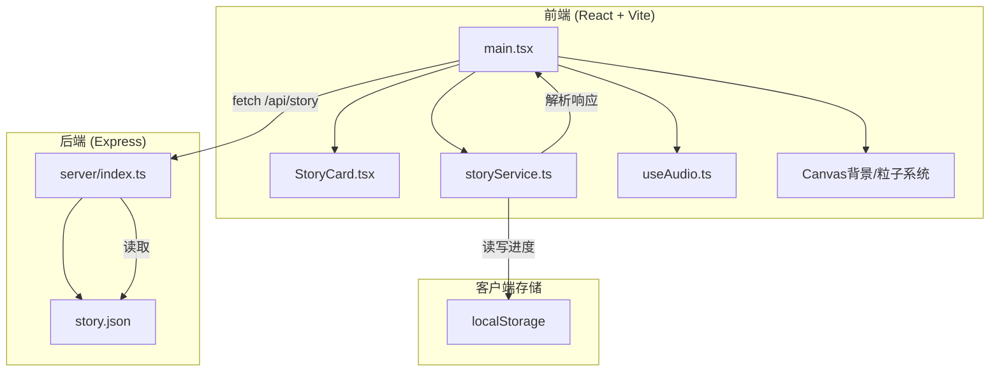
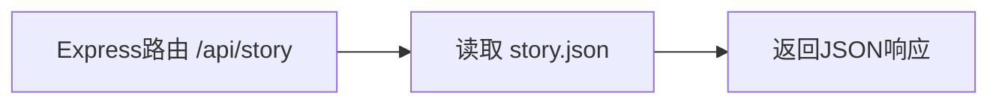

## 1. 架构设计



## 2. 技术说明

- 前端：React@18 + TypeScript + Vite + GSAP + TailwindCSS
- 初始化工具：vite-init (react-express-ts模板)
- 后端：Express@4 + TypeScript + CORS
- 数据库：无，使用JSON文件存储故事数据
- 状态管理：Zustand
- 动画：GSAP（卡片飞入飞出）、CSS transitions（按钮交互）、Canvas API（背景地图、粒子星空）
- 音频：Web Audio API（风声、心跳、铃音合成）

## 3. 路由定义

| 路由 | 用途 |
|------|------|
| / | 主页面，包含欢迎页、故事模式、结局画面三个状态 |

## 4. API定义

| 接口 | 方法 | 用途 | 响应 |
|------|------|------|------|
| /api/story | GET | 获取完整故事数据 | StoryData对象 |

### TypeScript类型定义

```typescript
interface StoryNode {
  id: string;
  text: string;
  options: StoryOption[];
  atmosphere: 'tense' | 'calm' | 'mysterious' | 'triumphant';
  isEnding: boolean;
  endingTitle?: string;
  achievement?: Achievement;
}

interface StoryOption {
  text: string;
  nextNodeId: string;
  isBranch?: boolean;
}

interface Achievement {
  name: string;
  description: string;
  color: string;
}

interface AudioConfig {
  atmosphere: 'tense' | 'calm' | 'mysterious' | 'triumphant';
  windFreq: number;
  heartbeatRate: number;
  bellFreq: number;
  volume: number;
}

interface StoryData {
  title: string;
  intro: string;
  startNodeId: string;
  nodes: StoryNode[];
  audioConfigs: Record<string, AudioConfig>;
}
```

## 5. 服务器架构



## 6. 数据模型

### 6.1 数据模型定义

故事数据以JSON文件存储，无关系型数据库。核心数据结构：

- **StoryData**：顶层故事配置，包含标题、引导语、起始节点ID
- **StoryNode**：单个故事节点，包含文本、选项、氛围类型、结局标记
- **StoryOption**：用户选择项，指向下一个节点，标记是否为分支路径
- **AudioConfig**：音效配置，按氛围类型映射不同频率参数

### 6.2 初始数据

story.json将包含至少5个节点的故事，含至少1条分支路径，分支节点在重玩时可随机打乱。

## 7. 文件组织

```
├── package.json
├── vite.config.ts
├── tsconfig.json
├── index.html
├── server/
│   ├── index.ts          # Express服务器入口
│   └── data/
│       └── story.json    # 故事数据
├── src/
│   ├── main.tsx          # React应用入口
│   ├── App.tsx           # 主应用组件
│   ├── components/
│   │   └── StoryCard.tsx # 故事卡片组件
│   ├── services/
│   │   └── storyService.ts # 数据服务
│   └── hooks/
│       └── useAudio.ts   # 音频钩子
```
