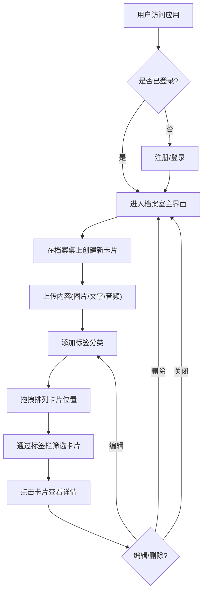

## 1. 产品概述

虹纱·光影档案柜是一款沉浸式创意素材管理Web应用，旨在解决用户在网页上缺乏将图片、手写笔记、语音片段等零散创意素材按照自定义分类体系进行归档与检索的问题。通过悬浮卡片交互和光影视觉效果，打造富有仪式感的创意素材管理体验。

- 目标用户：创意工作者、设计师、写作者等需要收集和整理碎片化灵感的用户
- 核心价值：以沉浸式光影美学包裹实用的素材管理功能，让归档与检索不再是枯燥的文件操作

## 2. 核心功能

### 2.1 用户角色

| 角色 | 注册方式 | 核心权限 |
|------|----------|----------|
| 普通用户 | 用户名/密码注册 | 创建、编辑、删除档案卡片，管理标签，上传素材 |

### 2.2 功能模块

1. **档案室主界面**：深灰蓝渐变背景，中央发光档案桌，网格纹理，卡片自由布局
2. **档案卡片系统**：支持图片/文字/录音三种内容类型，自动图标标识，标签分类，时间标记
3. **标签筛选系统**：右侧垂直标签栏，淡入/淡出动画筛选
4. **卡片详情模态框**：全屏毛玻璃展开，内容滚动浏览
5. **拖拽排列系统**：自由拖拽定位，网格吸附，缩略图导航
6. **悬浮动效系统**：呼吸发光、上浮阴影、微交互反馈

### 2.3 页面详情

| 页面名称 | 模块名称 | 功能描述 |
|----------|----------|----------|
| 登录/注册页 | 认证表单 | 用户名密码注册登录，简洁深色表单 |
| 档案室主界面 | 发光档案桌 | 60%视口宽/40%视口高桌面，1px淡蓝网格线(20px间距,0.3透明度)，半透明发光效果 |
| 档案室主界面 | 卡片创建 | 点击创建120x160px卡片，0.5px发光边框(#667eea)，毛玻璃背景(blur 8px) |
| 档案室主界面 | 内容上传 | 支持图片上传、文字输入、音频拖入(wav/mp3,最长30秒)，自动类型图标 |
| 档案室主界面 | 标签管理 | 每卡最多3标签，胶囊形，渐变背景(#667eea→#764ba2)，12px白色文字 |
| 档案室主界面 | 标签筛选栏 | 右侧60px宽半透明标签栏，0.3s淡入缩放/0.2s淡出缩小动画 |
| 档案室主界面 | 卡片详情 | 全屏毛玻璃模态框(0.85透明度)，最大宽度800px，自适应高度，竖向滚动 |
| 档案室主界面 | 拖拽排列 | 自由拖拽+0.15s网格吸附动画，左侧200px缩略图面板(60x80px) |
| 档案室主界面 | 悬浮动效 | 呼吸发光(0.3s 1.0→1.5循环,色#667eea→#764ba2)，上浮3px，阴影增强 |

## 3. 核心流程

用户注册/登录 → 进入档案室主界面 → 在档案桌上创建新卡片 → 上传内容(图片/文字/音频) → 添加标签分类 → 拖拽排列位置 → 通过标签栏筛选 → 点击查看详情

## 4. 用户界面设计

### 4.1 设计风格

- 主色调：深灰蓝(#121828)搭配淡蓝紫(#667eea、#764ba2)渐变强调色
- 按钮风格：圆角胶囊形，渐变背景，0.2s悬停过渡
- 字体：标题使用衬线体营造档案感，正文使用无衬线体保证可读性
- 布局风格：中央桌面 + 左侧缩略图面板 + 右侧标签栏的三栏布局
- 图标风格：线性图标，白色，0.7透明度，16x16px微型图标

### 4.2 页面设计概览

| 页面名称 | 模块名称 | UI元素 |
|----------|----------|--------|
| 登录/注册页 | 认证表单 | 深色半透明卡片居中，毛玻璃背景，渐变按钮 |
| 档案室主界面 | 背景层 | 深灰蓝渐变(#12182b→#1c2541)，木质纹理径向渐变叠加 |
| 档案室主界面 | 档案桌 | 60%×40%视口，1px淡蓝网格(20px间距,0.3透明度)，半透明发光 |
| 档案室主界面 | 卡片 | 120×160px，圆角12px，0.5px发光边框，毛玻璃背景 |
| 档案室主界面 | 标签栏 | 右侧60px宽，半透明，胶囊标签 |
| 档案室主界面 | 左侧面板 | 200px宽，80%透明度#1c2541背景，缩略图列表 |
| 档案室主界面 | 详情模态框 | 全屏毛玻璃(0.85透明度)，800px最大宽度，自适应高度 |

### 4.3 响应式适配

- 桌面端(≥768px)：三栏布局，桌面60%视口宽度
- 移动端(<768px)：桌面占比95%，标签栏和左侧面板变为可收起/展开的浮动按钮(右上角，圆形，直径40px，背景#667eea，0.8透明度)

### 4.4 性能要求

- 50张卡片同时渲染时交互延迟≤50ms
- 卡片动画帧率≥55FPS
- 使用CSS transform和opacity进行动画以利用GPU加速
