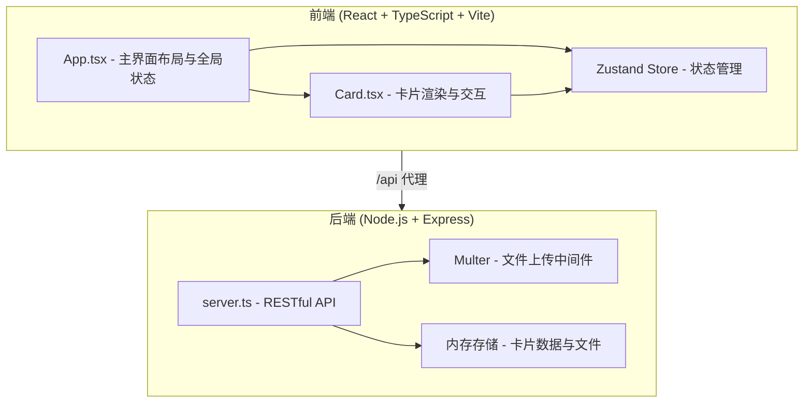
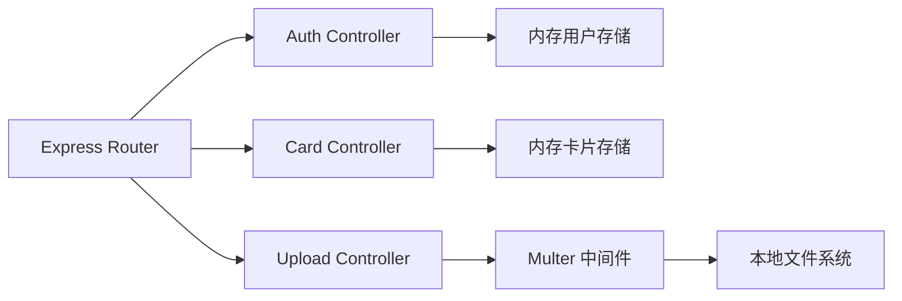
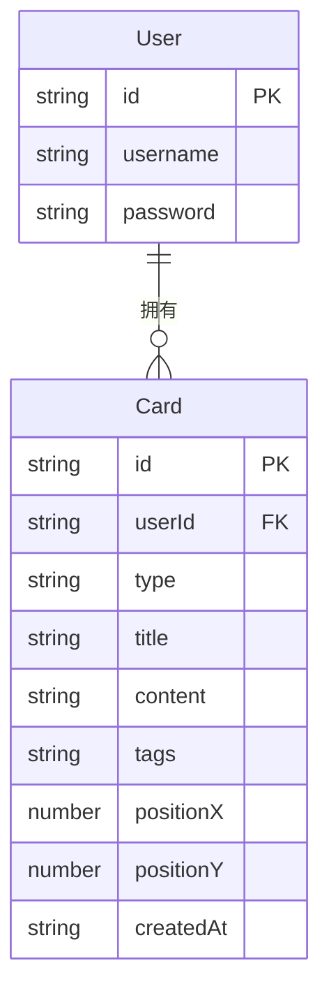

## 1. 架构设计



## 2. 技术说明

- 前端：React@18 + TypeScript + Vite
- 初始化工具：vite-init (react-express-ts 模板)
- 后端：Express + TypeScript（ESM格式）
- 数据库：无，使用内存存储（Map结构）
- 状态管理：Zustand
- 文件上传：Multer（处理音频和图片）
- ID生成：uuid

## 3. 路由定义

| 路由 | 用途 |
|------|------|
| / | 档案室主界面（含登录/注册） |

## 4. API定义

### 4.1 认证相关

```typescript
interface User {
  id: string;
  username: string;
  password: string;
}

POST /api/auth/register
  Request: { username: string; password: string }
  Response: { user: { id: string; username: string }; token: string }

POST /api/auth/login
  Request: { username: string; password: string }
  Response: { user: { id: string; username: string }; token: string }
```

### 4.2 卡片相关

```typescript
interface Card {
  id: string;
  userId: string;
  type: "image" | "text" | "audio";
  title: string;
  content: string;
  tags: string[];
  positionX: number;
  positionY: number;
  createdAt: string;
}

GET /api/cards?userId=&tag=&sort=
  Response: Card[]

POST /api/cards
  Request: Omit<Card, "id" | "createdAt">
  Response: Card

PUT /api/cards/:id
  Request: Partial<Card>
  Response: Card

DELETE /api/cards/:id
  Response: { success: boolean }

POST /api/cards/:id/upload
  Request: FormData (file field)
  Response: { url: string }
```

### 4.3 标签相关

```typescript
GET /api/tags?userId=
  Response: string[]
```

## 5. 服务器架构图



## 6. 数据模型

### 6.1 数据模型定义



### 6.2 数据存储

- 用户数据：`Map<string, User>` 内存存储
- 卡片数据：`Map<string, Card>` 内存存储
- 上传文件：存储在本地 `uploads/` 目录
