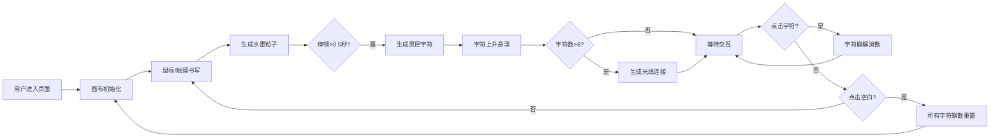

## 1. 产品概述

墨羽·灵犀笺是一款基于Canvas的互动数字书法艺术应用，将传统水墨书法与现代光影粒子效果相结合。用户在宣纸上书写时，墨迹会化作发光的灵犀字符，如羽毛般飘舞，形成不断演化的动态诗篇。

- **核心价值**：传统书法与数字艺术的创新融合，打造沉浸式的书写禅意体验
- **目标用户**：书法爱好者、艺术创作者、追求沉浸式体验的用户

## 2. 核心功能

### 2.1 功能模块

1. **书写画布**：全屏宣纸纹理画布，支持鼠标/触摸书写
2. **水墨粒子系统**：流动的墨色粒子，带金色光晕和渐隐拖尾
3. **灵犀字符生成**：书写完成后自动转化为发光粒子字符，悬浮上升
4. **光线连接系统**：字符间自动生成脉动光线连接
5. **交互反馈**：点击字符崩解、点击空白飘散重置

### 2.2 功能详情

| 模块名称 | 功能描述 | 关键参数 |
|---------|---------|---------|
| 书写画布 | 全屏宣纸纹理背景，磨砂玻璃质感 | 最小800x600px，暖灰渐变#f5f0e8到#e8ddd0，backdrop-filter: blur(2px) |
| 水墨粒子 | 鼠标划过时生成流动墨色粒子 | 直径3-6px随机，透明度0.6-1.0，金色光晕#d4a373，拖尾20-40px，持续1.2秒 |
| 灵犀字符 | 书写停顿0.5秒后生成发光粒子字符 | 尺寸48-64px，上升速度2px/s，旋转0.5度/s，荧光尾迹#d4a373→#f72585，悬浮高度100-400px |
| 光线连接 | 超过8个字符时自动生成连接光线 | 距离<80px触发，线宽1-2px，透明度0.3-0.6，脉动周期2秒 |
| 字符崩解 | 点击字符后飘散为光点 | 20-30个光点，大小1-3px，颜色#f72585，持续1.5秒，扩散半径50-80px |
| 飘散重置 | 点击空白区域所有字符飞走 | 类似蝴蝶飘散，路径随机，持续3秒 |

## 3. 核心流程

## 4. 用户界面设计

### 4.1 设计风格

- **主色调**：暖金色(#d4a373)到淡粉色(#f72585)的低饱和度渐变
- **背景**：宣纸纹理暖灰渐变(#f5f0e8 → #e8ddd0)，叠加磨砂玻璃效果
- **字体**：书法风格字体，体现传统艺术气质
- **动效**：所有交互使用ease-out缓动，平滑自然
- **光标**：书写时显示发光毛笔图标

### 4.2 页面设计

| 页面 | 模块 | UI元素 |
|------|------|--------|
| 主画布 | 背景层 | 宣纸纹理、磨砂玻璃质感、暖灰渐变 |
| 主画布 | 书写层 | 水墨粒子、金色光晕、渐隐拖尾 |
| 主画布 | 字符层 | 发光灵犀字符、荧光尾迹、缓慢旋转上升 |
| 主画布 | 连接层 | 半透明光线、呼吸脉动效果 |
| 主画布 | 交互层 | 字符点击崩解、空白点击飘散 |

### 4.3 响应式设计

- **桌面端(1920x1080 / 1280x720)**：全屏画布，完整显示所有效果
- **移动端(375x667)**：竖屏模式，书写区域为视口宽度90%，动画速度减半
- **最低尺寸**：800x600px

### 4.4 性能要求

- 书写时FPS ≥ 50
- 15个灵犀字符同时悬浮时FPS ≥ 40
- 粒子系统优化，避免内存泄漏
