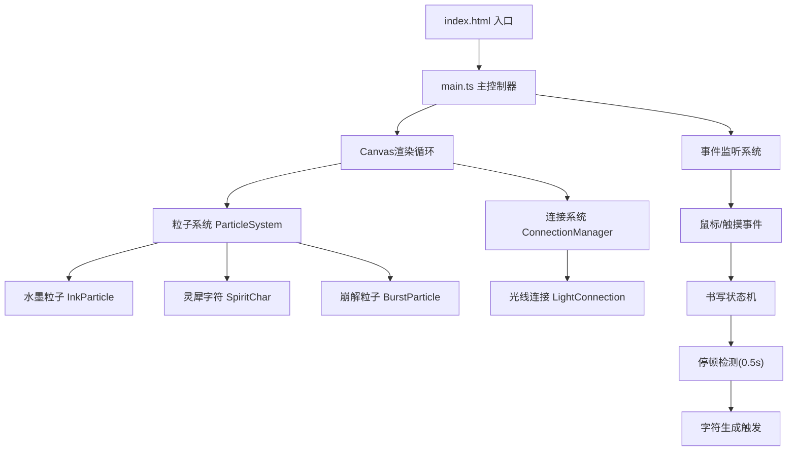

## 1. 架构设计



## 2. 技术描述

- **前端框架**：原生 TypeScript + Canvas 2D API
- **构建工具**：Vite 5.x
- **动画库**：GSAP (用于复杂缓动动画)
- **语言**：TypeScript 5.x (严格模式)
- **模块系统**：ES Modules
- **无后端**：纯前端静态应用

## 3. 文件结构

| 文件 | 职责 |
|------|------|
| `package.json` | 项目依赖和脚本配置 |
| `vite.config.js` | Vite构建配置 |
| `tsconfig.json` | TypeScript编译配置 |
| `index.html` | 入口HTML页面 |
| `src/main.ts` | 应用入口，Canvas初始化，事件管理，主循环 |
| `src/particle.ts` | 粒子系统：水墨粒子、灵犀字符、崩解粒子 |
| `src/connection.ts` | 光线连接系统：字符间连接线、脉动动画 |

## 4. 核心类定义

### 4.1 粒子系统 (particle.ts)

```typescript
interface InkParticle {
  x: number;
  y: number;
  vx: number;
  vy: number;
  radius: number;       // 3-6px 随机
  alpha: number;        // 0.6-1.0
  life: number;         // 剩余生命
  maxLife: number;      // 总寿命(1.2秒)
  glowColor: string;    // #d4a373 金色光晕
  tail: TrailPoint[];   // 拖尾点数组
}

interface SpiritChar {
  id: string;
  char: string;         // 识别的汉字
  x: number;
  y: number;
  targetY: number;      // 目标悬浮高度
  size: number;         // 48-64px
  rotation: number;     // 当前旋转角度
  rotationSpeed: number;// 0.5度/秒
  riseSpeed: number;    // 2px/秒
  alpha: number;
  particles: CharParticle[]; // 组成字符的粒子
  trail: TrailPoint[];  // 荧光尾迹
  isFloating: boolean;  // 是否已到达悬浮位置
  isDispersing: boolean;// 是否正在飘散
  dispersionProgress: number;
}

interface BurstParticle {
  x: number;
  y: number;
  vx: number;
  vy: number;
  radius: number;       // 1-3px
  alpha: number;
  life: number;
  maxLife: number;      // 1.5秒
  color: string;        // #f72585
}
```

### 4.2 连接系统 (connection.ts)

```typescript
interface LightConnection {
  charA: string;        // 字符A id
  charB: string;        // 字符B id
  alpha: number;        // 0.3-0.6
  pulsePhase: number;   // 脉动相位
  pulseSpeed: number;   // 脉动速度(周期2秒)
  lineWidth: number;    // 1-2px
}

class ConnectionManager {
  connections: LightConnection[];
  threshold: number;    // 80px 距离阈值
  minCharCount: number; // 8个字符触发
  
  update(chars: SpiritChar[], delta: number): void;
  draw(ctx: CanvasRenderingContext2D): void;
}
```

### 4.3 主控制器 (main.ts)

```typescript
class InkFeatherApp {
  canvas: HTMLCanvasElement;
  ctx: CanvasRenderingContext2D;
  width: number;
  height: number;
  isWriting: boolean;
  lastWriteTime: number;
  writeStrokes: {x: number, y: number}[];
  particleSystem: ParticleSystem;
  connectionManager: ConnectionManager;
  animationId: number;
  lastTime: number;
  
  init(): void;
  setupEventListeners(): void;
  resize(): void;
  update(delta: number): void;
  draw(): void;
  loop(time: number): void;
  checkWritingPause(): void;
  createSpiritChar(): void;
  handleClick(x: number, y: number): void;
  disperseAll(): void;
}
```

## 5. 性能优化策略

1. **对象池模式**：复用粒子对象，避免频繁GC
2. **离屏Canvas**：预渲染字符纹理
3. **分层渲染**：背景、粒子、字符、连接线分层处理
4. **帧率控制**：使用requestAnimationFrame，DeltaTime计算
5. **粒子数量限制**：最大粒子数上限，动态调整
6. **距离剔除**：视口外的粒子跳过渲染

## 6. 响应式适配

- 使用window.innerWidth/innerHeight设置Canvas尺寸
- 监听resize事件，动态调整画布
- 移动端检测：navigator.userAgent / matchMedia
- 移动端参数缩放：动画速度减半，粒子数量调整
- 触摸事件支持：touchstart/touchmove/touchend
