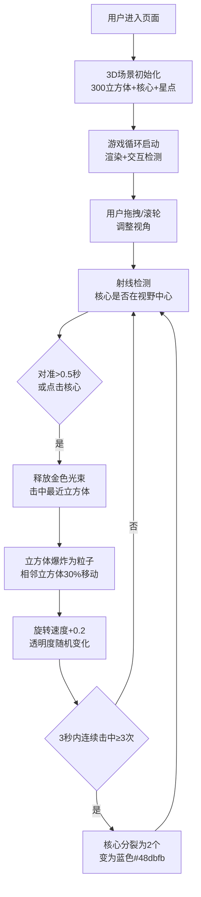

## 1. 产品概述

"晶格·星尘迷宫"是一款基于WebGL的3D互动探索应用，用户通过鼠标拖拽和滚轮缩放，在虚拟3D空间中探索由数百个发光立方体构成的迷宫，寻找隐藏的发光核心并与之互动，改变迷宫结构。

- **核心价值**：提供沉浸式的3D探索体验，解决用户无法在网页中获得立体网格迷宫漫游、寻找隐藏光源并互动的问题
- **目标用户**：喜欢互动艺术、3D视觉体验的网络用户

## 2. 核心功能

### 2.1 功能模块

1. **3D迷宫场景**：300个半透明发光立方体构成的正四面体网格结构，整体缓慢旋转
2. **发光核心系统**：可交互的发光核心，支持视角对准触发、点击触发、光束释放、分裂机制
3. **粒子效果系统**：立方体爆炸产生的碎片粒子动画
4. **用户交互系统**：鼠标拖拽旋转视角、滚轮缩放、核心悬停/点击反馈
5. **信息面板**：左上角显示FPS帧率和核心探索次数
6. **背景氛围系统**：深空渐变背景、150颗脉动星点

### 2.2 功能详情

| 模块名称 | 功能描述 | 技术要点 |
|---------|---------|---------|
| 迷宫网格 | 300个边长0.5-1.2随机的发光立方体，颜色从6种主题色随机选取，透明度0.5-0.8，正四面体网格排列 | Three.js InstancedMesh/Group，发光材质，动态属性管理 |
| 核心交互 | 拳头大小发光核心（半径1.5），颜色脉冲#fff→#ff6b6b，周期2秒；视角对准0.5秒触发光束；3秒内连续击中3次分裂为2个蓝色核心 | 射线检测，计时器，颜色插值，状态机 |
| 光束效果 | 金色光束（#ffd700）从核心射向最近立方体，目标立方体变色后爆炸消失；相邻立方体30%概率变亮并向核心移动 | Line几何体，透明度渐变，gsap动画 |
| 粒子爆炸 | 每个立方体爆炸产生10个碎片粒子，直径0.2-0.5，持续1秒后消失 | BufferGeometry，Points材质，gsap动画 |
| 难度递增 | 每次光束释放后旋转速度+0.2°/秒（上限3°），立方体透明度随机变化0.3-0.9 | 状态累积，随机数生成 |
| 相机控制 | 鼠标拖拽OrbitControls旋转，滚轮缩放范围1-15单位 | Three.js OrbitControls |
| HUD面板 | 左上角半透明面板显示FPS和探索次数 | DOM覆盖层，requestAnimationFrame计算 |

## 3. 核心流程

## 4. 用户界面设计

### 4.1 设计风格

- **视觉风格**：发光赛博朋克风格，深空背景衬托霓虹发光体
- **主色调**：深空渐变背景 #0f0c29 → #302b63 → #24243e
- **立方体颜色**：#ff6b6b（红）、#48dbfb（蓝）、#feca57（黄）、#ff9ff3（粉）、#54a0ff（浅蓝）、#a29bfe（紫）
- **光束颜色**：金色#ffd700（初始）、蓝色#48dbfb（分裂后）
- **发光效果**：glow强度1-2单位，颜色随立方体变化
- **面板样式**：背景rgba(255,255,255,0.1)，圆角8px，边框1px #ffffff33

### 4.2 页面设计

| 区域 | 模块 | UI元素 |
|-----|-----|-------|
| 全屏 | 3D视口 | 立方体网格、发光核心、光束、粒子、星点 |
| 左上角 | HUD面板 | FPS帧率（实时更新）、核心探索次数计数 |
| 无 | 其他UI | 无其他UI元素遮挡，纯沉浸体验 |

### 4.3 响应式设计

- **桌面优先**：全屏适配，最小800x600px
- **比例支持**：16:9和4:3屏幕比例自适应
- **视口变化**：窗口resize时重新计算立方体间距和核心位置

### 4.4 3D场景设计

- **环境**：深空渐变背景，无HDRI，纯颜色渐变营造宇宙氛围
- **光照**：
  - AmbientLight 环境光 0.3强度
  - PointLight 点光源跟随核心，强度2.0
  - 自发光材质 emissive 配合 bloom 后处理
- **相机**：PerspectiveCamera，fov 75，初始距离10单位，OrbitControls无平移
- **后处理**：UnrealBloomPass 实现发光效果，强度1.5，阈值0.1
- **性能预算**：1920x1080下FPS ≥ 30，300立方体+150星点+粒子系统

## 5. 性能要求

- **目标帧率**：1920x1080分辨率下稳定30FPS以上
- **优化策略**：
  - 使用InstancedMesh批量渲染立方体
  - 粒子使用BufferGeometry + Points
  - 后处理bloom优化参数
  - 合理的requestAnimationFrame逻辑
- **浏览器支持**：现代浏览器（Chrome/Firefox/Safari/Edge）支持WebGL
