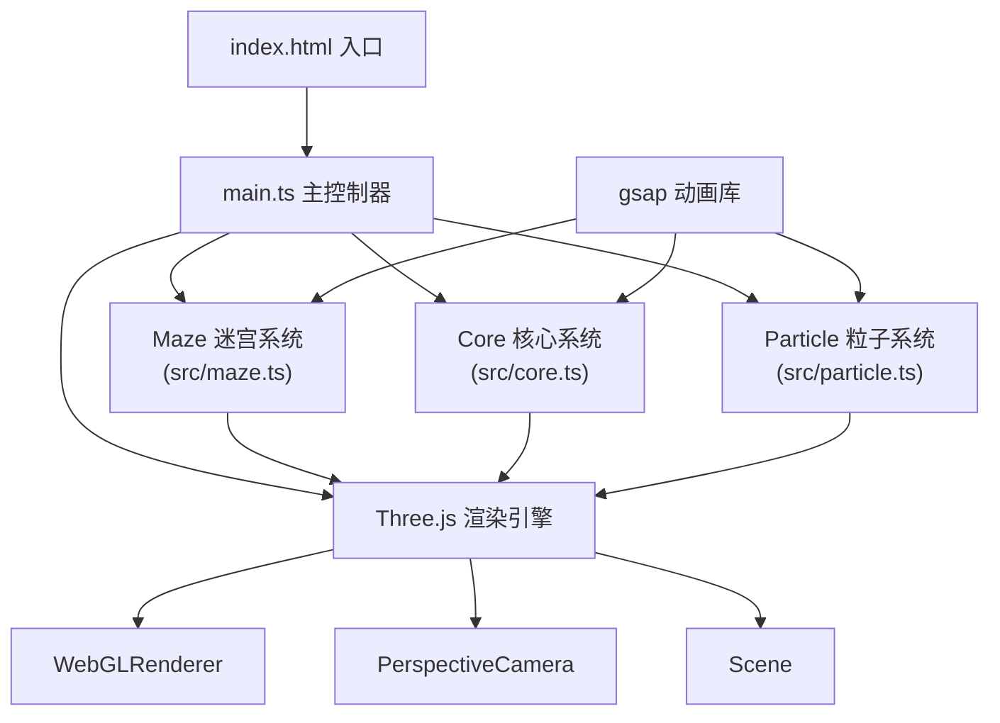

## 1. 架构设计



## 2. 技术选型

- **前端框架**：原生TypeScript + Three.js 0.160.0（无React/Vue，纯3D场景）
- **构建工具**：Vite 5.x
- **动画库**：gsap 3.x
- **类型定义**：@types/three 0.160.0
- **开发语言**：TypeScript 5.x 严格模式

## 3. 目录结构

```
.
├── index.html                 # 入口HTML
├── package.json               # 依赖配置
├── vite.config.js             # Vite配置
├── tsconfig.json              # TypeScript配置
└── src/
    ├── main.ts                # 主入口：场景初始化、游戏循环、事件绑定
    ├── maze.ts                # 迷宫系统：立方体格网、爆炸、移动逻辑
    ├── core.ts                # 核心系统：发光核心、光束、分裂逻辑
    └── particle.ts            # 粒子系统：爆炸碎片生成与动画
```

## 4. 模块设计

### 4.1 main.ts - 主控制器

**职责**：
- 初始化Three.js场景、相机、渲染器、后处理
- 管理OrbitControls相机控制
- 实现游戏主循环（requestAnimationFrame）
- 绑定鼠标事件（拖拽、滚轮、点击、悬停）
- 调用Maze/Core/Particle各模块更新
- 实现FPS计算和HUD更新

**核心接口**：
```typescript
class Game {
  constructor()
  init(): Promise<void>
  animate(): void
  onMouseMove(event: MouseEvent): void
  onClick(event: MouseEvent): void
  onResize(): void
  calculateFPS(): number
}
```

### 4.2 maze.ts - 迷宫系统

**职责**：
- 生成300个立方体的正四面体网格
- 管理立方体的位置、颜色、透明度、发光强度
- 提供立方体爆炸方法
- 提供立方体向核心移动方法
- 管理立方体网格的整体旋转

**核心接口**：
```typescript
class Maze {
  cubes: Cube[]
  group: THREE.Group
  rotationSpeed: number
  
  constructor(scene: THREE.Scene)
  generateGrid(): void
  getNearestCube(position: THREE.Vector3): Cube | null
  explodeCube(cube: Cube): void
  moveCubeToCore(cube: Cube, corePosition: THREE.Vector3): void
  getAdjacentCubes(cube: Cube): Cube[]
  randomizeOpacity(): void
  updateRotation(delta: number): void
  dispose(): void
}

interface Cube {
  mesh: THREE.Mesh
  originalPosition: THREE.Vector3
  color: string
  opacity: number
  size: number
  isMoving: boolean
  targetPosition: THREE.Vector3 | null
}
```

### 4.3 core.ts - 核心系统

**职责**：
- 管理发光核心的位置、颜色脉冲动画
- 处理视角对准检测（0.5秒阈值）
- 释放光束击中最近立方体
- 核心膨胀动画
- 核心分裂逻辑（连续3次击中后）
- 管理核心数量和颜色状态

**核心接口**：
```typescript
class CoreSystem {
  cores: Core[]
  beam: THREE.Line | null
  hitCount: number
  lastHitTime: number
  
  constructor(scene: THREE.Scene)
  update(camera: THREE.Camera, maze: Maze, delta: number): void
  checkAlignment(camera: THREE.Camera, core: Core): boolean
  releaseBeam(core: Core, targetCube: Cube): void
  triggerSplit(): void
  pulseAnimation(delta: number): void
  isHoveringCore(event: MouseEvent, camera: THREE.Camera): Core | null
  dispose(): void
}

interface Core {
  mesh: THREE.Mesh
  position: THREE.Vector3
  color: string
  isSplit: boolean
  alignmentTime: number
  isPulsing: boolean
}
```

### 4.4 particle.ts - 粒子系统

**职责**：
- 管理所有活跃的爆炸粒子
- 为立方体爆炸创建10个碎片粒子
- 使用gsap实现粒子动画（缩放、透明度、位置偏移）
- 清理过期粒子

**核心接口**：
```typescript
class ParticleSystem {
  particles: Particle[]
  scene: THREE.Scene
  
  constructor(scene: THREE.Scene)
  createExplosion(position: THREE.Vector3, color: string): void
  update(delta: number): void
  removeParticle(particle: Particle): void
  dispose(): void
}

interface Particle {
  mesh: THREE.Mesh
  velocity: THREE.Vector3
  lifetime: number
  maxLifetime: number
}
```

## 5. 关键算法

### 5.1 正四面体网格生成
```
网格大小：约8x8x8单位空间
立方体间距：1.5单位
填充率：约60%（300个）
位置计算：基于正四面体晶格坐标转换
```

### 5.2 视角对准检测
```
核心→相机向量与相机前方向量点积 > 0.95
持续时间 > 500ms
触发：releaseBeam()
```

### 5.3 相邻立方体查找
```
距离阈值：2.0单位内
遍历所有立方体
欧氏距离计算
返回距离 < 阈值的立方体列表
```

## 6. 后处理配置

```
EffectComposer
├── RenderPass (场景渲染)
└── UnrealBloomPass
    ├── strength: 1.5
    ├── radius: 0.5
    └── threshold: 0.1
```

## 7. 性能优化策略

1. **InstancedMesh**：使用实例化网格渲染300个立方体，减少draw call
2. **BufferGeometry**：粒子使用BufferGeometry批量渲染
3. **材质复用**：相同颜色的立方体共享材质实例
4. **动画合并**：使用gsap的timeline批量管理动画
5. **按需更新**：仅状态变化时更新立方体矩阵
6. **FPS自适应**：根据性能动态调整粒子数量

## 8. 构建配置

### vite.config.js
```javascript
export default {
  root: '.',
  server: {
    port: 5173,
    open: true
  },
  build: {
    target: 'es2020',
    sourcemap: true
  }
}
```

### tsconfig.json
```json
{
  "compilerOptions": {
    "target": "ES2020",
    "module": "ESNext",
    "strict": true,
    "moduleResolution": "node",
    "esModuleInterop": true,
    "skipLibCheck": true,
    "forceConsistentCasingInFileNames": true
  },
  "include": ["src/**/*"]
}
```
