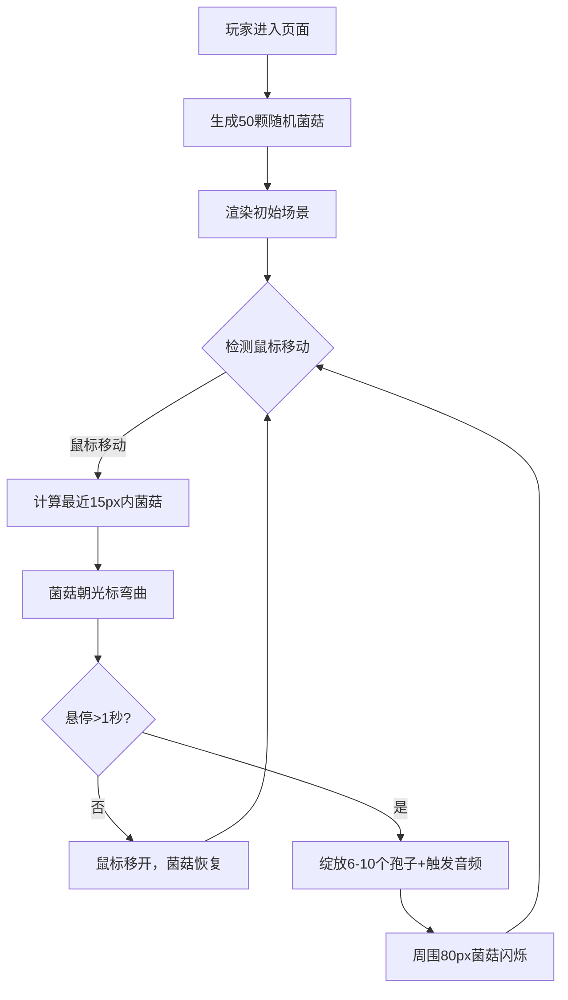

## 1. 产品概述

「菌隙·荧光丛林」是一款基于浏览器的沉浸式互动视觉体验游戏，为数字植物学家和艺术爱好者打造。玩家通过鼠标与虚拟发光真菌森林互动，观察菌菇的生长、扭曲与绽放，感受黑暗中微弱冷光营造的神秘氛围。

- 核心目的：提供纯粹的视觉疗愈体验，让用户通过简单的鼠标交互探索虚拟生物群落
- 目标用户：数字艺术爱好者、植物学爱好者、追求放松疗愈的浏览器用户
- 产品价值：在纯黑背景中打造沉浸式发光生态，用细腻的动画和音效反馈创造独特的交互艺术体验

## 2. 核心 Features

### 2.1 功能模块

1. **主页（唯一页面）**：全屏Canvas渲染场景、菌菇生长动画系统、脉冲光孢子粒子系统、音频反馈系统、聚光交互反馈系统

### 2.2 页面详情

| 页面名称 | 模块名称 | Feature 描述 |
|-----------|-------------|---------------------|
| 主页 | 菌菇生成与生长 | 50颗菌菇随机分布，菌柄30-60px，鼠标靠近时最近菌菇弯曲30度生长，移开后恢复原状 |
| 主页 | 脉冲光孢子绽放 | 鼠标悬停菌菇1秒以上触发6-10个光孢子飞散，同步触发高频音 |
| 主页 | 菌群颜色渐变 | 左侧蓝色(#54a0ff)过渡至右侧粉色(#ff9ff3)，绽放触发周围80px内相邻菌菇闪烁 |
| 主页 | 交互聚光效果 | 光标上方20px处半透明白色光晕，悬停菌菇时光晕变色，菌菇高亮 |
| 主页 | 性能与响应式 | 50FPS+稳定帧率，对象池管理，Canvas自适应窗口，resize时保持相对位置重分布 |

## 3. 核心流程

玩家进入页面后，场景自动生成50颗随机分布的发光菌菇。鼠标缓慢移动时，距离最近的菌菇感知并朝光标方向弯曲生长。若鼠标停留在菌菇上方超过1秒，菌菇绽放脉冲光孢子并播放高频音色，同时触发周围相邻菌菇的闪烁反馈。整个交互循环持续进行，无胜负条件，旨在创造沉浸式疗愈体验。

## 4. 用户界面设计

### 4.1 设计风格

- **主色调**：纯黑色背景(#000000)，菌菇发光色左蓝(#54a0ff)右粉(#ff9ff3)渐变，孢子色(#ff6b6b、#48dbfb、#feca57、#ff9ff3)
- **视觉风格**：黑暗中发光生物群落，通过Canvas shadowBlur(15-25px)和globalCompositeOperation='lighter'实现强发光感
- **字体**：无UI文字，纯视觉交互
- **布局**：全屏无边界场景，菌菇随机分布于整个视口
- **图标**：无图标元素，所有视觉反馈通过菌菇动画形态呈现

### 4.2 页面设计概览

| 页面名称 | 模块名称 | UI 元素 |
|-----------|-------------|-------------|
| 主页 | 场景渲染 | 纯黑背景，Canvas全屏，发光菌菇含菌柄+菌盖斑点+底部光晕 |
| 主页 | 菌菇动画 | 弯曲生长(0.5s)，长度增加10px，菌盖脉冲放大 |
| 主页 | 孢子粒子 | 6-10个圆形孢子，随机方向飞散60-100px，1.5s淡出 |
| 主页 | 聚光光圈 | 鼠标上方20px固定40px直径光晕，透明度0.2，悬停变色 |

### 4.3 响应式

- **适配策略**：桌面优先，Canvas尺寸实时匹配window.innerWidth/innerHeight
- **最小适配**：800x600px视口仍保持50颗菌菇可见
- **最大适配**：4K显示器自适应，菌菇相对位置不变，缩放从1200x800基准计算
- **Resize处理**：窗口尺寸变化时，菌菇按相对位置比例重新分布，避免超出边界

### 4.4 音效设计

- 孢子绽放触发Tone.js合成高频音(1200-1800Hz随机，0.2秒短促)
- 音高与菌菇位置关联，左侧音高略低，右侧略高，创造空间感
