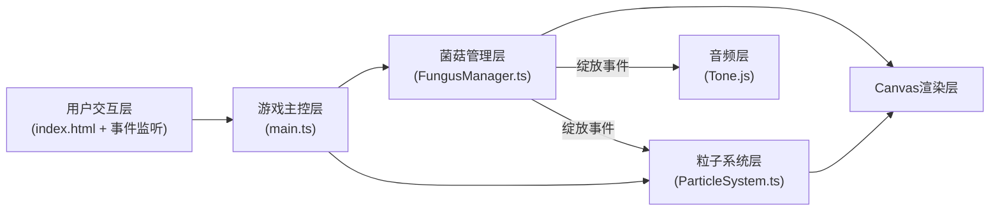

## 1. 架构设计

本项目为纯前端Canvas游戏，采用模块化分层架构，各模块职责明确，数据单向流动，确保性能与可维护性。



**调用关系与数据流向：**
- index.html → 加载main.ts，挂载Canvas元素
- main.ts → 绑定鼠标/窗口事件 → 每帧调用FungusManager.update()和ParticleSystem.update() → 执行渲染
- main.ts 鼠标位置 → FungusManager.handleMouseMove(x, y) → 更新菌菇弯曲/悬停逻辑
- FungusManager → 检测悬停超时 → emitBloomEvent → ParticleSystem.emit() + Tone.js播放音效
- FungusManager.update() → 返回菌菇渲染数据数组 → main.ts渲染至Canvas
- ParticleSystem.update() → 返回粒子渲染数据数组 → main.ts渲染至Canvas

## 2. 技术说明

| 分类 | 技术选择 | 版本 | 用途 |
|------|---------|------|------|
| 构建工具 | Vite | ^5.0 | 极速开发服务器与ES模块打包 |
| 语言 | TypeScript | ^5.3 | 类型安全的JavaScript开发 |
| 动画补间 | GSAP | ^3.12 | 菌菇弯曲/脉冲/闪烁的平滑插值 |
| 音频合成 | Tone.js | ^14.8 | Web Audio API封装，生成孢子绽放高频音 |
| 渲染 | Canvas 2D API | 原生 | 高性能逐帧绘制发光菌菇与粒子 |
| 计时 | requestAnimationFrame | 原生 | 稳定游戏循环，自动适配显示器刷新率 |

**初始化方式**：手写配置文件（package.json、vite.config.js、tsconfig.json），无需脚手架。

## 3. 模块定义

### 3.1 文件结构

| 文件路径 | 职责说明 | 对外暴露 |
|---------|---------|---------|
| `package.json` | 项目元信息、依赖声明、npm脚本(dev) | - |
| `vite.config.js` | Vite构建配置、入口指向index.html | - |
| `tsconfig.json` | TypeScript严格模式配置、ES模块目标 | - |
| `index.html` | 入口HTML、全屏Canvas挂载点、黑色背景 | - |
| `src/main.ts` | 游戏循环调度、Canvas上下文管理、事件绑定、最终渲染调度 | - |
| `src/FungusManager.ts` | 菌菇对象池、生命周期、生长弯曲、碰撞检测、绽放事件 | FungusManager类 |
| `src/ParticleSystem.ts` | 孢子对象池、运动计算、淡出逻辑、粒子上限控制 | ParticleSystem类 |

### 3.2 接口定义

**FungusManager 公共接口：**

```typescript
class FungusManager {
  constructor(canvasWidth: number, canvasHeight: number);
  handleMouseMove(x: number, y: number): { hoveredFungusId: number | null };
  update(deltaTime: number): FungusRenderData[];
  onBloom(callback: (event: BloomEvent) => void): void;
  resize(newWidth: number, newHeight: number): void;
}

interface FungusRenderData {
  id: number;
  baseX: number;
  baseY: number;
  stemLength: number;
  stemWidth: number;
  currentAngle: number;       // 弯曲角度(弧度)，0为垂直向上
  capScale: number;           // 菌盖缩放，脉冲时变化
  baseColor: string;          // 渐变计算后的颜色
  brightness: number;         // 0.2~1.3，闪烁时提升
  spots: { offsetX: number; offsetY: number; radius: number }[];
  highlight: boolean;         // 悬停时高亮边框
}

interface BloomEvent {
  x: number;       // 绽放世界坐标(菌盖中心)
  y: number;
  color: string;   // 菌菇基础色，用于光晕变色
}
```

**ParticleSystem 公共接口：**

```typescript
class ParticleSystem {
  constructor(maxParticles: number = 200);
  emit(x: number, y: number, count: number): void;
  update(deltaTime: number): ParticleRenderData[];
}

interface ParticleRenderData {
  x: number;
  y: number;
  radius: number;
  color: string;
  alpha: number;   // 0~1，随时间衰减
}
```

## 4. 核心算法

### 4.1 菌菇弯曲生长

- 使用GSAP的to()方法，duration=0.5秒，ease='power2.out'
- 每帧根据鼠标位置遍历最近15px内的菌菇，距离越近弯曲目标角度越大(最大30°)
- 弯曲恢复使用相同GSAP补间，duration=0.5秒回到0°
- 菌柄长度生长：GSAP从baseLength过渡到baseLength+10px，与弯曲同步

### 4.2 悬停绽放检测

- 鼠标移动时FungusManager记录每个菌菇的hoverStartTime
- 每帧update中检查当前时间 - hoverStartTime > 1000ms
- 触发绽放后重置hoverStartTime，避免连续触发
- 每个菌菇有bloomCooldown(2000ms)，冷却期内不重复绽放

### 4.3 相邻菌菇闪烁

- 绽放时遍历所有菌菇，计算欧氏距离 < 80px的邻居
- 邻居菌菇的brightness属性用GSAP从1.0提升到1.3，duration=0.15s，再回落至1.0
- 邻居菌菇的currentAngle微微抖动±5°，同样使用GSAP补间

### 4.4 粒子运动(一次性缓存)

- emit()时对每个孢子预计算：vx, vy(单位向量×速度), 起始pos, 总寿命(1.5s), 颜色
- update()中不再做三角函数运算，仅按deltaTime累加x += vx * dt，alpha = 1 - (age / lifespan)
- 粒子超过maxParticles时，复用最早的死亡粒子或丢弃新粒子（不强制覆盖活跃粒子）

### 4.5 对象池策略

- **菌菇池**：固定50个Fungus对象，初始化时创建，永不销毁，resize仅更新baseX/baseY相对比例
- **粒子池**：预分配200个Particle对象槽位，含active标志位，emit时查找第一个非活跃槽位

### 4.6 颜色渐变算法

- 基于菌菇baseX/canvasWidth计算t∈[0,1]
- 使用线性插值：`lerpColor(#54a0ff, #ff9ff3, t)`
- RGB通道分别插值，转换为hex字符串

## 5. 性能约束实现

| 约束指标 | 实现方式 |
|---------|---------|
| FPS≥50 | requestAnimationFrame驱动，渲染逻辑分阶段，粒子更新用缓存向量 |
| 粒子≤200 | ParticleSystem池上限200，emit前检查活跃计数 |
| 鼠标距离运算优化 | 仅对baseX在mouseX±15px，baseY在mouseY±15px内的菌菇做精确距离计算(空间哈希粗略筛选) |
| 避免GC抖动 | 对象池复用，update循环不创建新对象/数组，预分配结果数组复用 |
| 发光渲染优化 | 所有发光菌菇和粒子统一在globalCompositeOperation='lighter'的单次pass中绘制 |

## 6. 响应式Resize实现

```
resize(newW, newH):
  for each fungus in pool:
    ratioX = fungus.relX   // 保存的相对比例0~1
    ratioY = fungus.relY
    fungus.baseX = ratioX * newW
    fungus.baseY = ratioY * newH
```

- 初始化时除baseX/baseY外，同时存relX=baseX/initialW, relY=baseY/initialH
- 保证窗口变化时菌菇相对位置不变，不会溢出边界

## 7. 渲染分层

Canvas单缓冲，每帧按以下顺序绘制（均使用globalCompositeOperation='lighter'叠加）：

1. 填充纯黑背景（非lighter模式，source-over正常覆盖）
2. 切换为'lighter'模式
3. 绘制每颗菌菇底部模糊光晕(shadowBlur=30, alpha=0.2)
4. 绘制每颗菌菇菌柄(shadowBlur=20)
5. 绘制每颗菌菇菌盖及斑点(shadowBlur=25)
6. 绘制高亮边框(仅hovered菌菇，shadowBlur=15, alpha=0.8)
7. 绘制所有孢子粒子(shadowBlur=15)
8. 切换为'source-over'，绘制鼠标光晕（避免与场景叠加过曝）
