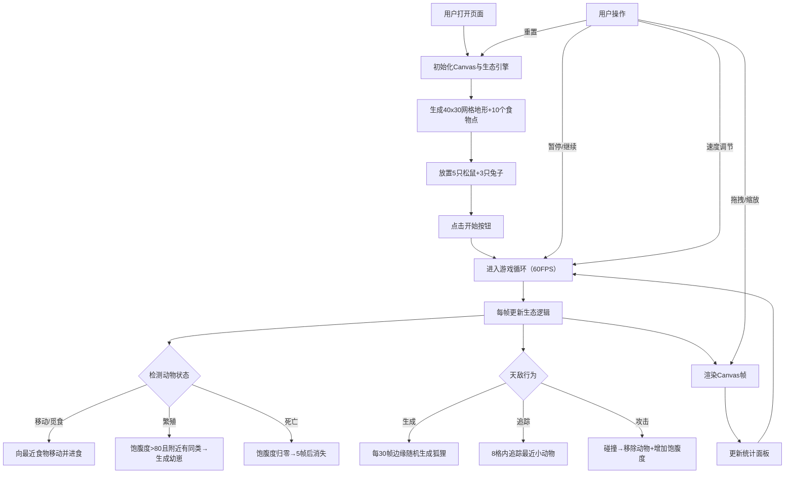

## 1. 产品概述

森林生态模拟器是一款基于网格的轻量级生存模拟游戏，用于教学演示森林生态系统中小型动物（松鼠、兔子）的觅食、躲避天敌与繁衍行为，直观展现物种间的互动关系。

- 核心目的：为博物学家和教育工作者提供可视化的生态教学工具
- 目标用户：教师、学生、博物学爱好者
- 产品价值：通过交互式模拟让抽象的生态概念变得生动可观测

## 2. 核心功能

### 2.1 用户角色
| 角色 | 注册方式 | 核心权限 |
|------|----------|----------|
| 访客用户 | 无需注册 | 运行模拟、调节参数、观察生态行为 |

### 2.2 功能模块
1. **主模拟界面**：Canvas渲染的40x30网格森林地图，包含动物、食物资源、天敌
2. **实时统计面板**：右上角显示动物数量、食物总量、模拟时间
3. **控制面板**：左下角的开始/暂停、重置、速度调节按钮
4. **视口交互**：鼠标中键拖拽平移、滚轮缩放（0.5x-3x）

### 2.3 页面详情
| 页面名称 | 模块名称 | 功能描述 |
|----------|----------|----------|
| 主页面 | 网格地图 | 40x30无缝衔接网格，随机草丛密度，10个食物资源点 |
| 主页面 | 动物系统 | 松鼠（快速/少食量）、兔子（慢速/快繁殖）、幼崽生成、死亡机制 |
| 主页面 | 天敌系统 | 狐狸每30帧从边缘生成，8格内追踪小动物，饱腹度机制 |
| 主页面 | 统计面板 | 松鼠/兔子/狐狸分别计数、总食物量、帧数计时，数值变化颜色闪烁提示 |
| 主页面 | 控制面板 | 播放/暂停切换、重置模拟（淡入动画）、1x/2x/4x速度循环 |
| 主页面 | 视口控制 | 中键拖拽平移、滚轮缩放、元素相对大小保持 |

## 3. 核心流程

## 4. 用户界面设计

### 4.1 设计风格
- **主色调**：深绿色渐变背景（#0a2e1a → #1a4a2e），模拟森林树冠遮光
- **辅助色**：亮绿色（#4ade80）食物资源、橙色（#fb923c）松鼠、白色（#f8fafc）兔子、红色（#ef4444）狐狸
- **按钮风格**：半透明毛玻璃效果（backdrop-blur + rgba背景），圆角8px，悬停背景模糊增强+轻微上浮
- **字体**：无衬线系统字体，标题加粗18px，统计数值14px
- **布局**：全屏Canvas + 固定定位UI面板（右上角统计、左下角控制）
- **动画效果**：食物点脉动发光（6-10px）、动物阴影、狐狸残影（前3帧）、统计数值增减颜色闪烁、重置淡入

### 4.2 页面设计概览
| 页面名称 | 模块名称 | UI元素 |
|----------|----------|----------|
| 主页面 | 背景 | 深绿色径向渐变，低透明度噪点纹理 |
| 主页面 | 网格层 | 40x30白色网格线（opacity 0.1），草丛深浅绿色噪点 |
| 主页面 | 食物资源 | 亮绿色圆形，6-10px脉动，shadow发光效果 |
| 主页面 | 松鼠 | 橙色圆形（半径6px），下方2px半透明黑椭圆阴影 |
| 主页面 | 兔子 | 白色椭圆（8x6px），下方2px半透明黑椭圆阴影 |
| 主页面 | 狐狸 | 红色三角形（10px边长），前3帧位置半透明红色残影 |
| 主页面 | 死亡动物 | 灰色，停止移动，5帧后消失 |
| 主页面 | 统计面板 | 右上角，毛玻璃半透明面板，垂直排列3项统计 |
| 主页面 | 控制按钮组 | 左下角，3个毛玻璃按钮水平排列，图标+文字 |

### 4.3 响应式设计
- Desktop-first设计，全屏Canvas自适应窗口大小
- 视口缩放和拖拽适配所有屏幕尺寸
- 统计面板和控制按钮使用固定定位，不随视口缩放

### 4.4 Canvas渲染优化
- 分层绘制：地形层（静态缓存）→ 资源层 → 动物层 → UI层
- 离屏Canvas缓存静态地形，避免每帧重绘网格
- requestAnimationFrame驱动主循环，deltaTime控制更新频率
- 动物总数<200时确保55-60FPS稳定帧率
