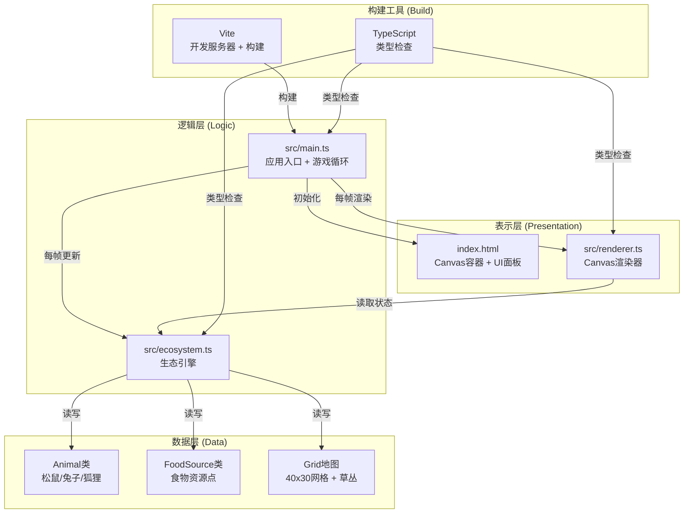

## 1. 架构设计



**数据流向详解：**
1. `main.ts` → 初始化 `Ecosystem`（生态引擎）和 `Renderer`（渲染器）
2. 游戏循环：`main.ts` → 调用 `ecosystem.update()` → 返回状态变更数组
3. `main.ts` → 调用 `renderer.render(ecosystemState)` → 刷新Canvas
4. UI事件：用户按钮/鼠标 → `main.ts`事件处理器 → 调用生态引擎/渲染器API

**文件调用关系：**
```
index.html → 加载 main.ts
main.ts → 导入 ecosystem.ts (Ecosystem类)
main.ts → 导入 renderer.ts (Renderer类)
ecosystem.ts → 纯逻辑模块，无外部UI依赖
renderer.ts → 仅读取Ecosystem公开状态，不修改逻辑
```

## 2. 技术说明

- **前端框架**：原生 TypeScript（无React/Vue）+ HTML5 Canvas 2D
- **构建工具**：Vite 5.x（vanilla-ts模板，无框架预置）
- **语言**：TypeScript 5.x，严格模式（strict: true），ES模块
- **可选依赖**：lodash（仅随机数工具函数，非必须）
- **初始化方式**：`npm create vite@latest . -- --template vanilla-ts`
- **后端**：无后端，纯前端单页应用
- **数据库**：无持久化，所有状态驻留内存

## 3. 项目文件结构

```
auto24/
├── .trae/documents/
│   ├── prd.md                     # 产品需求文档
│   └── technical-architecture.md  # 技术架构文档
├── index.html                     # 入口HTML（Canvas容器 + UI面板）
├── package.json                   # 依赖与脚本配置
├── vite.config.js                 # Vite构建配置
├── tsconfig.json                  # TypeScript严格模式配置
└── src/
    ├── main.ts                    # 应用入口：初始化 + 游戏循环 + UI控制
    ├── ecosystem.ts               # 生态引擎：Animal/FoodSource/Grid逻辑
    └── renderer.ts                # 渲染器：Canvas绘制 + 视口控制
```

## 4. 核心数据模型

### 4.1 类型定义（TypeScript）

```typescript
// 生物类型枚举
enum AnimalType { SQUIRREL = 'squirrel', RABBIT = 'rabbit', FOX = 'fox' }

// 位置坐标（网格坐标，浮点数支持平滑移动）
interface Position { x: number; y: number; }

// 动物基类状态
interface AnimalState {
  id: number;
  type: AnimalType;
  position: Position;        // 网格坐标（0-40, 0-30）
  hunger: number;            // 饱腹度 0-100
  isAlive: boolean;
  deathTimer: number;        // 死亡后帧数计数（0-5）
  lastBreedFrame: number;    // 上次繁殖帧号
  trail: Position[];         // 狐狸残影：前3帧位置
}

// 食物资源状态
interface FoodSourceState {
  id: number;
  position: Position;
  amount: number;            // 当前食物量 0-100
  maxAmount: number;         // 最大容量 100
}

// 网格单元格
interface GridCell {
  density: number;           // 草丛密度 0-1
  noise: number;             // 噪点值 0-1
}

// 生态系统状态快照（供渲染器读取）
interface EcosystemSnapshot {
  frame: number;
  grid: GridCell[][];        // 40x30
  animals: AnimalState[];
  foodSources: FoodSourceState[];
  stats: {
    squirrelCount: number;
    rabbitCount: number;
    foxCount: number;
    totalFood: number;
  };
}
```

### 4.2 核心类定义

**Ecosystem 类（ecosystem.ts）**
```typescript
class Ecosystem {
  static readonly GRID_WIDTH = 40;
  static readonly GRID_HEIGHT = 30;
  static readonly INITIAL_SQUIRRELS = 5;
  static readonly INITIAL_RABBITS = 3;
  static readonly INITIAL_FOOD_SOURCES = 10;
  static readonly FOX_SPAWN_INTERVAL = 30;   // 每30帧
  static readonly FOX_TRACK_RADIUS = 8;      // 追踪半径8格
  static readonly FOX_FULL_HUNGER = 100;
  static readonly BREED_INTERVAL = 30;       // 繁殖冷却帧
  static readonly BREED_HUNGER_THRESHOLD = 80;
  static readonly BREED_NEAR_RADIUS = 5;
  static readonly EAT_RADIUS = 2;
  static readonly FOOD_RECOVERY_RATE = 0.5;  // 每帧恢复量

  private grid: GridCell[][];
  private animals: Animal[];
  private foodSources: FoodSource[];
  private frameCount: number = 0;
  private nextId: number = 1;

  constructor() { this.reset(); }
  reset(): void;                                    // 重置整个生态系统
  update(): void;                                   // 每帧更新逻辑
  getSnapshot(): EcosystemSnapshot;                // 返回只读状态快照
  private generateGrid(): GridCell[][];            // 生成随机地形
  private spawnInitialAnimals(): void;             // 放置初始动物
  private spawnInitialFood(): void;                // 放置初始食物
  private spawnFox(): void;                        // 随机边缘生成狐狸
  private updateAnimal(animal: Animal): void;      // 单只动物更新
  private moveTowardsTarget(a: Animal, target: Position, speed: number): void;
  private wrapPosition(pos: Position): Position;   // 无缝地图坐标卷动
  private findNearestFood(pos: Position): FoodSource | null;
  private findNearestPrey(pos: Position): Animal | null;
  private findNearbySameSpecies(a: Animal): Animal | null;
  private breed(a: Animal): void;                  // 繁殖幼崽
}
```

**Renderer 类（renderer.ts）**
```typescript
class Renderer {
  private canvas: HTMLCanvasElement;
  private ctx: CanvasRenderingContext2D;
  private offscreenCanvas: HTMLCanvasElement;     // 缓存静态地形
  private offscreenCtx: CanvasRenderingContext2D;
  
  // 视口参数
  public scale: number = 1;                       // 0.5 - 3
  public offsetX: number = 0;
  public offsetY: number = 0;
  private cellSize: number = 20;                  // 每格基础像素
  
  // 动画参数
  private time: number = 0;                       // 用于脉动动画
  
  constructor(canvas: HTMLCanvasElement);
  resize(width: number, height: number): void;
  render(snapshot: EcosystemSnapshot): void;      // 主渲染入口
  setViewport(scale: number, offsetX: number, offsetY: number): void;
  screenToWorld(sx: number, sy: number): Position; // 屏幕→网格坐标
  
  private renderTerrainCache(grid: GridCell[][]): void;  // 缓存地形
  private renderGrid(): void;
  private renderFoodSources(food: FoodSourceState[]): void;
  private renderAnimals(animals: AnimalState[]): void;
  private renderSquirrel(a: AnimalState): void;
  private renderRabbit(a: AnimalState): void;
  private renderFox(a: AnimalState): void;
  private renderShadow(x: number, y: number, w: number, h: number): void;
  private worldToScreen(wx: number, wy: number): { x: number; y: number };
}
```

**Main 入口（main.ts）**
```typescript
// 游戏状态管理
class GameApp {
  private ecosystem: Ecosystem;
  private renderer: Renderer;
  private canvas: HTMLCanvasElement;
  
  // 控制状态
  private isRunning: boolean = false;
  private speedMultiplier: number = 1;  // 1, 2, 4
  private lastFrameTime: number = 0;
  private accumulator: number = 0;
  private FIXED_DT: number = 1000 / 60; // 固定60FPS逻辑步长
  
  // 视口拖拽
  private isDragging: boolean = false;
  private dragStartX: number = 0;
  private dragStartY: number = 0;
  private dragOffsetStartX: number = 0;
  private dragOffsetStartY: number = 0;
  
  // 统计面板闪烁
  private prevStats: Stats = { ... };
  private statsFlashTimers: Map<string, number> = new Map();
  
  constructor();
  init(): void;                              // 绑定UI事件
  start(): void;                             // 开始模拟
  pause(): void;                             // 暂停模拟
  reset(): void;                             // 重置（带淡入动画）
  cycleSpeed(): void;                        // 1x→2x→4x→1x
  private gameLoop(currentTime: number): void;  // RAF驱动
  private updateStatsPanel(stats: Stats): void;
  private bindCanvasEvents(): void;          // 拖拽/缩放
  private bindControlButtons(): void;        // 按钮点击
}
```

## 5. 算法与性能优化要点

### 5.1 无缝地图（Torus拓扑）
```
wrapX(x): (x % W + W) % W
wrapY(y): (y % H + H) % H
距离计算时考虑最短环绕路径：dx = min(|x1-x2|, W-|x1-x2|)
```

### 5.2 动物移动算法
```
目标：最近食物点（欧几里得距离，考虑环绕）
方向向量：normalize(target - current)
移动步数：squirrel=2格/帧，rabbit=1格/帧，fox=2格/帧
觅食判定：距离 ≤ 2格时进食，food-10, hunger+20
```

### 5.3 繁殖判定
```
条件：hunger > 80 && 距离5格内有同种动物 && 距上次繁殖≥30帧
结果：自身位置生成幼崽（hunger=50）
```

### 5.4 狐狸AI
```
生成：每30帧在地图四边缘随机选点生成
追踪：8格内寻找最近小动物（松鼠/兔子），沿最短方向移动
攻击：位置重合 → 移除猎物 + fox.hunger += 40
饱腹：hunger >= 100 时不攻击
```

### 5.5 性能优化
1. **地形离屏缓存**：网格和草丛静态层绘制到离屏Canvas，主循环直接贴图
2. **空间索引**：动物按网格分桶存储，邻近搜索只查相邻9格
3. **固定时间步长**：逻辑更新60FPS固定，渲染帧率自适应
4. **对象池**：动物对象复用，减少GC压力（超200时启用）
5. **批量绘制**：同种动物批量路径绘制，减少ctx状态切换

## 6. UI组件规范

### 6.1 统计面板（右上角）
```
HTML结构：fixed top-4 right-4 backdrop-blur-md bg-white/10 rounded-xl p-4
内部：3行div，每行 label + value + 闪烁span
数值变化时：value背景色→绿色/红色闪烁→200ms淡出
```

### 6.2 控制按钮（左下角）
```
HTML结构：fixed bottom-4 left-4 flex gap-2
按钮样式：backdrop-blur-md bg-white/10 hover:bg-white/20 hover:-translate-y-0.5
         transition-all duration-200 rounded-lg px-4 py-2 text-white
3个按钮：
  1. 播放/暂停：SVG图标（播放/暂停切换）+ 文字
  2. 重置：SVG循环图标 + 文字
  3. 速度：数字显示 "1x"/"2x"/"4x" + 循环切换
```

### 6.3 重置淡入动画
```
重置时：Canvas覆盖半透明黑色div → opacity 1→0（300ms过渡）
```
