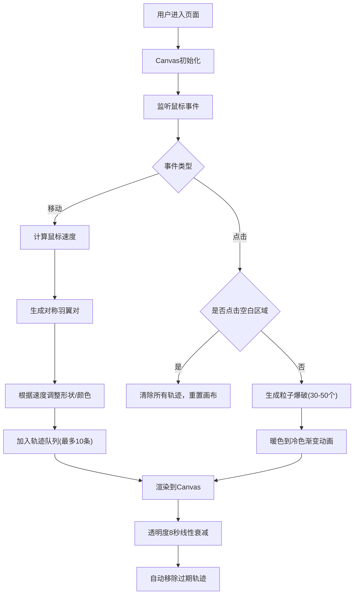

## 1. 产品概述
"翼痕·流光绘羽"是一款基于Canvas的交互式数字艺术绘图应用，专为数字艺术爱好者和插画师设计，让用户通过鼠标移动和点击创造流动的发光羽翼图案。
- 核心价值：将鼠标移动转化为富有艺术感的发光羽翼轨迹，提供沉浸式创作体验
- 目标用户：插画师、数字艺术家、创意爱好者

## 2. 核心特性

### 2.1 用户角色
| 角色 | 注册方式 | 核心权限 |
|------|---------|---------|
| 访客用户 | 无需注册 | 直接进入画布进行创作 |

### 2.2 功能模块
1. **画布主界面**：全屏交互式Canvas画布、羽翼轨迹渲染、粒子爆破动画
2. **羽翼生成系统**：对称羽翼生成、速度感知形状变化、渐变色粒子系统
3. **交互控制系统**：鼠标移动追踪、点击爆破响应、画布清除重置、空闲状态检测

### 2.3 页面详情
| 页面名称 | 模块名称 | 功能描述 |
|---------|---------|---------|
| 主画布页 | 画布渲染模块 | 全屏Canvas、深蓝紫径向渐变背景、边缘脉冲光晕、羽翼轨迹画廊（保留最近10条） |
| 主画布页 | 羽翼生成模块 | 鼠标位置生成对称羽翼、慢速舒展宽大/快速收缩尖锐、发光粒子路径、颜色随速度从蓝#48dbfb渐变到橙#feca57 |
| 主画布页 | 粒子爆破模块 | 点击产生30-50个飞散粒子、暖色调(#ff6b6b/#feca57)过渡到冷色调(#54a0ff)、1.5秒消散动画 |
| 主画布页 | 画布状态管理 | 透明度8秒线性衰减、空白点击清除所有轨迹、最小画布尺寸800x600px |

## 3. 核心流程
用户进入应用后，鼠标在画布上移动即可实时生成发光羽翼轨迹，点击产生粒子爆破效果，点击空白区域可重置画布。

## 4. 用户界面设计

### 4.1 设计风格
- **主色调**：深蓝紫色渐变背景（中心#1a1a2e → 边缘#16213e）
- **羽翼色彩**：冷色#48dbfb（慢速）、暖色#feca57（快速）、爆破粒子#ff6b6b/#feca57/#54a0ff
- **光晕效果**：羽翼区域微弱蓝光晕box-shadow: 0 0 20px rgba(102,126,234,0.3)
- **发光效果**：所有元素带1-2px柔和发光（filter: drop-shadow）
- **动画风格**：呼吸脉冲光晕动画（2s infinite）、粒子飞散动画（1.5s）、透明度线性衰减（8s）
- **整体氛围**：梦幻、流动、沉浸式、艺术感

### 4.2 页面设计概述
| 页面名称 | 模块名称 | UI元素 |
|---------|---------|--------|
| 主画布页 | 背景层 | 全屏径向渐变(#1a1a2e→#16213e)、最小尺寸800x600px |
| 主画布页 | 羽翼轨迹层 | 对称曲线路径、发光粒子(2-6px随机大小)、渐变尾迹、画廊式轨迹展示 |
| 主画布页 | 状态反馈层 | 鼠标悬停3秒后边缘淡紫脉冲光晕、爆破粒子飞散效果 |

### 4.3 响应式设计
- 桌面优先设计，全屏适配浏览器视口
- 窗口大小变化时Canvas自动重绘适配
- 窄屏适配：宽度<768px时羽翼尺寸缩小30%保证可见性

## 5. 性能要求
- 60FPS刷新率下至少流畅渲染15对羽翼 + 80个飞散粒子
- 帧率不低于55FPS
- 内存占用持续稳定，连续使用10分钟无明显增长
