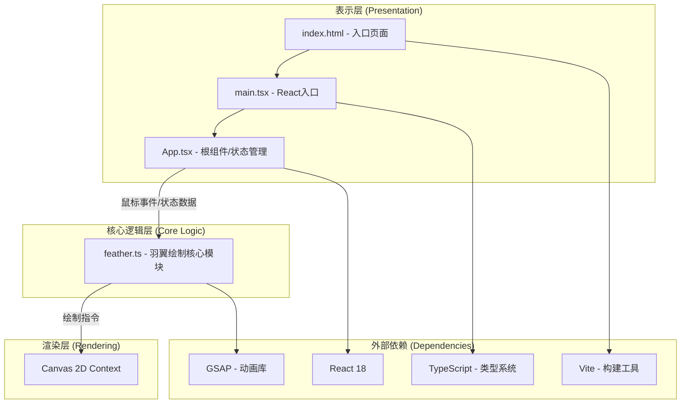

## 1. 架构设计



## 2. 技术描述
- **前端框架**：React 18 + TypeScript
- **构建工具**：Vite 5.x + @vitejs/plugin-react
- **动画库**：GSAP (GreenSock Animation Platform)
- **渲染技术**：HTML5 Canvas 2D API
- **无后端**：纯前端应用，无服务端依赖

## 3. 项目文件结构与调用关系

```
auto242/
├── package.json                          # 项目依赖配置
├── vite.config.js                        # Vite构建配置 → 指向 index.html
├── tsconfig.json                         # TypeScript编译配置
├── index.html                            # 入口HTML → 加载 main.tsx
└── src/
    ├── main.tsx                          # React入口 → 渲染 App 组件，初始化Canvas事件绑定
    ├── App.tsx                           # 根组件 → 管理画布状态，将鼠标事件传入feather.ts
    └── feather.ts                        # 羽翼绘制核心模块 → 接收坐标，生成粒子路径，渲染到Canvas
```

### 数据流向说明
1. **输入层**：`main.tsx` 初始化Canvas并绑定鼠标事件 → 事件回调传递给 `App.tsx`
2. **状态管理层**：`App.tsx` 管理以下状态并向下传递：
   - 鼠标坐标 (x, y)
   - 鼠标移动速度 (speed)
   - 点击状态 (isClicked, clickPosition)
   - 羽翼轨迹队列 (最多10条)
   - 爆破粒子列表
   - 画布空闲状态
3. **绘制逻辑层**：`feather.ts` 从 `App.tsx` 接收参数：
   - `drawFeather(ctx, position, speed, scale)` → 绘制单对羽翼
   - `drawBurstParticles(ctx, particles)` → 绘制爆破粒子
   - `generateFeatherPath(position, speed)` → 生成羽翼曲线路径
   - `generateBurstParticles(position)` → 生成爆破粒子
4. **输出层**：所有绘制结果通过 Canvas 2D Context 渲染到画布

## 4. 核心数据模型

### 4.1 羽翼轨迹 (FeatherTrail)
| 属性 | 类型 | 说明 |
|------|------|------|
| id | string | 唯一标识 |
| position | { x: number, y: number } | 羽翼中心坐标 |
| speed | number | 生成时鼠标速度 |
| createdAt | number | 生成时间戳 |
| paths | FeatherPath[] | 曲线路径数据 |
| particles | Particle[] | 路径上的发光粒子 |

### 4.2 羽翼路径 (FeatherPath)
| 属性 | 类型 | 说明 |
|------|------|------|
| points | { x: number, y: number }[] | 贝塞尔曲线控制点 |
| colorStart | string | 渐变起始颜色 |
| colorEnd | string | 渐变结束颜色 |

### 4.3 发光粒子 (Particle)
| 属性 | 类型 | 说明 |
|------|------|------|
| x | number | X坐标 |
| y | number | Y坐标 |
| size | number | 大小 (2-6px随机) |
| color | string | 粒子颜色 |
| opacity | number | 透明度 |

### 4.4 爆破粒子 (BurstParticle)
| 属性 | 类型 | 说明 |
|------|------|------|
| id | string | 唯一标识 |
| x | number | X坐标 |
| y | number | Y坐标 |
| vx | number | X方向速度 |
| vy | number | Y方向速度 |
| size | number | 粒子大小 |
| color | string | 当前颜色（随时间从暖色过渡到冷色） |
| createdAt | number | 生成时间戳 |
| life | number | 生命周期 (1500ms) |

## 5. 性能优化策略

### 5.1 渲染优化
- 使用 `requestAnimationFrame` 进行帧同步渲染
- 对象池模式复用粒子对象，减少GC压力
- Canvas分层：背景静态层 + 动态轨迹层

### 5.2 内存管理
- 羽翼轨迹队列限制为10条，超出自动移除最早的
- 爆破粒子生命周期1.5秒后自动回收
- 透明度衰减至0时立即从渲染队列移除

### 5.3 计算优化
- 鼠标速度采用滑动窗口平均计算，避免抖动
- 曲线路径预计算缓存，避免每帧重复计算
- 离屏Canvas预渲染静态渐变资源
