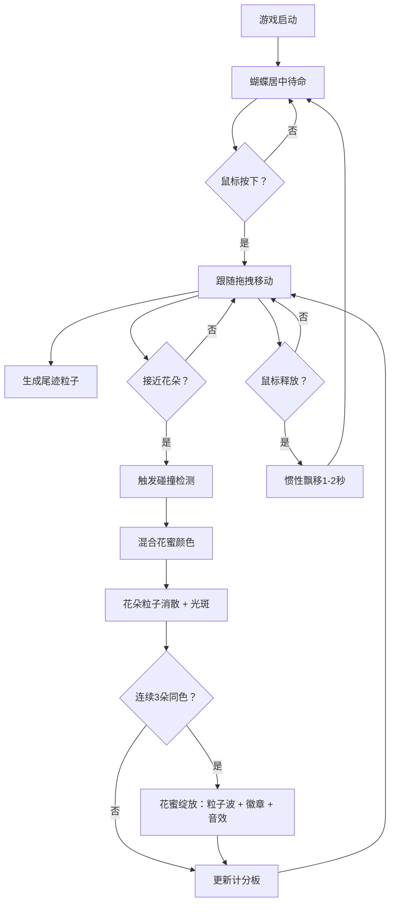

## 1. 产品概述

「蝶翼·花涧行」是一款运行于浏览器的休闲收集游戏。玩家通过鼠标拖拽操控一只由发光粒子构成的蝴蝶，在风中采集不同颜色的花蜜，并在花丛间留下渐变光轨。

- **目标用户**：独立游戏爱好者、休闲玩家、喜欢自然美学与粒子效果的用户
- **核心价值**：通过柔和发光的视觉风格、流畅的拖拽手感、以及渐进式的成就反馈，提供一段沉浸式的自然休闲体验

## 2. 核心功能

### 2.1 用户角色

| 角色 | 注册方式 | 核心权限 |
|------|---------|---------|
| 普通玩家 | 无需注册，直接游玩 | 操控蝴蝶、采集花蜜、触发成就 |

### 2.2 功能模块

1. **主画布场景**：蝴蝶粒子、花朵、风场流线、渐变背景
2. **蝴蝶控制系统**：鼠标拖拽跟随、惯性飘移、粒子蝶翼、渐变尾迹
3. **花朵采集系统**：随机生成花朵、碰撞检测、花蜜颜色混合、采集消散动画、渐变色光斑
4. **花蜜绽放系统**：连续采集3朵同色花触发粒子波扩散、成就徽章显示、音效反馈
5. **实时计分板**：采集数、花色组合、绽放次数显示

### 2.3 页面详情

| 页面名称 | 模块名称 | 功能描述 |
|---------|---------|---------|
| 主游戏画布 | 背景层 | 森林深处渐变（顶部墨绿 #0a1f15 → 底部深蓝 #0f1a2b），画布下方较暗 |
| 主游戏画布 | 风场层 | 极淡半透明流线（透明度0.08，宽1px），缓缓漂移，营造呼吸感 |
| 主游戏画布 | 花朵层 | 8朵随机花朵（直径30-50px半透明圆盘，六片发光花瓣，脉动花芯） |
| 主游戏画布 | 蝴蝶层 | 12-18个发光粒子（直径3-5px）构成蝶翼，粒子间细线连接，颜色随花蜜变化 |
| 主游戏画布 | 尾迹层 | 渐变细线尾迹，0.3秒后消失 |
| 主游戏画布 | 采集特效层 | 渐变色光斑（20px，2分钟淡出）、挤压放大动画（0.2秒缩放1.15倍） |
| 主游戏画布 | 绽放特效层 | 彩色粒子波（8-12个粒子，半径扩展50px，持续1秒）、顶部成就徽章 |
| 左上角计分板 | UI层 | 白色半透明背景、圆角8px、字体 #e2e8f0，显示采集数/花色/绽放次数 |

## 3. 核心流程

玩家进入游戏后，蝴蝶默认停留在画布中央。玩家按下鼠标开始拖拽，蝴蝶粒子群跟随移动并产生尾迹；释放鼠标后蝴蝶继续飘移1-2秒后减速停止。蝴蝶在画布下半部花丛间穿梭，接近花朵时触发采集：花朵颜色混合到蝴蝶上，花朵化作粒子消散并留下光斑。连续采集3朵同色花后触发花蜜绽放特效，显示成就徽章并播放音效。

## 4. 用户界面设计

### 4.1 设计风格

- **主色调**：森林墨绿 #0a1f15、深海蓝 #0f1a2b
- **花蜜色**：红 #ff6b6b、蓝 #48dbfb、黄 #feca57、粉 #ff9ff3、紫 #a29bfe
- **文字色**：#e2e8f0（冷白）
- **视觉基调**：柔和发光、低饱和自然系、无锋利边缘、整体呼吸感
- **动画风格**：GSAP 驱动的缓动挤压、脉冲、扩散、淡出

### 4.2 页面设计概览

| 页面名称 | 模块名称 | UI 元素 |
|---------|---------|---------|
| 主游戏画布 | 背景 | 垂直渐变（#0a1f15 → #0f1a2b），底部加深暗角 |
| 主游戏画布 | 风场流线 | 1px 白色，透明度 0.08，缓慢水平漂移 |
| 主游戏画布 | 花朵 | 半透明圆盘 + 6片发光花瓣（随机旋转10-20°） + 脉动花芯（0.5-1.5Hz） + 1-2px光晕 |
| 主游戏画布 | 蝴蝶 | 12-18个发光粒子构成对称蝶翼，粒子间细发光线连接，颜色随花蜜渐变 |
| 主游戏画布 | 尾迹 | 渐变细线，透明度随时间衰减，0.3秒寿命 |
| 主游戏画布 | 光斑 | 20px 渐变色圆，2分钟淡出 |
| 主游戏画布 | 绽放粒子波 | 8-12个粒子从蝴蝶中心向外扩散50px，1秒内透明度1→0 |
| 左上角计分板 | UI | 白色半透明（rgba(255,255,255,0.1)）背景，圆角8px，12px/14px 冷白字体 |
| 顶部成就徽章 | UI | 带光芒边框的徽章，显示花蜜名称（如「蜜韵·赤红」），GSAP 进场退场动画 |

### 4.3 响应式

- 桌面优先，画布占满整个视口（最小 800×600px）
- 窗口 resize 时自适应调整画布尺寸与内容坐标

### 4.4 性能策略

- 主循环稳定 60FPS，单帧计算与绘制 50-80ms
- 蝴蝶粒子 ≤20，尾迹粒子 ≤100
- 花朵光晕使用离屏 Canvas 预计算缓存
- 粒子对象池复用，避免频繁 GC
- Tone.js 音效延迟加载，避免阻塞首帧