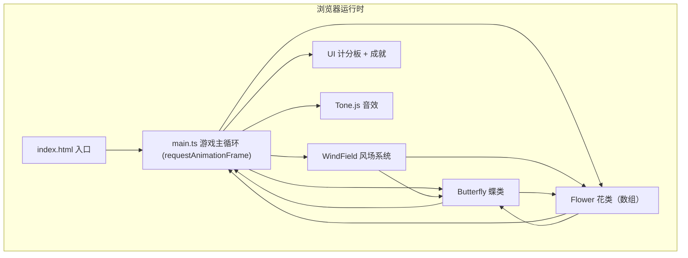

## 1. 架构设计



**数据流向**：
1. `main.ts` 每帧调用 `windField.update(dt)` → 产出全局风矢量场
2. `main.ts` 将风矢量传入 `butterfly.update(dt, wind, mouse)` → 更新蝴蝶位置、速度、粒子、尾迹
3. `main.ts` 遍历 `flowers[]`，传入风矢量与蝴蝶位置 → 每朵花更新旋转/脉动/碰撞检测
4. 花朵碰撞后触发 `onCollect` 回调 → `main.ts` 通知蝴蝶混合颜色、生成光斑、计分、检查绽放条件
5. 绽放条件达成 → `main.ts` 生成粒子波、显示徽章、调用 `Tone.js` 播放音效
6. 各模块的 `render(ctx)` 由 `main.ts` 统一按层调用绘制

## 2. 技术描述

- **前端框架**：原生 HTML5 Canvas + TypeScript（无 React/Vue，单画布游戏）
- **构建工具**：Vite 5
- **动画库**：GSAP 3（用于挤压、脉冲、徽章、粒子扩散等缓动动画）
- **音效库**：Tone.js 14（短促上升音调合成）
- **语言**：TypeScript 5，strict 严格模式，target ES2020，module ESNext
- **包管理**：npm

## 3. 文件结构与职责

| 文件路径 | 职责 | 输出/调用关系 |
|---------|-----|-------------|
| `package.json` | 项目依赖与启动脚本 | `npm run dev` 启动 Vite |
| `vite.config.js` | Vite 构建配置（TypeScript 处理、index.html 入口） | 被 Vite CLI 读取 |
| `tsconfig.json` | TS 编译选项（strict、ES 模块目标） | 被 Vite/tsc 读取 |
| `index.html` | 入口页面，全屏 Canvas、深色渐变背景、加载 `/src/main.ts` | 浏览器入口 |
| `src/main.ts` | 游戏入口：初始化 Canvas、绑定鼠标事件、构建核心 RAF 循环、协调四大模块、渲染 UI、管理成就与音效 | 调用 `Butterfly` / `Flower` / `WindField` 的 `update` 与 `render`；接收花朵采集回调 |
| `src/butterfly.ts` | 蝶类：12-18 个发光粒子构成、鼠标跟随、拖拽惯性、尾迹粒子、颜色混合、挤压动画 | 接收 `mouse` 状态 + `wind` 矢量 → 输出位置、粒子、尾迹；暴露 `blendColor()` 给 `main.ts` |
| `src/flower.ts` | 花类：随机生成、旋转、脉动光晕、碰撞检测、采集消散、光斑、离屏光晕缓存 | 接收蝴蝶位置 → 触发 `onCollect`；暴露 `render()` 给 `main.ts` |
| `src/windField.ts` | 风场系统：多气旋 + 缓流，每帧计算风矢量 | 暴露 `queryWind(x, y)` 给 `butterfly` 和 `flower`；自身每帧 `update()` 漂移 |

## 4. 核心数据模型

```typescript
// 花蜜颜色枚举
type NectarColor = 'red' | 'blue' | 'yellow' | 'pink' | 'purple';

// 2D 向量
interface Vec2 { x: number; y: number; }

// 蝴蝶粒子
interface ButterflyParticle {
  localPos: Vec2;   // 相对于蝶心的局部坐标（构成蝶翼形状）
  worldPos: Vec2;   // 世界坐标
  size: number;     // 3-5px 随机
  color: string;    // 当前颜色
}

// 尾迹粒子
interface TrailParticle {
  pos: Vec2;
  life: number;     // 0-1，随时间衰减
  color: string;
}

// 花朵
interface FlowerData {
  pos: Vec2;
  radius: number;        // 30-50px
  color: NectarColor;
  rotation: number;      // 随机10-20度初始
  pulsePhase: number;    // 花芯脉动相位
  pulseFreq: number;     // 0.5-1.5 Hz
  collected: boolean;
  collectProgress: number; // 0-1 消散动画进度
}

// 风场气旋
interface Vortex {
  pos: Vec2;
  vel: Vec2;      // 漂移速度
  strength: number;
  radius: number;
  rotation: number; // 顺时针/逆时针
}

// 成就状态
interface GameState {
  collectedCount: number;
  colorCombo: NectarColor[];  // 最近采集序列
  bloomCount: number;
  lastColor: NectarColor | null;
  streak: number;             // 同色连续计数
}
```

## 5. 关键技术决策

1. **Canvas 分层渲染**：背景 → 风场流线 → 光斑 → 花朵 → 尾迹 → 蝴蝶 → 粒子波 → UI，在同一 Canvas 按序绘制，避免多层 Canvas 合成开销
2. **离屏光晕缓存**：花朵光晕一次性预绘制到 OffscreenCanvas，主循环仅 drawImage，避免每帧重复绘制模糊圆
3. **粒子对象池**：尾迹与绽放粒子使用对象池复用，减少 GC 压力
4. **GSAP 非运动动画**：挤压缩放、徽章进出、光斑淡出等时间精度要求高的动画交由 GSAP 控制，RAF 循环只负责物理位置更新
5. **Tone.js 延迟初始化**：首次用户交互后再创建 AudioContext，符合浏览器自动播放策略
6. **颜色混合算法**：RGB 通道线性平均（当前蝴蝶色 × 0.6 + 新花蜜色 × 0.4），保证颜色平滑过渡