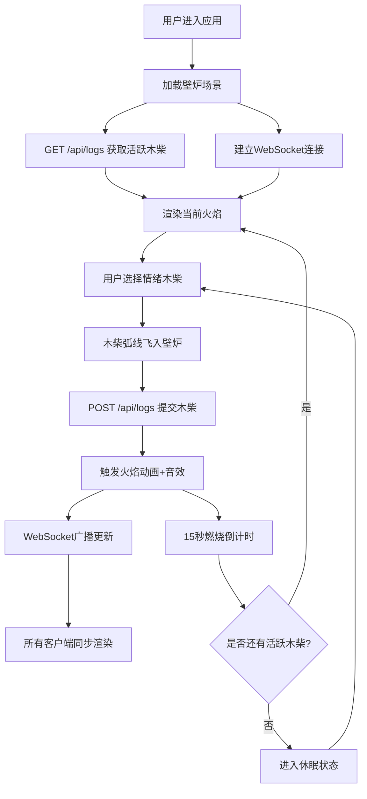

## 1. 产品概述

回声·情绪壁炉是一个全栈Web应用，让用户通过投入代表不同情绪（喜悦、悲伤、愤怒、宁静）的发光木柴到虚拟壁炉中，观看对应的动态火焰动画和聆听合成环境音效。多个用户可通过WebSocket实时同步壁炉中的燃烧状态，创造一个共享的情绪空间。
- 目标用户：需要情绪表达和情感陪伴的人群，追求沉浸式互动体验的用户
- 核心价值：将抽象情绪转化为具象的视觉和听觉体验，通过共享壁炉创造情感连接

## 2. 核心功能

### 2.1 用户角色
| 角色 | 注册方式 | 核心权限 |
|------|----------|----------|
| 访客 | 无需注册 | 投入木柴、观看火焰、聆听音效、实时同步 |

### 2.2 功能模块
1. **壁炉主页**：全屏壁炉场景、Canvas2D火焰粒子系统、木炭堆渲染、休眠状态提示
2. **控制面板**：四种情绪木柴按钮、拖拽/点击交互、木柴飞入动画
3. **音效引擎**：Web Audio API合成音效、四种情绪对应音色、与火焰同步启停
4. **实时同步**：WebSocket广播壁炉状态、REST API管理木柴列表、多用户共享

### 2.3 页面详情
| 页面名称 | 模块名称 | 功能描述 |
|----------|----------|----------|
| 壁炉主页 | 壁炉场景 | 全屏Canvas壁炉，深棕到暗橙渐变背景，仿砖石纹理边框，木炭堆静态渲染 |
| 壁炉主页 | 火焰粒子系统 | Canvas2D粒子渲染，四种情绪对应不同颜色/数量/大小/速率/飘散模式，发光效果 |
| 壁炉主页 | 休眠状态 | 所有木柴烧尽后暗淡木炭堆，呼吸动画提示文字 |
| 控制面板 | 情绪木柴按钮 | 四个毛玻璃按钮（😊😢😠😌），悬停放大发光，点击弧线飞入壁炉 |
| 控制面板 | 拖拽交互 | 鼠标拖拽木柴到壁炉区域触发添加事件 |
| 音效引擎 | 合成音效 | 喜悦风铃声、悲伤哼鸣声、愤怒爆裂声、宁静钟声，15秒同步燃烧 |
| 实时同步 | WebSocket | 服务器每100ms广播所有正在燃烧的木柴列表（情绪类型+剩余时间） |
| 实时同步 | REST API | POST /api/logs添加木柴，GET /api/logs获取活跃木柴列表 |

## 3. 核心流程

用户进入应用 → 页面显示壁炉场景（GET /api/logs加载活跃木柴）→ WebSocket连接建立 → 用户点击/拖拽情绪木柴 → 木柴弧线飞入壁炉 → POST /api/logs提交 → 触发火焰动画+音效 → WebSocket广播更新 → 15秒后木柴烧尽火焰消失 → 所有木柴烧尽后进入休眠状态

## 4. 用户界面设计

### 4.1 设计风格
- 主色调：暖棕暗色系（#1a1108、#2d1b0e、#4a2e1b）
- 壁炉背景渐变：顶部#1a1108到底部#2d1b0e
- 按钮风格：半透明毛玻璃（backdrop-filter:blur(10px)，rgba(255,255,255,0.08)）
- 壁炉边框：box-shadow多层阴影模拟仿砖石纹理凹凸感
- 字体：16px，白色低透明度呼吸动画
- 情绪色彩：喜悦淡黄、悲伤淡蓝、愤怒橙红、宁静淡绿

### 4.2 页面设计概述
| 页面名称 | 模块名称 | UI元素 |
|----------|----------|--------|
| 壁炉主页 | 壁炉场景 | 全屏Canvas，深棕渐变背景，仿砖石边框，木炭堆，呼吸脉冲动画(3s周期opacity 0.8→1.0) |
| 壁炉主页 | 火焰粒子 | Canvas2D模糊圆点粒子，ctx.shadowBlur发光，四种颜色方案 |
| 壁炉主页 | 休眠提示 | 16px白色文字'向壁炉投入一份情绪……'，呼吸动画(3s opacity 0.4→0.7)，木炭堆亮度降低10% |
| 控制面板 | 木柴按钮 | 60x80px，毛玻璃效果，emoji图标+发光，悬停70x90px+text-shadow扩散4px，弧线飞入transition 0.6s ease-out |

### 4.3 响应式设计
- 桌面优先设计，移动端自适应
- 宽度<768px时：按钮缩小为40x50px，壁炉画布高度调整为视口50%
- 移动端火焰粒子数量减少30%以保证60fps
- 触摸优化：支持触摸拖拽木柴

### 4.4 粒子参数详情
| 情绪 | 颜色范围 | 粒子数量 | 大小(px) | 上升速率(px/帧) | 飘散角度 | 透明度 | 特殊效果 |
|------|----------|----------|----------|-----------------|----------|--------|----------|
| 喜悦 | #ffd700→#ff8c00 | 40-60 | 6-12 | 0.5-1.0 | ±15° | 0.6→0 | 无 |
| 悲伤 | #4a90d9→#6b7b8d | 20-30 | 4-8 | 0.3-0.5 | 缓慢飘散 | 0.5 | 整体低透明度 |
| 愤怒 | #ff4500→#dc143c | 50-80 | 8-16 | 1.0-1.5 | ±25° | 0.4-1.0振荡 | 尾迹闪烁 |
| 宁静 | #98d8c8→#c4e0d9 | 15-25 | 3-6 | 0.2-0.4 | 正弦曲线 | 0.3-0.5 | 正弦飘动 |

### 4.5 音效参数详情
| 情绪 | 波形 | 频率 | 音量 | 特效 | 持续时间 |
|------|------|------|------|------|----------|
| 喜悦 | 正弦波 | 780Hz | 0.2 | 高音风铃声 | 15s(随火焰) |
| 悲伤 | 锯齿波 | 180Hz | 0.15 | 缓慢颤音 | 15s(随火焰) |
| 愤怒 | 噪声burst | - | 0.3 | 每200ms一次爆裂 | 15s(随火焰) |
| 宁静 | 正弦波 | 220Hz | 0.2 | 0.8s后衰减 | 15s(随火焰) |
