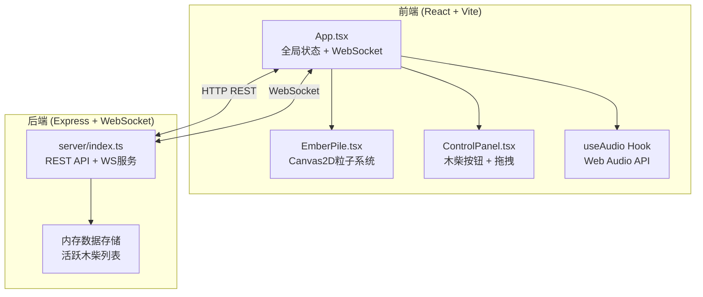
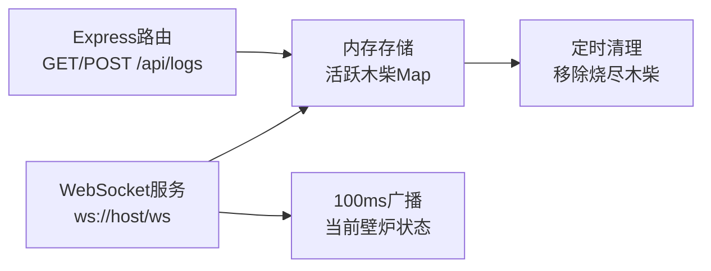
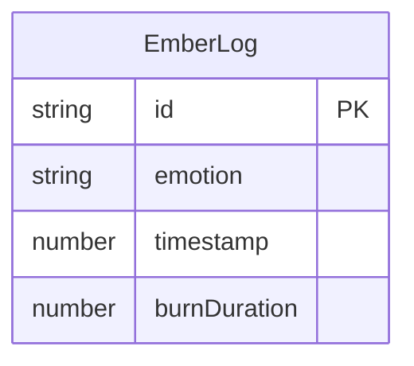

## 1. 架构设计



## 2. 技术说明
- 前端：React@18 + TypeScript + Vite + Canvas2D
- 初始化工具：vite-init (react-express-ts模板)
- 后端：Express@4 + ws (WebSocket) + TypeScript
- 数据库：无，使用内存存储
- 状态管理：zustand
- 音频：Web Audio API（浏览器原生）

## 3. 路由定义
| 路由 | 用途 |
|------|------|
| / | 壁炉主页，全屏壁炉场景+控制面板 |

## 4. API定义

### 4.1 REST API

**GET /api/logs**
- 响应：`{ logs: EmberLog[] }`
- 获取当前所有活跃木柴列表

**POST /api/logs**
- 请求：`{ emotion: 'joy' | 'sadness' | 'anger' | 'serenity' }`
- 响应：`{ id: string, emotion: string, timestamp: number, remainingMs: number }`
- 添加新木柴到壁炉

### 4.2 TypeScript类型定义

```typescript
type EmotionType = 'joy' | 'sadness' | 'anger' | 'serenity';

interface EmberLog {
  id: string;
  emotion: EmotionType;
  timestamp: number;
  burnDuration: number;
}

interface FireplaceState {
  logs: EmberLog[];
}

interface WSMessage {
  type: 'state_update';
  logs: Array<{
    id: string;
    emotion: EmotionType;
    remainingMs: number;
  }>;
}
```

### 4.3 WebSocket协议
- 连接端点：ws://host/ws
- 服务器→客户端：每100ms广播 `{ type: 'state_update', logs: [...] }`
- 数据量控制在2KB以内

## 5. 服务器架构图



## 6. 数据模型

### 6.1 数据模型定义



### 6.2 内存数据结构
- 使用 `Map<string, EmberLog>` 存储活跃木柴
- 每次请求时计算剩余燃烧时间 = burnDuration - (now - timestamp)
- 剩余时间 <= 0 时移除木柴
- burnDuration 固定为 15000ms (15秒)

## 7. 前端组件架构

### 7.1 状态管理 (Zustand Store)
```typescript
interface FireplaceStore {
  embers: Array<{ id: string; emotion: EmotionType; remainingMs: number }>;
  addEmber: (emotion: EmotionType) => void;
  updateEmbers: (embers: WSMessage['logs']) => void;
  isDormant: () => boolean;
}
```

### 7.2 Canvas2D粒子系统
- 使用requestAnimationFrame驱动渲染循环
- 每帧：更新粒子位置 → 清除画布 → 绘制木炭堆 → 绘制粒子 → 绘制休眠提示
- 粒子属性：x, y, size, color, opacity, velocityX, velocityY, life, maxLife
- 发光效果：ctx.shadowBlur + ctx.shadowColor
- 移动端检测：window.innerWidth < 768，粒子数量乘以0.7

### 7.3 Web Audio API音效引擎
- AudioContext单例管理
- 四种情绪对应不同OscillatorNode配置
- 喜悦：OscillatorNode(sine, 780Hz) + GainNode(0.2)
- 悲伤：OscillatorNode(sawtooth, 180Hz) + GainNode(0.15) + LFO颤音
- 愤怒：AudioBufferSourceNode(噪声) + 每200ms触发 + GainNode(0.3)
- 宁静：OscillatorNode(sine, 220Hz) + GainNode(指数衰减0.8s)
- 所有音效15秒后自动停止

## 8. 性能优化策略
- Canvas2D渲染：每帧<16ms，桌面端保持60fps
- 移动端粒子数量减少30%
- WebSocket消息频率100ms，数据量<2KB
- 粒子池复用：避免频繁GC
- 使用performance.now()精确帧计时
