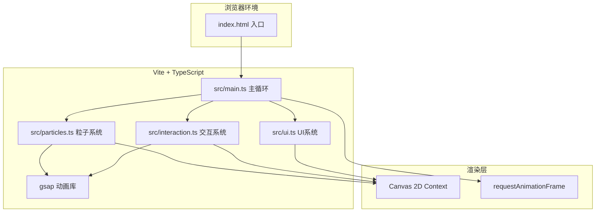

## 1. 架构设计



---

## 2. 技术描述

### 2.1 核心技术栈

| 技术 | 版本/说明 | 用途 |
|------|----------|------|
| **TypeScript** | 严格模式，ES模块 | 类型安全开发 |
| **Vite** | 最新稳定版 | 构建工具，开发服务器 |
| **gsap** | 最新稳定版 | 动画缓动、属性过渡 |
| **Canvas 2D API** | 原生浏览器API | 粒子渲染、图形绘制 |
| **requestAnimationFrame** | 原生 | 60FPS主循环控制 |

### 2.2 项目配置

- **package.json**：依赖 `typescript`、`vite`、`gsap`
- **vite.config.js**：处理TypeScript，指向index.html
- **tsconfig.json**：严格模式，ES模块目标，`moduleResolution: 'bundler'`

### 2.3 文件组织结构

```
auto261/
├── package.json
├── vite.config.js
├── tsconfig.json
├── index.html
└── src/
    ├── main.ts          # 主入口：Canvas初始化、主循环、系统协调
    ├── particles.ts     # 粒子系统：粒子类、水球、光流、水母、涟漪
    ├── interaction.ts   # 交互系统：鼠标/触摸/键盘事件、模式管理
    └── ui.ts            # UI系统：模式标签、FPS、操作提示框
```

---

## 3. 核心模块设计

### 3.1 粒子系统 (src/particles.ts)

```typescript
// 粒子基类
interface Particle {
  x: number;           // X坐标
  y: number;           // Y坐标
  vx: number;          // X速度
  vy: number;          // Y速度
  color: string;       // 颜色
  size: number;        // 大小
  opacity: number;     // 透明度
  life: number;        // 生命值 (0-1)
  type: 'water' | 'flow' | 'burst' | 'star'; // 粒子类型
  baseX: number;       // 基础X位置（用于自转）
  baseY: number;       // 基础Y位置（用于自转）
  angle: number;       // 角度（用于自转）
  radius: number;      // 半径（用于水球）
  targetX?: number;    // 目标X（用于引力）
  targetY?: number;    // 目标Y（用于引力）
  bounceOffset?: number; // 涟漪弹跳偏移
}

// 水母类
interface Jellyfish {
  x: number;
  y: number;
  vx: number;
  vy: number;
  color: string;
  diameter: number;
  tentacleLength: number;
  breathPhase: number;
  breathPeriod: number;
  wavePhase: number;
  opacity: number;
  life: number; // 0=创建, 1=正常, 0=消散
}

// 涟漪类
interface Ripple {
  x: number;
  y: number;
  radius: number;
  maxRadius: number;
  opacity: number;
  startTime: number;
  duration: number;
  affectedParticles: Set<number>;
}

// 光流类
interface FlowParticle extends Particle {
  bornTime: number;
  lifeDuration: number;
  dissipating: boolean;
}

// 粒子系统类
class ParticleSystem {
  waterParticles: Particle[];       // 水球粒子 (3000个)
  flowParticles: FlowParticle[];    // 光流粒子 (≤200个)
  burstParticles: Particle[];       // 爆裂粒子
  starParticles: Particle[];        // 背景星点 (100个)
  jellyfish: Jellyfish[];           // 水母 (≤5只)
  ripples: Ripple[];                // 涟漪
  centerX: number;                  // 水球中心X
  centerY: number;                  // 水球中心Y
  baseRadius: number;               // 水球基础半径 (400px)
  rotationAngle: number;            // 自转角
  breathPhase: number;              // 呼吸相位
  mode: number;                     // 当前模式 (1/2/3)
  modeTransitionProgress: number;   // 模式过渡进度 (0-1)
  
  init(): void;                     // 初始化所有粒子
  update(deltaTime: number, mouseX: number, mouseY: number, isDragging: boolean): void;
  draw(ctx: CanvasRenderingContext2D): void;
  createFlowParticle(x: number, y: number, vx: number, vy: number): void;
  createBurst(x: number, y: number, color: string): void;
  createRipple(x: number, y: number): void;
  createJellyfish(count: number): void;
  setMode(newMode: number): void;
  isVisible(particle: Particle): boolean; // 可视性检测
}
```

### 3.2 交互系统 (src/interaction.ts)

```typescript
type DragMode = 1 | 2 | 3; // 光流追踪 | 星轨喷涌 | 漩涡捕获

class InteractionManager {
  canvas: HTMLCanvasElement;
  mouseX: number;
  mouseY: number;
  isDragging: boolean;
  dragStartTime: number;
  dragPath: {x: number, y: number, time: number}[];
  currentMode: DragMode;
  particleSystem: ParticleSystem;
  lastJellyfishTime: number;
  onModeChange: (mode: DragMode) => void;
  
  init(canvas: HTMLCanvasElement, particleSystem: ParticleSystem): void;
  handleMouseMove(e: MouseEvent): void;
  handleMouseDown(e: MouseEvent): void;
  handleMouseUp(e: MouseEvent): void;
  handleClick(e: MouseEvent): void;
  handleTouchStart(e: TouchEvent): void;
  handleTouchMove(e: TouchEvent): void;
  handleTouchEnd(e: TouchEvent): void;
  handleKeyDown(e: KeyboardEvent): void;
  update(deltaTime: number): void;  // 每帧更新拖拽逻辑
  private getCanvasCoords(clientX: number, clientY: number): {x: number, y: number};
  private processDragMode1(x: number, y: number): void; // 光流追踪
  private processDragMode2(x: number, y: number): void; // 星轨喷涌
  private processDragMode3(x: number, y: number): void; // 漩涡捕获
  private checkJellyfishSpawn(): void;
}
```

### 3.3 UI系统 (src/ui.ts)

```typescript
class UIManager {
  canvas: HTMLCanvasElement;
  fps: number;
  frameCount: number;
  lastFpsUpdate: number;
  currentMode: DragMode;
  breathPhase: number;
  
  init(canvas: HTMLCanvasElement): void;
  update(deltaTime: number): void;
  draw(ctx: CanvasRenderingContext2D): void;
  setMode(mode: DragMode): void;
  private drawModeLabel(ctx: CanvasRenderingContext2D, x: number, y: number): void;
  private drawFPS(ctx: CanvasRenderingContext2D, x: number, y: number): void;
  private drawHintBox(ctx: CanvasRenderingContext2D, x: number, y: number, width: number, height: number): void;
  private getBreathGlow(): number; // 呼吸光晕强度
}

const MODE_NAMES: Record<DragMode, string> = {
  1: '光流追踪',
  2: '星轨喷涌',
  3: '漩涡捕获'
};
```

### 3.4 主循环 (src/main.ts)

```typescript
// 主入口类
class GameApp {
  canvas: HTMLCanvasElement;
  ctx: CanvasRenderingContext2D;
  particleSystem: ParticleSystem;
  interactionManager: InteractionManager;
  uiManager: UIManager;
  lastTime: number;
  animationId: number;
  
  init(): void;
  resize(): void;
  loop(currentTime: number): void;
  start(): void;
  stop(): void;
}

// 工具函数
function easeInOutQuad(t: number): number;
function lerp(a: number, b: number, t: number): number;
function hexToRgb(hex: string): {r: number, g: number, b: number};
function rgbToHex(r: number, g: number, b: number): string;
function lerpColor(color1: string, color2: string, t: number): string;
function randomRange(min: number, max: number): number;
function distance(x1: number, y1: number, x2: number, y2: number): number;
```

---

## 4. 性能优化策略

### 4.1 可视性剔除
```typescript
// 仅更新可视范围内的粒子
isVisible(particle: Particle): boolean {
  const margin = 50; // 外边距，避免边缘闪烁
  return particle.x >= -margin && 
         particle.x <= this.canvas.width + margin &&
         particle.y >= -margin && 
         particle.y <= this.canvas.height + margin;
}
```

### 4.2 粒子数量控制
- 水球粒子：固定3000个，池化复用
- 光流粒子：上限200个，超出时覆盖最旧的
- 水母：上限5只
- 爆裂粒子：临时生成，快速回收

### 4.3 渲染优化
- 使用 `globalCompositeOperation: 'lighter'` 实现粒子融合
- 分层绘制：背景 → 星点 → 水球 → 光流 → 涟漪 → 水母 → UI
- 批量绘制相同类型粒子，减少状态切换

---

## 5. 动画系统

### 5.1 GSAP应用场景
- 模式切换过渡：0.5秒平滑过渡颜色和运动参数
- 水母生成/消散：easeInOutQuad 缓动
- UI呼吸光晕：GSAP tween 控制透明度

### 5.2 自定义动画
- 水球自转：`rotationAngle += (deltaTime / 15000) * Math.PI * 2`
- 呼吸脉动：`breathPhase += (deltaTime / 4000) * Math.PI * 2`
- 涟漪扩散：线性插值，半径从0到300px，1.2秒完成
- 粒子弹跳：被涟漪覆盖时Y轴偏移5单位，缓动恢复
