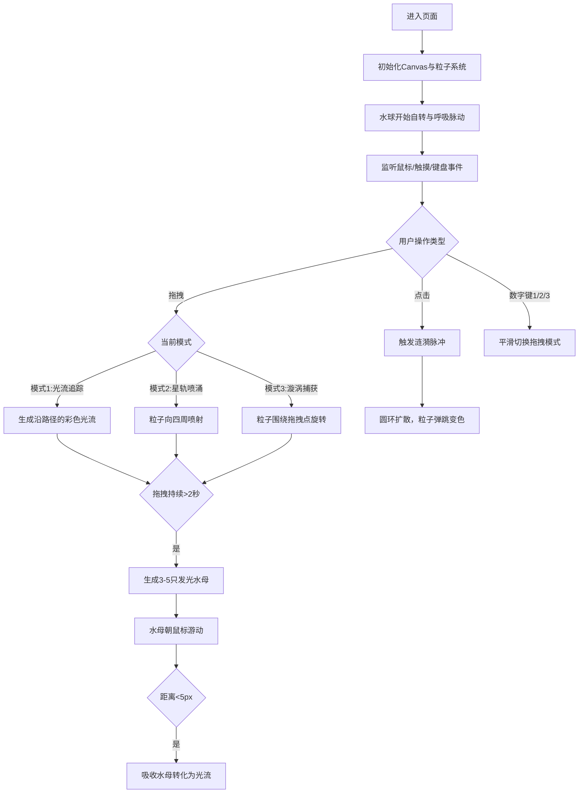

## 1. 产品概述

"墨韵·流光引水"是一款基于Canvas的沉浸式交互式粒子艺术游戏，用户通过鼠标/触摸在虚拟水景中引导水流方向，观察流体粒子与动态光影的融合，触发涟漪和光波反馈，创造独特的东方水墨美学体验。

- **核心价值**：为用户提供一种可以通过手部动作实时与虚拟水景互动的沉浸式创意体验
- **目标用户**：艺术爱好者、创意设计人士、追求视觉美学的普通用户
- **解决问题**：网页端缺乏高质感、可实时交互的流体粒子艺术体验

---

## 2. 核心功能

### 2.1 功能模块

1. **主场景页面**：动态水球粒子系统、背景星点、全屏Canvas渲染
2. **交互系统**：鼠标拖拽光流、点击涟漪、键盘模式切换、水母生成与吸收
3. **模式系统**：光流追踪、星轨喷涌、漩涡捕获三种拖拽模式，平滑过渡动画
4. **UI系统**：模式标签、FPS计数器、操作提示框

### 2.2 页面详情

| 页面名称 | 模块名称 | 功能描述 |
|----------|----------|----------|
| 主场景 | 动态水球 | 3000个粒子构成的半透明水球，15秒自转周期，4秒呼吸脉动 |
| 主场景 | 光流系统 | 拖拽路径生成彩色光流，3秒后消散并产生光点爆裂 |
| 主场景 | 涟漪系统 | 点击触发发光圆环扩散，粒子被圆环覆盖时变色弹跳 |
| 主场景 | 水母系统 | 连续拖拽2秒生成3-5只发光水母，朝鼠标游动，被吸收转化为光流 |
| 主场景 | 模式切换 | 数字键1/2/3切换三种拖拽模式，0.5秒平滑过渡 |
| 主场景 | UI系统 | 左上角模式标签与FPS、右下角操作提示框 |

---

## 3. 核心流程

用户进入页面 → 水球自动自转呼吸 → 鼠标移动/拖拽 → 根据当前模式生成光流/星轨/漩涡 → 持续拖拽2秒生成水母 → 点击触发涟漪 → 键盘切换模式 → 体验流畅的粒子艺术互动

---

## 4. 用户界面设计

### 4.1 设计风格

**整体基调**：深色沉静的东方水墨美学，融合现代光影效果

**色彩系统**：
- 背景渐变：`#0b0f19` → `#15233b`（墨黑到深蓝）
- 粒子主色：`#0fb5e5`（深蓝）↔ `#a855f7`（淡紫）
- 光流渐变色：`#ff6b6b` → `#fbbf24`
- 涟漪颜色：`#67e8f9`（青）→ `#f472b6`（粉）
- 水母调色盘：`#38bdf8`、`#a78bfa`、`#f472b6`
- UI文字色：`#c084fc`（发光模式标签）、`#94a3b8`（FPS）、`#a78bfa`（提示文字）

**排版**：
- 模式标签：20px，发光字体
- FPS计数器：14px，monospace字体
- 操作提示：适中字号，淡紫色

**视觉特效**：
- 粒子混合模式：`globalCompositeOperation: 'lighter'`（柔和融合）
- 毛玻璃效果：`backdrop-filter: blur(12px)`
- 呼吸光晕动画：UI元素带轻微呼吸脉动
- 背景星点：100颗，随机闪烁周期2-5秒

### 4.2 页面设计概述

| 页面名称 | 模块名称 | UI元素 |
|----------|----------|----------|
| 主场景 | 背景层 | 墨黑到深蓝渐变、100颗闪烁星点 |
| 主场景 | 粒子层 | 3000个粒子水球、自转、呼吸脉动 |
| 主场景 | 光流层 | 拖拽路径彩色光流、消散爆裂效果 |
| 主场景 | 涟漪层 | 点击触发的发光扩散圆环 |
| 主场景 | 水母层 | 半透明发光水母、波浪游动、触须动画 |
| 主场景 | UI层 | 左上角：模式标签 + FPS 右下角：毛玻璃操作提示框 |

### 4.3 响应式设计

- **桌面优先**：以桌面端体验为核心设计
- **自适应**：Canvas宽度适配窗口宽高比，最小16:9
- **触摸优化**：移动端触摸时交互热区至少44x44px
- **性能适配**：屏幕外粒子不更新位置，仅保留状态

### 4.4 动画与交互规范

- **水球自转**：每15秒一周，匀速
- **呼吸脉动**：幅度0.1单位，周期4秒
- **光流消散**：3秒后缓慢消散，消散时产生15px半径爆裂效果（0.5秒）
- **涟漪扩散**：半径0→300px，持续1.2秒，颜色从青渐变到粉
- **粒子弹跳**：被涟漪覆盖时向上弹跳5单位
- **水母运动**：波浪运动速度0.3单位/秒，呼吸周期1.5-3秒
- **模式过渡**：切换时0.5秒内平滑过渡
- **缓动函数**：水母使用easeInOutQuad，涟漪和光流使用线性插值

### 4.5 性能规范

- **目标帧率**：60FPS稳定运行
- **粒子上限**：总数≤4000，光流粒子≤200，水母≤5只
- **优化策略**：仅更新可视范围内粒子，鼠标事件不节流
