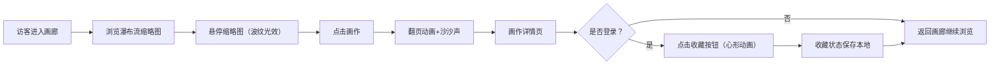

## 1. 产品概述
「纸间·光痕画廊」是一个面向自由插画师的在线数字画作展示平台，模拟实体水彩本的翻阅体验，让访客通过交互感受纸页翻动的艺术氛围。
- 目标用户：艺术爱好者、画廊访客、潜在客户
- 核心价值：通过沉浸式交互体验展示数字画作，提升艺术作品的感染力和商业价值

## 2. 核心功能

### 2.1 用户角色
| 角色 | 注册方式 | 核心权限 |
|------|----------|----------|
| 访客 | 无需注册 | 浏览画廊、查看画作详情、翻页浏览 |
| 注册用户 | 前端模拟注册 | 浏览画廊、收藏画作、管理个人收藏 |

### 2.2 功能模块
1. **画廊主页**：三列瀑布流缩略图展示、悬停波纹光效、导航栏、回到顶部按钮
2. **画作详情页**：水彩本翻页动画、沙沙声效、画作信息展示、收藏功能
3. **用户系统**：注册/登录（前端模拟）、收藏管理、心形图标动画

### 2.3 页面详情
| 页面名称 | 模块名称 | 功能描述 |
|----------|----------|----------|
| 画廊主页 | 瀑布流画廊 | 三列布局展示画作缩略图，尺寸随机240-320px，自适应高度 |
| 画廊主页 | 悬停特效 | 缩略图悬停时产生波纹光效，放大1.05倍，亮度提升 |
| 画廊主页 | 导航栏 | 左侧60px垂直导航栏，磨砂玻璃效果，含Logo和图标 |
| 画廊主页 | 回到顶部 | 底部浮动圆形按钮，悬停变色 |
| 画作详情页 | 翻页动画 | 点击进入时以卷曲动画从右侧翻入，3D透视效果 |
| 画作详情页 | 音效 | 翻页时播放Web Audio生成的沙沙声（0.5秒白噪声） |
| 画作详情页 | 信息展示 | 画作标题、创作日期、文字描述 |
| 画作详情页 | 收藏功能 | 登录后可收藏，心形图标空心→实心金色，弹跳动画 |
| 用户系统 | 注册登录 | 前端模拟，无需后端数据库，状态本地存储 |

## 3. 核心流程

访客浏览画廊 → 悬停缩略图查看波纹效果 → 点击画作进入详情页（翻页动画+沙沙声）→ 查看画作信息 → 登录用户可收藏画作

## 4. 用户界面设计

### 4.1 设计风格
- 主色调：米白 #f5f0e6、浅金 #d4af37
- 辅助色：淡墨绿 #7a9e7e、米色 #f0e6d3、古铜 #c9b99a
- 按钮风格：圆角过渡，悬停阴影变化
- 字体：衬线字体（展示）+ 无衬线字体（正文），营造书卷气息
- 布局：左侧垂直导航 + 内容区，卡片式画廊
- 背景：纸纹理（repeating-linear-gradient模拟）

### 4.2 页面设计概览
| 页面名称 | 模块名称 | UI元素 |
|----------|----------|--------|
| 画廊主页 | 瀑布流画廊 | 卡片阴影 0 4px 20px rgba(0,0,0,0.3)，圆角2px，悬停放大1.05倍，亮度1.2，波纹径向渐变动画1.5秒周期 |
| 画廊主页 | 导航栏 | 60px宽，backdrop-filter:blur(8px)，背景rgba(245,240,230,0.6) |
| 画廊主页 | 回到顶部 | 圆形40px直径，背景#c9b99a，悬停#b8a88a |
| 画作详情页 | 翻页动画 | clip-path + perspective(1000px) rotateY(-30deg) |
| 画作详情页 | 收藏按钮 | 空心心形#c9b99a → 实心金色#d4af37，0.2秒弹跳动画 |

### 4.3 响应式设计
- 桌面端（≥768px）：三列瀑布流，左侧垂直导航
- 平板端（<768px）：单列瀑布流，底部导航栏
- 移动端（<480px）：缩略图圆角4px，阴影淡化，单列布局

### 4.4 性能指标
- 首屏加载：8张缩略图 ≤ 2秒（图片懒加载+预压缩）
- 翻页动画：≥ 30fps
- 悬停波纹响应：≤ 50ms延迟
