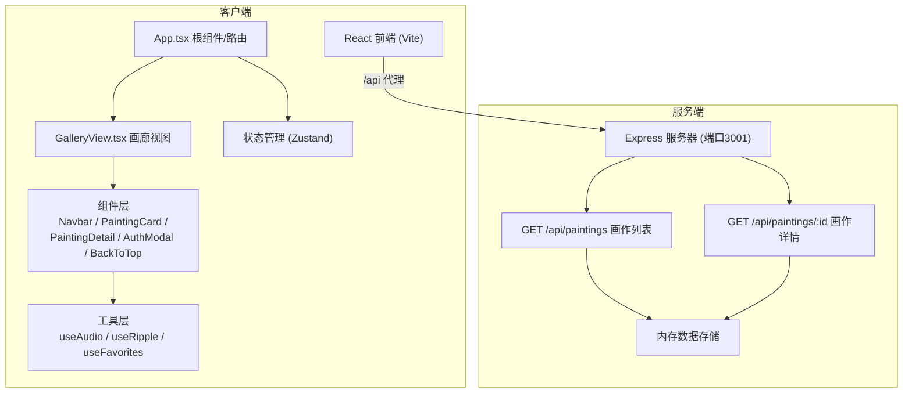
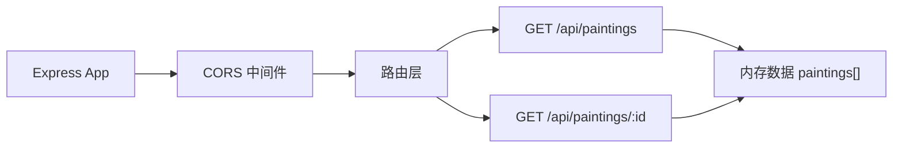
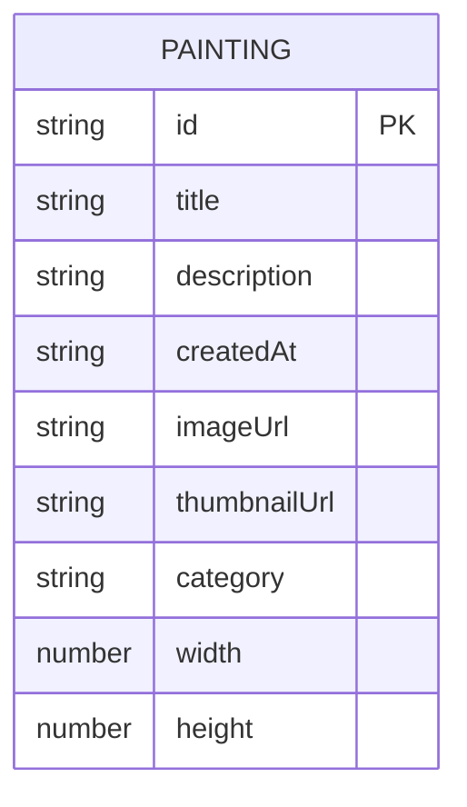

## 1. 架构设计



## 2. 技术描述
- **前端**：React 18 + TypeScript + Vite 5 + React Router DOM 6 + Zustand
- **后端**：Node.js + Express 4 + CORS + UUID
- **构建工具**：Vite 5（@vitejs/plugin-react）
- **启动方式**：concurrently 同时启动前端(Vite 5173)和后端(Express 3001)
- **数据层**：后端内存数组模拟数据库，含8幅预设画作

## 3. 路由定义
| 路由 | 用途 |
|------|------|
| / | 画廊主页（瀑布流展示） |
| /painting/:id | 画作详情页（翻页动画展示） |
| /favorites | 收藏画作列表（登录后可见） |

## 4. API 定义

### 4.1 类型定义
```typescript
interface Painting {
  id: string;
  title: string;
  description: string;
  createdAt: string;
  imageUrl: string;
  thumbnailUrl: string;
  category: 'landscape' | 'floral' | 'abstract';
  width: number;
  height: number;
}

interface User {
  username: string;
  favorites: string[];
}
```

### 4.2 接口定义
| 方法 | 路径 | 请求 | 响应 |
|------|------|------|------|
| GET | /api/paintings | - | Painting[]（8幅预设作品） |
| GET | /api/paintings/:id | - | Painting（画作详情） |

## 5. 服务端架构



## 6. 数据模型

### 6.1 画作数据（内存存储）


### 6.2 初始数据
后端启动时初始化8幅画作，使用 picsum.photos 占位图：
- 水彩风景：art1-art3
- 水彩花卉：art4-art6
- 水彩抽象：art7-art8
- 图片规格：600x800 / 800x600 / 600x600 等比例

## 7. 文件结构

```
auto263/
├── package.json                 # 项目依赖和脚本
├── vite.config.js               # Vite构建配置（代理/api到3001）
├── tsconfig.json                # TypeScript严格模式配置
├── index.html                   # 前端入口（全屏布局、内嵌字体）
└── src/
    ├── frontend/
    │   ├── App.tsx              # 根组件（路由+全局状态）
    │   ├── GalleryView.tsx      # 画廊主视图（瀑布流+交互）
    │   ├── components/
    │   │   ├── Navbar.tsx       # 左侧/底部导航栏
    │   │   ├── PaintingCard.tsx # 画作缩略图卡片（波纹效果）
    │   │   ├── PaintingDetail.tsx # 画作详情（翻页动画）
    │   │   ├── AuthModal.tsx    # 登录/注册弹窗
    │   │   ├── BackToTop.tsx    # 回到顶部按钮
    │   │   └── FavoriteButton.tsx # 收藏心形按钮
    │   ├── hooks/
    │   │   ├── useAudio.ts      # Web Audio沙沙声生成
    │   │   ├── useRipple.ts     # 波纹光效Hook
    │   │   └── useFavorites.ts  # 收藏管理Hook
    │   ├── store/
    │   │   └── useAuthStore.ts  # 用户状态管理（Zustand）
    │   ├── types/
    │   │   └── index.ts         # 类型定义
    │   ├── api/
    │   │   └── paintings.ts     # 后端API调用封装
    │   └── styles/
    │       └── global.css       # 全局样式（纸纹理、动画）
    └── backend/
        └── server.ts            # Express服务器（API接口+内存数据）
```

## 8. 数据流向

1. **应用启动**：App.tsx → useEffect 调用 GET /api/paintings → 存入本地状态
2. **画廊展示**：GalleryView.tsx 接收画作列表 → 渲染 PaintingCard 网格
3. **悬停交互**：PaintingCard 触发 CSS radial-gradient 波纹动画
4. **点击详情**：PaintingCard → 路由跳转 /painting/:id → PaintingDetail 触发翻页动画 + useAudio 播放沙沙声
5. **收藏功能**：FavoriteButton → useAuthStore 检查登录 → 切换收藏状态 → 弹跳动画
6. **用户认证**：AuthModal → useAuthStore → localStorage 持久化用户数据
