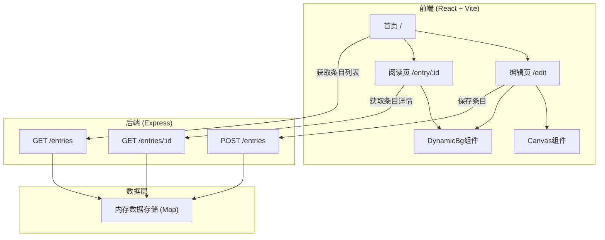
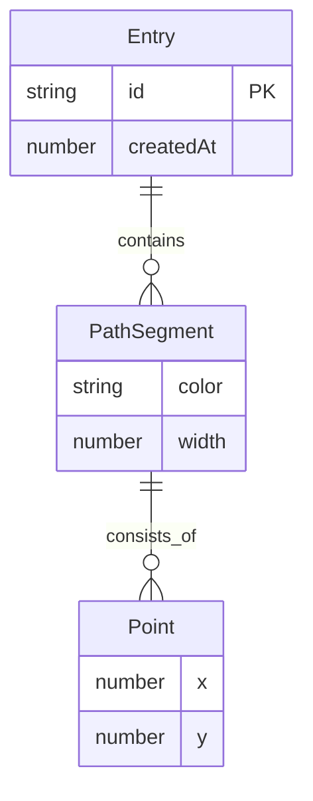

## 1. 架构设计



## 2. 技术说明
- 前端：React 18 + TypeScript + Vite
- 初始化工具：vite-init (react-express-ts 模板)
- 后端：Express 4 + TypeScript
- 数据库：内存Map存储（轻量级方案，无需外部数据库）
- 状态管理：zustand
- 样式：Tailwind CSS + CSS-in-JS (内联样式)
- 路由：react-router-dom

## 3. 路由定义
| 路由 | 用途 |
|------|------|
| / | 首页，展示日记条目时间线 |
| /edit | 编辑页，Canvas画布创建新条目 |
| /entry/:id | 阅读页，展示动态光影效果和路径动画 |

## 4. API定义

### 4.1 数据类型
```typescript
interface Point {
  x: number;
  y: number;
}

interface PathSegment {
  points: Point[];
  color: string;
  width: number;
}

interface Entry {
  id: string;
  paths: PathSegment[];
  createdAt: number;
}
```

### 4.2 API端点
| 方法 | 路径 | 请求体 | 响应 |
|------|------|--------|------|
| POST | /entries | `{ paths: PathSegment[] }` | `{ id: string, createdAt: number }` |
| GET | /entries | - | `Array<{ id: string, createdAt: number, pathCount: number }>` |
| GET | /entries/:id | - | `Entry` |

## 5. 服务器架构图

```mermaid
flowchart LR
    "Controller (路由层)" --> "Service (业务层)" --> "Repository (数据层)" --> "内存Map"
```

## 6. 数据模型

### 6.1 数据模型定义


### 6.2 数据定义
- 使用内存Map<string, Entry>存储，键为entry.id
- id由uuid v4生成
- createdAt为Unix时间戳(毫秒)
- 无需数据库建表语句
