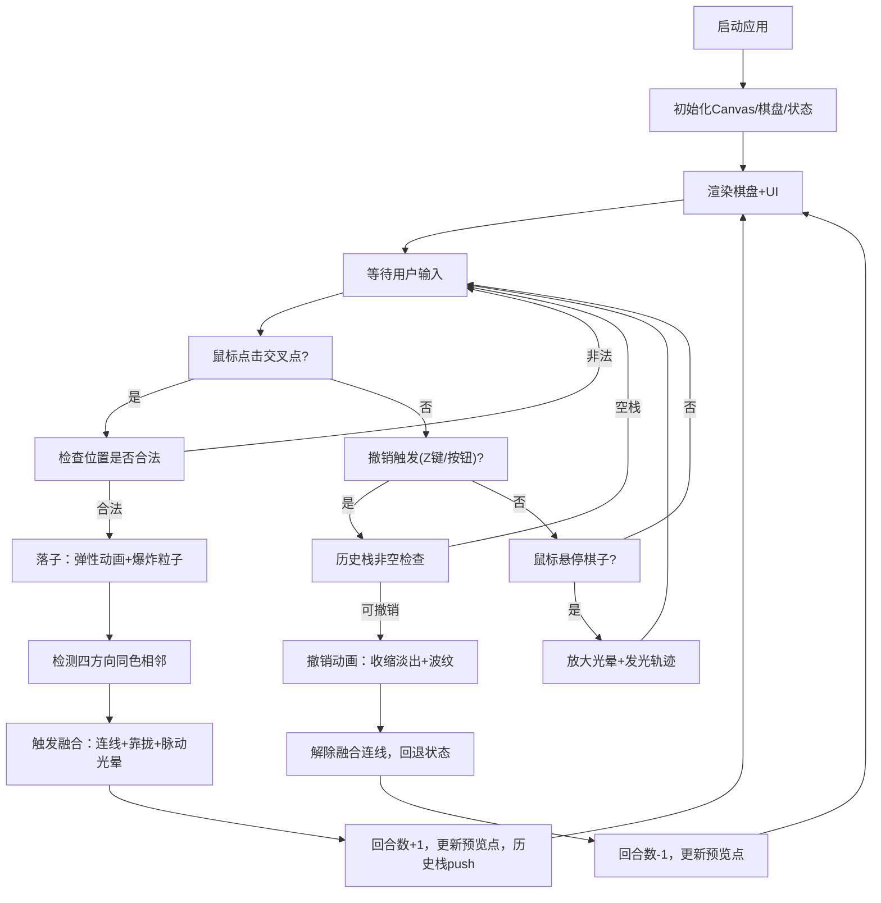

## 1. 产品概述

「落樱·琉璃棋局」是一款基于 Canvas 的沉浸式围棋变体交互体验，将传统棋盘策略与实时粒子物理、流体光影效果相结合，在深色琉璃质感棋盘上呈现棋子碰撞、融合、发光轨迹等绚烂视觉。

- **核心价值**：为用户提供超越传统黑白围棋的视觉化、艺术性对弈体验，让每一步落子都成为流光溢彩的瞬间
- **目标用户**：围棋爱好者、视觉艺术爱好者、追求沉浸式交互体验的玩家

## 2. 核心功能

### 2.1 功能模块

1. **棋盘渲染系统**：19×19 深色木纹渐变棋盘，半透明金色网格，棋子球体发光渲染
2. **落子交互系统**：鼠标点击落子，弹性动画，粒子爆炸特效
3. **同色融合系统**：相邻同色棋子间发光连线、靠拢位移、脉动光晕
4. **撤销回退系统**：Z 键/按钮撤销，棋子倒放消失，扩散波纹特效
5. **信息展示系统**：回合数发光显示、最近5步落子预览点
6. **悬停交互系统**：悬停放大光晕、发光轨迹线

### 2.2 功能详情

| 功能模块 | 子模块 | 详细描述 |
|---------|--------|---------|
| 棋盘渲染 | 背景绘制 | 深色木纹渐变 (#1a0f1e → #2d1b3a)，棋盘外框暗金色1px描边 |
| | 网格绘制 | 19×19 交叉点，半透明金色 (#d4af37, α=0.4) 线条 |
| | 棋子渲染 | 直径20px半透明发光球体，6色调色板随机取色，3px同色外光晕 |
| 落子交互 | 点击检测 | 捕捉最近交叉点，空位方可落子 |
| | 弹性动画 | 0.3秒坠地弹跳衰减动画（scale 1.3→0.9→1.0→0.97→1.0） |
| | 爆炸粒子 | 16个随机直径2-5px粒子，0.4秒向外扩散消散 |
| 同色融合 | 连线检测 | 相邻四方向同色棋子触发连线发光渐变（2px宽） |
| | 靠拢效果 | 两颗棋子各向对方移动1px |
| | 脉动光晕 | 接触点生成半径10px、周期1秒的呼吸光晕 |
| 撤销系统 | 触发方式 | Z键 / 右下角半透明撤销按钮 |
| | 倒放动画 | 0.3秒棋子收缩淡出动画 |
| | 波纹效果 | 圆形波纹扩散0.5秒，棋子颜色淡色版渐变透明 |
| 信息展示 | 回合数 | 左上角白色24px发光文字，text-shadow #d4af37 |
| | 落子预览 | 右上角5个8×8px圆点，间距4px，对应棋子颜色半透明 |
| 悬停交互 | 光晕放大 | 悬停棋子时光晕放大1.5倍 |
| | 发光轨迹 | 从棋子延伸出0.3秒发光轨迹线 |

## 3. 核心流程

## 4. 用户界面设计

### 4.1 设计风格

- **主色调**：深紫黑蓝渐变背景 (#0f0c29 → #302b63 → #24243e)，营造夜空琉璃氛围
- **棋盘色**：深色木纹渐变 (#1a0f1e → #2d1b3a)，暗金 (#d4af37) 点缀线条边框
- **棋子色**：6色霓虹调色板 (#ff6b6b, #ff9ff3, #48dbfb, #feca57, #54a0ff, #a29bfe)
- **材质**：毛玻璃半透明 (backdrop-filter: blur(4px))，圆角设计，发光描边 (glow/shadow)
- **字体**：无衬线现代字体，发光文字效果 (text-shadow)

### 4.2 页面布局

| 区域 | 元素 | UI规格 |
|-----|------|--------|
| 全屏背景 | 深紫→黑蓝渐变 | linear-gradient(to bottom, #0f0c29, #302b63, #24243e) |
| 顶部左上 | 回合计数器 | 白色24px，text-shadow: 0 0 10px #d4af37 |
| 顶部右上 | 最近5步预览 | 5×8px圆点，水平排列间距4px，毛玻璃背景容器 |
| 中央 | 棋盘 | 19×19网格，外边框1px #d4af37 (α=0.2)，四周留白 |
| 右下 | 撤销按钮 | 圆角8px，背景#d4af37，文字#1a0f1e，毛玻璃半透明 |

### 4.3 响应式适配

- **桌面 (>768px)**：棋盘居中，按原始像素比例渲染
- **移动端 (≤768px)**：棋盘整体等比缩放到屏幕宽 90%，网格线/棋子同步缩小；按钮/文字缩至 80%
- **触控适配**：点击触控事件映射到交叉点检测

### 4.4 性能要求

- 所有动画稳定 60fps
- 落子/融合/撤销等操作视觉反馈 ≤ 0.5秒
- 粒子数量动态管理，生命周期自动回收，避免内存泄漏
