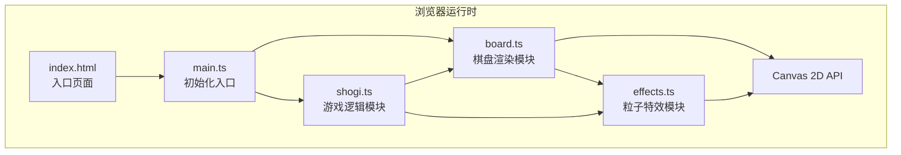

## 1. 架构设计



**分层说明**：
- **视图层 (board.ts)**：负责棋盘网格、棋子、UI信息的 Canvas 绘制；绑定鼠标/键盘事件
- **逻辑层 (shogi.ts)**：管理棋盘状态、落子合法性、融合判定、历史栈（撤销）
- **特效层 (effects.ts)**：粒子系统爆炸、融合脉动光晕、撤销波纹、悬停轨迹
- **入口层 (main.ts)**：创建 Canvas、初始化实例、启动 requestAnimationFrame 主循环

## 2. 技术描述

| 类别 | 选型 | 说明 |
|------|------|------|
| 前端框架 | **原生 TypeScript + Canvas 2D** | 无额外UI库，纯 Canvas 渲染以保证粒子动画60fps性能 |
| 构建工具 | **Vite 5** | 原生ES模块，热更新快，TypeScript开箱即用 |
| 语言 | **TypeScript 5 (strict模式)** | 严格类型检查，ES2022目标 |
| 样式 | **原生 CSS + backdrop-filter** | 毛玻璃半透明UI，响应式媒体查询 |
| 动画 | **requestAnimationFrame + 时间插值** | 手动管理动画帧进度，非线性缓动函数 |
| 粒子系统 | **对象池 + 生命周期管理** | 每个粒子带 birth/death 时间，自动回收 |

**依赖版本**：
```
devDependencies:
  typescript: ^5.3.0
  vite: ^5.0.0
```

## 3. 文件结构定义

```
root/
├── package.json           # 依赖声明 + dev脚本
├── vite.config.js         # Vite 配置 (入口 index.html, TS处理)
├── tsconfig.json          # strict模式, ES模块, target ES2022
├── index.html             # 全屏布局, meta viewport, title
└── src/
    ├── main.ts            # 初始化Canvas, 主循环, 事件桥接
    ├── board.ts           # 棋盘渲染/交互/棋子绘制/UI绘制
    ├── shogi.ts           # 游戏状态/落子逻辑/融合检测/撤销栈
    └── effects.ts         # 粒子特效系统/动画管理器
```

## 4. 核心数据结构 (TypeScript)

```typescript
// === 棋子数据 ===
interface Stone {
  id: number;            // 唯一标识
  row: number;           // 行 0-18
  col: number;           // 列 0-18
  color: string;         // 6色调色板色值
  state: 'dropping' | 'settled' | 'removing';
  animStart: number;     // 动画起始时间戳
  offsetX: number;       // 融合靠拢偏移像素
  offsetY: number;
}

// === 融合连线数据 ===
interface FusionLine {
  stone1Id: number;
  stone2Id: number;
  blendColor: string;    // 两色混合值
  pulseStart: number;    // 脉动起始时间
}

// === 特效基类 ===
interface Effect {
  type: 'explode' | 'pulse' | 'ripple' | 'trail';
  x: number;
  y: number;
  color: string;
  birth: number;         // 创建时间
  life: number;          // 生命周期ms
  data?: any;            // 粒子数组/扩展数据
}

// === 历史记录 (撤销) ===
interface HistoryEntry {
  stone: Stone;
  fusionLines: FusionLine[];  // 本次新增的连线
}
```

## 5. 核心算法

### 5.1 落子检测
```
click → 计算最近交叉点 (round(x/cellSize), round(y/cellSize))
      → 边界检查 0≤row/col≤18
      → 遍历 stones 查重 (row,col相同视为冲突)
      → 合法：分配ID+随机色→加入数组→触发落子动画
```

### 5.2 相邻同色融合检测
落子后检查新棋子的四邻域 (±1,0)(0,±1)：
```
for 每个方向:
  邻居 = stones.find(s => s.row==r±1 && s.col==c±1 && s.color==newColor)
  若存在:
    → 计算混合色 blendColor = 插值(stone.color, neighbor.color, 0.5)
    → 创建 FusionLine 记录
    → 双方 offsetX/offsetY += 向对方移动1px
    → 触发脉冲光晕特效
```

### 5.3 撤销算法
```
撤销触发 → historyStack.pop() → 取出最后一条 HistoryEntry
         → 标记 stone.state = 'removing', animStart = now
         → 移除本次产生的 fusionLines
         → 触发波纹特效 ripple(stone.x, stone.y, stone.color淡色版)
         → 0.3秒后从 stones 数组中移除 stone
         → 回合数 count--
```

### 5.4 粒子系统生命周期
每帧 (rAF 回调):
```
effects = effects.filter(e => now - e.birth < e.life)
for e in effects:
  t = (now - e.birth) / e.life  (0→1)
  α = 1 - t                     (线性淡出)
  根据 type 分别绘制:
    explode: particles[i].pos = origin + dir[i] * t * maxDist
    ripple : radius = r0 + t * maxR, stroke(α)
    pulse  : r = 10 * (0.8 + 0.2*sin(2π * now/1000))
    trail  : 沿方向绘制渐变线(α从1→0)
```

## 6. Canvas 渲染分层 (每帧绘制顺序)
```
Layer 1: 棋盘背景渐变 (boardBg)
Layer 2: 网格线 (#d4af37, α=0.4)
Layer 3: 融合连线 (2px 混合色渐变)
Layer 4: 脉动光晕 (shadowBlur + 呼吸半径)
Layer 5: 撤销波纹 (描边圆环, α渐变)
Layer 6: 棋子发光光晕 (shadowColor, shadowBlur 3px / 悬停×1.5)
Layer 7: 棋子球体 (半透明 radial-gradient)
Layer 8: 落子爆炸粒子 (圆形 fill, α淡出)
Layer 9: 悬停发光轨迹 (线性渐变描边)
Layer 10: UI层 - 回合数 / 预览点 / 撤销按钮 (Canvas + DOM混合)
```

## 7. 性能优化策略

1. **脏矩形优化**：仅重绘棋子状态变化区域（可选实现，初期全屏重绘优先保证正确性）
2. **粒子上限**：同时存在的粒子总数 ≤ 256，超出时淘汰最旧的 explode 特效
3. **对象池**：Particle 对象从 pool 复用，避免频繁 GC
4. **颜色缓存**：混合色、淡色版存入 Map，避免重复计算
5. **时间插值**：动画进度使用 `(now - birth) / life` 计算，不依赖固定步长
