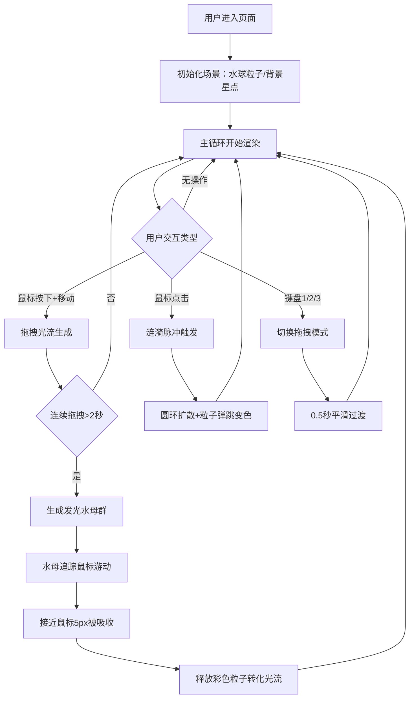

## 1. 产品概述

'墨韵·流光引水'是一款基于浏览器Canvas技术的沉浸式交互式粒子水景游戏，让用户通过鼠标/触摸手势在虚拟水景中实时引导水流方向，体验流体粒子与动态光影融合的创意视觉效果。

- **核心目的**：解决用户在网页上缺乏沉浸式流体粒子创意体验的问题，提供通过手部动作引导水流、触发涟漪和光波反馈的治愈系交互体验
- **目标用户**：创意爱好者、视觉艺术从业者、休闲游戏玩家、压力释放人群
- **产品价值**：低门槛、高沉浸的视觉交互艺术品，兼具娱乐性与减压疗愈效果

## 2. 核心功能

### 2.1 功能模块

1. **主场景粒子系统**：中央动态光泽水球（3000粒子），自转+呼吸脉动效果
2. **拖拽光流系统**：鼠标拖拽生成彩色光流，3秒后消散融入水球
3. **涟漪脉冲系统**：点击触发发光圆环扩散，影响覆盖粒子
4. **水母召唤系统**：连续拖拽2秒生成发光水母，游动至鼠标位置被吸收
5. **多模式切换系统**：三种拖拽模式（光流追踪/星轨喷涌/漩涡捕获），0.5秒平滑过渡
6. **UI信息展示**：模式标签、FPS计数器、操作提示框

### 2.2 页面详情

| 页面名称 | 模块名称 | 功能描述 |
|---------|---------|---------|
| 主场景 | 水球粒子系统 | 3000粒子构成半径400px动态水球，深蓝-淡紫渐变，15秒自转，4秒呼吸脉动 |
| 主场景 | 光流生成器 | 拖拽路径生成彩色光流粒子（5-10px宽，#ff6b6b→#fbbf24），3秒消散+爆裂 |
| 主场景 | 涟漪脉冲器 | 点击生成发光圆环（0→300px，1.2秒，青→粉渐变），粒子弹跳变色 |
| 主场景 | 水母系统 | 连续拖拽2秒生成3-5只水母（40-80px），追踪鼠标，吸收转化光流 |
| 主场景 | 模式控制器 | 键盘1/2/3切换三种拖拽模式，0.5秒平滑过渡动画 |
| 主场景 | UI层 | 左上：模式+FPS；右下：毛玻璃操作提示框 |
| 主场景 | 背景层 | 墨黑-深蓝渐变背景，100颗星点闪烁 |

## 3. 核心流程

## 4. 用户界面设计

### 4.1 设计风格
- **主色调**：墨黑到深蓝渐变背景（#0b0f19 → #15233b）
- **强调色**：青色#67e8f9、粉色#f472b6、紫色#a855f7、深蓝#0fb5e5、暖黄#fbbf24、珊瑚#ff6b6b
- **字体**：发光字体，主标签20px#c084fc，FPS 14px#94a3b8 monospace
- **混合模式**：粒子使用'lighter'叠加融合
- **视觉基调**：深色沉静、极光流光、水墨意境

### 4.2 页面设计概述

| 区域位置 | 模块名称 | UI元素细节 |
|---------|---------|---------|
| 全屏背景 | 星空渐变层 | 径向渐变#0b0f19→#15233b，100颗1-2px星点，2-5秒周期闪烁 |
| 屏幕中央 | 水球粒子 | 400px半径3000粒子，深蓝-淡紫渐变，0.3-0.6透明度，2-5px大小，自转+呼吸 |
| 左上角 | 模式+FPS | 发光文字#c084fc 20px模式名，#94a3b8 14px monospace FPS，呼吸光晕 |
| 右下角 | 操作提示 | 毛玻璃backdrop-filter:blur(12px)，rgba(15,23,42,0.7)背景，1px半透明白边，12px圆角，淡紫文字#a78bfa |
| 拖拽路径 | 光流粒子 | 5-10px宽度，#ff6b6b→#fbbf24渐变，持续3秒后消散+15px爆裂 |
| 点击位置 | 涟漪圆环 | 4px宽度，0.4-0.8透明度，#67e8f9→#f472b6渐变，0→300px扩散1.2秒 |
| 屏幕中 | 发光水母 | 40-80px直径，30-60px触须，1.5-3秒呼吸周期，#38bdf8/#a78bfa/#f472b6随机色 |

### 4.3 响应式设计
- **设计策略**：桌面优先，移动端自适应
- **画布适配**：最小16:9宽高比，自动适配窗口尺寸
- **触摸优化**：移动端交互热区≥44x44px
- **性能预算**：粒子≤4000，光流≤200，水母≤5，目标60FPS

### 4.4 性能优化策略
- 仅更新可视范围内粒子位置
- 粒子更新使用线性插值确保流畅
- 鼠标事件不做节流，粒子计算做视锥剔除
- 使用requestAnimationFrame主循环
