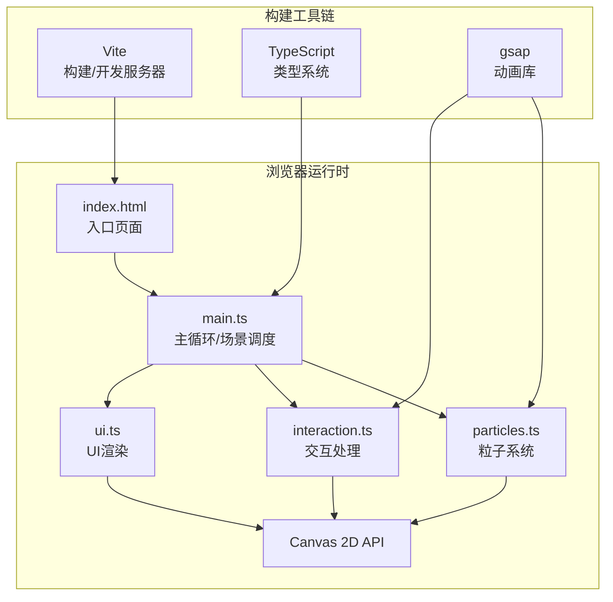

## 1. 架构设计



## 2. 技术说明

- **前端框架**：原生 TypeScript + HTML5 Canvas 2D API（无React/Vue，纯Canvas渲染性能最优）
- **构建工具**：Vite 5.x
- **动画库**：gsap 3.x（用于平滑过渡动画、easing缓动）
- **初始化方式**：Vite vanilla-ts 模板，手动配置文件结构
- **后端**：无（纯前端项目）

## 3. 文件组织结构

| 文件路径 | 职责 | 导出内容 |
|---------|-----|---------|
| package.json | 项目配置，依赖：typescript、vite、gsap，脚本：npm run dev | - |
| vite.config.js | Vite构建配置，处理TypeScript，入口index.html | - |
| tsconfig.json | TS严格模式，ES模块目标，moduleResolution: bundler | - |
| index.html | 全屏入口页面，Canvas挂载点，viewport设置 | - |
| src/main.ts | 初始化Canvas，requestAnimationFrame主循环，协调子模块 | `GameApp`类 |
| src/particles.ts | 粒子类定义，水球/光流/爆裂/涟漪粒子管理，可视范围优化 | `ParticleSystem`类，`Particle`接口 |
| src/interaction.ts | 鼠标/触摸/键盘事件处理，三种模式逻辑，水母生成/吸收 | `InteractionManager`类 |
| src/ui.ts | 模式标签、FPS、操作提示框绘制，响应式适配 | `UIRenderer`类 |

## 4. 核心数据模型

### 4.1 粒子接口

```typescript
interface Particle {
  x: number;           // 位置X
  y: number;           // 位置Y
  vx: number;          // 速度X
  vy: number;          // 速度Y
  baseX: number;       // 基础位置X（水球粒子用）
  baseY: number;       // 基础位置Y（水球粒子用）
  color: {             // 颜色（RGBA分量）
    r: number; g: number; b: number; a: number
  };
  targetColor: {       // 目标颜色（用于过渡）
    r: number; g: number; b: number; a: number
  };
  size: number;        // 粒子大小
  life: number;        // 剩余生命值（毫秒），-1表示永久
  maxLife: number;     // 最大生命值
  type: 'water' | 'flow' | 'burst' | 'star' | 'jellyfish';  // 粒子类型
  bounceOffset: number; // 涟漪弹跳偏移
  bounceDecay: number;  // 弹跳衰减
  angle: number;       // 旋转角度（漩涡模式用）
  radius: number;      // 轨道半径（漩涡模式用）
}
```

### 4.2 涟漪接口

```typescript
interface Ripple {
  x: number;
  y: number;
  currentRadius: number;
  maxRadius: number;
  startTime: number;
  duration: number;
  lineWidth: number;
}
```

### 4.3 水母接口

```typescript
interface Jellyfish {
  x: number;
  y: number;
  vx: number;
  vy: number;
  diameter: number;
  tentacleLength: number;
  breathCycle: number;
  breathPhase: number;
  color: string;
  startTime: number;
  lifeDuration: number;
  waveOffset: number;
  easeIn: number;    // 出现缓动
  easeOut: number;   // 消散缓动
}
```

### 4.4 拖拽模式枚举

```typescript
enum DragMode {
  FLOW_TRACE = 1,    // 光流追踪
  STAR_BURST = 2,    // 星轨喷涌
  VORTEX_CAPTURE = 3 // 漩涡捕获
}
```

## 5. 核心算法

### 5.1 水球粒子自转+呼吸
- 每个水球粒子有基础位置(baseX, baseY)，基于极坐标分布在半径400px圆内
- 自转：每帧将基础位置绕中心旋转 (2π / 15000) * deltaTime 弧度
- 呼吸：半径乘以 scale = 1 + 0.1 * sin(time / 2000 * π)

### 5.2 可视范围粒子优化
- 粒子更新前判断：`x ∈ [-50, canvasW+50] && y ∈ [-50, canvasH+50]`
- 屏幕外粒子：仅保留状态，不计算速度/位置更新

### 5.3 三种拖拽模式
1. **光流追踪**：沿鼠标路径以5-10px间隔生成光流粒子，速度 = 鼠标速度向量 + 小幅随机
2. **星轨喷涌**：每帧在鼠标位置生成粒子，速度方向 = 随机角度，速度大小 1.5px/帧 + 向外径向力
3. **漩涡捕获**：在鼠标位置创建30px半径漩涡，附近粒子被吸引，切向速度产生0.8转/秒旋转

### 5.4 平滑过渡（0.5秒）
- 模式切换时存储transitionStart = currentTime
- 过渡进度t = clamp((now - transitionStart) / 500, 0, 1)
- 使用gsap的easeInOutQuad插值：粒子行为 = 旧行为 * (1-t) + 新行为 * t

### 5.5 颜色插值
- 深蓝#0fb5e5 → rgb(15, 181, 229)
- 淡紫#a855f7 → rgb(168, 85, 247)
- 线性插值：lerp(a, b, t) = a + (b - a) * t

### 5.6 easeInOutQuad缓动
```
t ∈ [0, 1]
if t < 0.5: ease = 2t²
else: ease = 1 - pow(-2t+2, 2) / 2
```

## 6. 性能预算

| 资源类型 | 上限 | 实现策略 |
|---------|-----|---------|
| 水球粒子 | 3000 | 预生成，基础位置极坐标分布 |
| 光流粒子 | 200 | 队列管理，超出数量移除最早粒子 |
| 水母 | 5 | 计数器限制，旧的先消散 |
| 涟漪 | 5 | 同时最多5个涟漪 |
| 目标FPS | 60 | requestAnimationFrame，deltaTime归一化 |
| 帧耗时 | <16ms | 可视范围剔除、避免GC对象池复用 |
