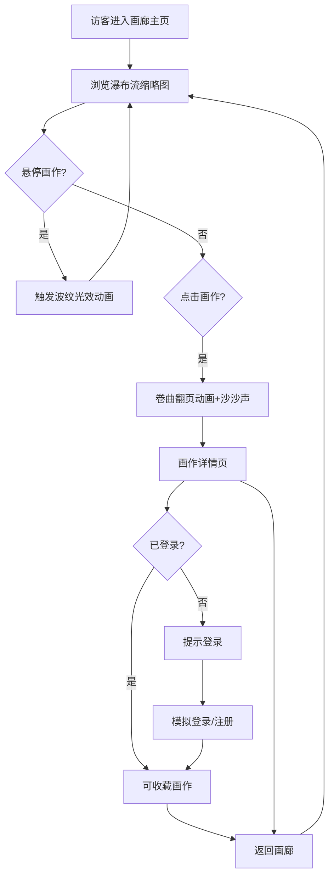

## 1. 产品概述

「纸间·光痕画廊」是一个面向自由插画师和艺术爱好者的在线数字画作浏览平台，模拟实体水彩本翻阅体验，让访客在浏览器中感受如同翻阅真实画册般的沉浸式浏览。通过纸页卷曲动画、沙沙声效和波纹光效，将数字画作的展示提升至触觉与听觉联觉的层面。

- 目标用户：自由插画师展示作品集、艺术爱好者浏览收藏
- 核心价值：以水彩纸质感的交互体验区别于传统在线画廊，创造记忆点

## 2. 核心功能

### 2.1 用户角色

| 角色 | 注册方式 | 核心权限 |
|------|----------|----------|
| 访客 | 无需注册 | 浏览画廊、查看画作详情 |
| 注册用户 | 前端模拟注册 | 浏览画廊、查看画作详情、收藏画作 |

### 2.2 功能模块

1. **画廊主页**：三列瀑布流展示画作缩略图，悬停波纹光效，拖拽交互
2. **画作详情页**：卷曲翻页动画进入，沙沙声效，画作标题/日期/描述展示
3. **用户系统**：前端模拟登录注册，收藏功能（心形图标动画）
4. **导航系统**：左侧垂直导航栏，回到顶部按钮

### 2.3 页面详情

| 页面名称 | 模块名称 | 功能描述 |
|----------|----------|----------|
| 画廊主页 | 瀑布流网格 | 三列瀑布流展示8+幅画作缩略图，随机宽度240-320px，按比例自适应高度 |
| 画廊主页 | 悬停波纹光效 | 鼠标悬停时从中心向外扩散radial-gradient动画，颜色#f0e6d3→#d4c5a9，周期1.5s |
| 画廊主页 | 缩略图交互 | 悬停放大scale(1.05)+亮度brightness(1.2)，过渡0.3s，阴影和2px圆角 |
| 画作详情页 | 卷曲翻页动画 | 点击缩略图从右侧卷曲翻入，clip-path+perspective(1000px) rotateY(-30deg) |
| 画作详情页 | 沙沙声效 | Web Audio API生成白噪声，0.5秒时长 |
| 画作详情页 | 画作信息 | 标题、创作日期、文字描述，深米色背景#f5f0e6 |
| 画廊主页 | 用户登录/注册 | 前端模拟，登录后显示收藏按钮 |
| 画廊主页 | 收藏功能 | 空心心形#c9b99a→实心金色#d4af37，0.2s弹跳动画 |
| 全局 | 左侧导航栏 | 60px宽，半透明磨砂玻璃，backdrop-filter:blur(8px)，背景rgba(245,240,230,0.6) |
| 全局 | 回到顶部按钮 | 圆形40px，背景#c9b99a，悬停#b8a88a，底部浮动 |

## 3. 核心流程

用户打开画廊主页 → 浏览三列瀑布流缩略图 → 悬停查看波纹光效 → 点击缩略图 → 触发卷曲翻页动画+沙沙声 → 进入画作详情页 → 查看画作信息 → 可登录后收藏 → 返回画廊继续浏览

## 4. 用户界面设计

### 4.1 设计风格

- 主色：米白（#f5f0e6）、浅金（#d4af37）
- 辅助色：淡墨绿（#7a9e7e）
- 强调色：暖金（#d4af37）
- 按钮风格：圆角2-4px，柔和阴影，暖色调
- 字体：衬线体为主（展示艺术感），无衬线体为辅（信息文字）
- 布局风格：左侧导航+右侧内容区，瀑布流卡片式
- 图标风格：线性图标，lucide-react
- 背景纹理：CSS repeating-linear-gradient模拟纸纹理

### 4.2 页面设计概述

| 页面名称 | 模块名称 | UI要素 |
|----------|----------|--------|
| 画廊主页 | 瀑布流网格 | 三列布局，缩略图带阴影和圆角，纸纹理背景 |
| 画廊主页 | 波纹光效 | radial-gradient从中心扩散，暖色调过渡 |
| 画作详情页 | 卷曲翻页 | perspective+rotateY动画，clip-path遮罩 |
| 画作详情页 | 画作信息 | 深米色背景，标题+日期+描述，优雅排版 |
| 全局 | 导航栏 | 半透明磨砂玻璃，垂直排列图标 |
| 全局 | 回到顶部 | 底部右侧浮动圆形按钮 |

### 4.3 响应式适配

- 桌面端（≥768px）：三列瀑布流，左侧垂直导航栏60px
- 平板端（<768px）：单列瀑布流，导航栏变底部栏
- 移动端（<480px）：单列瀑布流，缩略图圆角减小到4px，阴影淡化
- 触摸优化：增大点击区域，滑动手势支持

### 4.4 性能要求

- 首屏8张缩略图加载 ≤ 2秒（懒加载+预压缩）
- 翻页动画帧率 ≥ 30fps
- 悬停波纹动画响应延迟 ≤ 50ms
