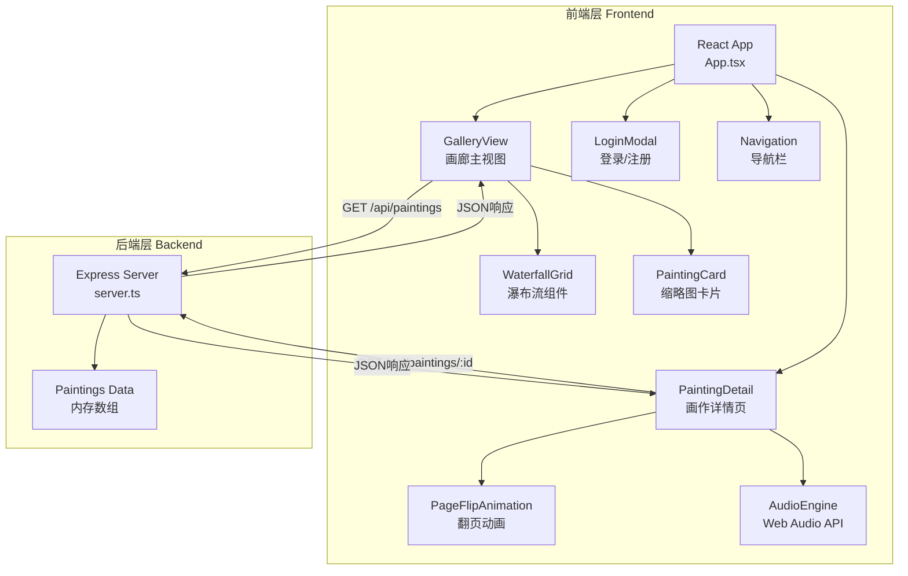
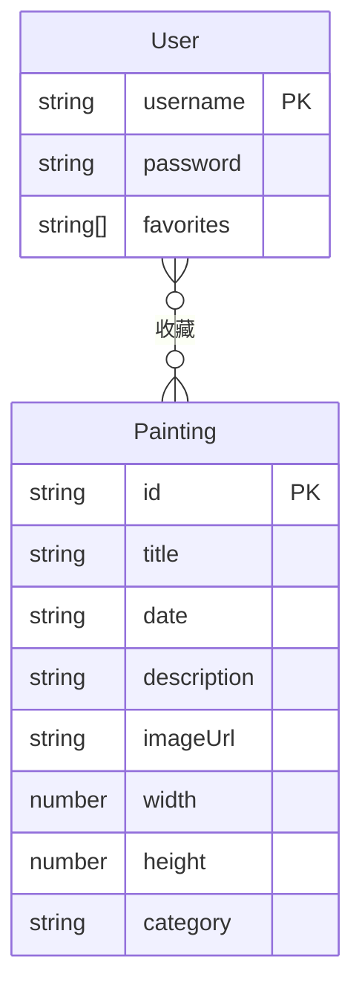

## 1. 架构设计



## 2. 技术说明

- 前端：React 18 + TypeScript + Tailwind CSS + Vite
- 初始化工具：vite-init（react-express-ts模板）
- 后端：Express 4 + TypeScript（ESM格式）
- 数据库：无，使用内存数组模拟数据
- 状态管理：Zustand
- 路由：react-router-dom
- 音频：Web Audio API（浏览器原生）

## 3. 路由定义

| 路由 | 用途 |
|------|------|
| / | 画廊主页，瀑布流展示所有画作 |
| /painting/:id | 画作详情页，带卷曲翻页动画 |

## 4. API定义

### 4.1 获取画作列表

```
GET /api/paintings
Response: Painting[]
```

### 4.2 获取画作详情

```
GET /api/paintings/:id
Response: Painting
```

### 4.3 数据类型定义

```typescript
interface Painting {
  id: string;
  title: string;
  date: string;
  description: string;
  imageUrl: string;
  width: number;
  height: number;
  category: 'landscape' | 'floral' | 'abstract';
}
```

## 5. 服务器架构图


## 6. 数据模型

### 6.1 数据模型定义



### 6.2 初始数据

预置8幅水彩画作数据：
- art1-art8：使用 `https://picsum.photos/seed/art{N}/600/800` 等占位图
- 类别涵盖：水彩风景(landscape)、花卉(floral)、抽象(abstract)
- 用户数据前端模拟存储（localStorage）
