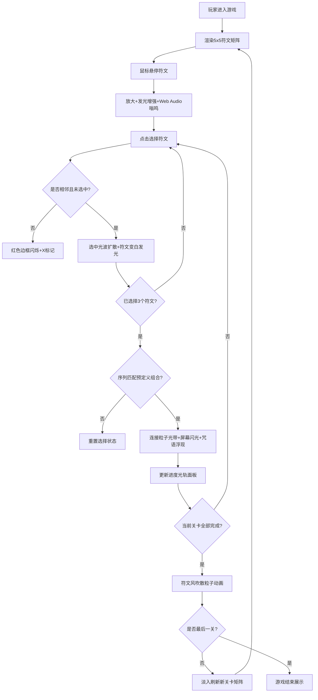

## 1. 产品概述
「星辉·符咒解谜」是一款基于浏览器Canvas的沉浸式符文组合解谜游戏，玩家通过鼠标点击拖拽组合发光符文来触发动态光影和粒子特效，在深邃星空背景下体验神秘的符咒咒语之旅。
- 核心玩法：在5x5发光符文矩阵中，通过点击选择最多3个相邻符文，组合出预定义的几何序列（直线、L形、T形等）以触发粒子特效和通关
- 目标用户：喜欢视觉艺术、解谜游戏、粒子特效体验的网页用户
- 产品价值：填补网页上缺乏高沉浸感符文组合解谜体验的空白，以霓虹夜光风格打造独特视觉享受

## 2. 核心功能

### 2.1 功能模块
1. **主游戏界面**：5x5符文矩阵、深邃星空背景、进度光轨面板
2. **符文交互系统**：悬停放大+嗡鸣、选中光波扩散、错误闪烁反馈
3. **解谜判定系统**：相邻符文判定、序列匹配、几何形状识别
4. **粒子特效系统**：符文爆发粒子、光带连接粒子、风吹散粒子、屏幕闪光
5. **关卡系统**：4个不同解谜关卡、5-7个待发现组合、关卡切换动画
6. **进度追踪系统**：右侧光轨面板、呼吸光晕进度点、关卡编号显示

### 2.2 页面详情
| 页面名称 | 模块名称 | 功能描述 |
|-----------|-------------|---------------------|
| 主游戏页 | 符文矩阵 | 5x5六边形发光符文，随机颜色和几何符号，悬停/选中动画 |
| 主游戏页 | 星空背景 | 垂直渐变星空+径向光晕+毛玻璃效果 |
| 主游戏页 | 进度光轨面板 | 右侧纵向进度条，光点指示组合完成度，关卡编号 |
| 主游戏页 | 反馈层 | 光波扩散、粒子爆发、连接光带、屏幕闪光、咒语浮现、错误X标记 |

## 3. 核心流程
玩家进入游戏 → 浏览5x5符文矩阵 → 鼠标悬停符文查看放大效果 → 点击选择第1个符文 → 点击相邻第2个符文 → 点击相邻第3个符文 → 系统判定序列匹配 → 匹配成功：触发连接光带+屏幕闪光+咒语浮现+进度更新 → 完成当前关卡所有组合 → 符文风吹散粒子动画 → 切换至下一关 → 重复直至全部关卡完成

## 4. 用户界面设计

### 4.1 设计风格
- **主色调**：深邃星空渐变（#0f0c29 → #302b63 → #24243e），霓虹夜光风格
- **符文调色板（8色）**：#ff6b6b（珊瑚红）、#48dbfb（天空蓝）、#feca57（琥珀黄）、#ff9ff3（樱花粉）、#54a0ff（宝石蓝）、#a29bfe（薰衣草紫）、#f368e0（洋红）、#7bed9f（薄荷绿）
- **强调色**：#f1c40f（淡金色，用于咒语、进度编号、屏幕闪光）、#2ecc71（翠绿，用于已完成进度点）、#ff0000（错误反馈）
- **毛玻璃效果**：backdrop-filter: blur(8px)，背景 rgba(255,255,255,0.04)
- **字体**：发光字体，text-shadow: 0 0 10px 当前颜色
- **按钮/交互风格**：六边形发光边框，悬停放大+亮度提升50%，ease-out过渡

### 4.2 页面设计概述
| 页面名称 | 模块名称 | UI元素 |
|-----------|-------------|-------------|
| 主游戏页 | 星空背景 | 垂直三段渐变，中心径向半透明白色光晕，居中对齐距顶部60px |
| 主游戏页 | 符文矩阵 | 5x5六边形（80px），1.5px发光边框，随机几何符号（三角/菱形/星形），毛玻璃背景，选中变白发光，永久变灰白半透明 |
| 主游戏页 | 进度光轨面板 | 右边缘纵向（宽80px），毛玻璃背景，垂直光点（8px），完成者翠绿呼吸光晕（1.5s周期），未完成者灰白0.3透明，底部金色发光关卡编号 |
| 主游戏页 | 粒子特效层 | 光波（半径0→120px，0.8s），连接光带（30粒子，3-6px，脉冲0.5s间隔），风吹散（100粒子，2-5px，加速2s），屏幕闪光（0.3s淡金色0.2透明），咒语浮现（32px金色4px阴影，2.5s） |
| 主游戏页 | 错误反馈层 | 符文边框红闪0.2s，下方淡红色半透X标记（24x24px，0.5s消失） |

### 4.3 响应式设计
- **桌面端（>1024px）**：5x5完整矩阵，符文间距120px，六边形80px
- **平板端（768-1024px）**：5x5矩阵，符文间距缩小到90px，保持80px六边形
- **移动端（<768px）**：3x3子矩阵可横向滑动查看，六边形缩小到60px
- **动画驱动**：所有交互使用requestAnimationFrame + CSS transition（ease-out，0.2-0.5s）
- **性能约束**：FPS稳定60，符文≤25，同屏粒子≤200

### 4.4 音效设计
- Web Audio API合成低频嗡鸣声，鼠标悬停符文时触发微弱音效
