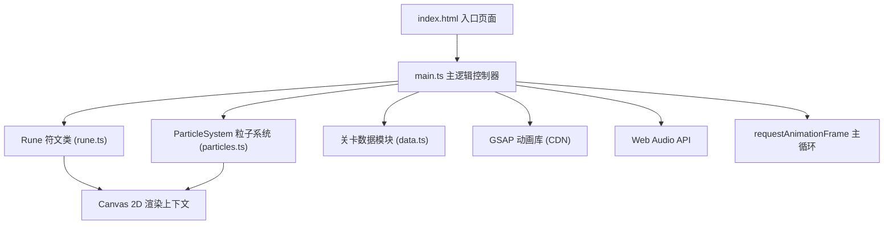

## 1. 架构设计



**层次说明**：
- **视图层**：Canvas 2D API 负责所有像素级渲染（符文、粒子、光影特效）
- **逻辑层**：main.ts 协调游戏状态、事件处理、关卡切换
- **数据层**：data.ts 存储关卡配置、预定义组合规则、调色板
- **特效层**：rune.ts + particles.ts + GSAP 处理动画和粒子物理

## 2. 技术栈说明
- **前端框架**：无（原生Canvas 2D + TypeScript，避免React/Vue额外开销以保证粒子性能）
- **构建工具**：Vite 5.x + @vitejs/plugin-typescript
- **编程语言**：TypeScript 5.x（严格模式 strict: true，ES模块目标）
- **动画库**：GSAP 3.x（通过CDN引入减小打包体积，用于时间线动画和缓动）
- **音效**：Web Audio API 原生合成（OscillatorNode + GainNode）
- **渲染引擎**：Canvas 2D Context（requestAnimationFrame驱动主循环）

## 3. 文件结构与模块定义
```
auto272/
├── package.json              # 依赖配置: typescript, vite, gsap; 脚本: npm run dev
├── vite.config.js            # Vite构建配置 + @vitejs/plugin-typescript
├── tsconfig.json             # TS严格模式 + ES模块目标
├── index.html                # 全屏深色背景入口 + GSAP CDN引入
└── src/
    ├── main.ts               # 主逻辑: Canvas初始化/渲染循环/事件/状态/关卡切换
    ├── rune.ts               # Rune类: 六边形绘制/悬停选中动画/几何符号/颜色切换
    ├── particles.ts          # ParticleSystem: 粒子生成/更新/渲染/光带/爆发/闪光
    └── data.ts               # 关卡数据: 4关配置/组合规则/调色板/咒语文本
```

## 4. 核心模块接口定义

### 4.1 数据模型 (data.ts)
```typescript
// 8色调色板
export const PALETTE: string[] = [
  '#ff6b6b', '#48dbfb', '#feca57', '#ff9ff3',
  '#54a0ff', '#a29bfe', '#f368e0', '#7bed9f'
];

// 几何符号类型
export type SymbolType = 'triangle' | 'diamond' | 'star' | 'circle' | 'hexagon';

// 符文组合规则形状
export type PatternShape = 'line-horizontal' | 'line-vertical' | 'line-diagonal' | 
                            'L-shape' | 'T-shape' | 'reverse-L' | 'Z-shape';

// 单个符文坐标
export interface RuneCoord { row: number; col: number; }

// 预定义符文组合
export interface RunePattern {
  id: string;
  coords: RuneCoord[];        // 3个符文坐标
  shape: PatternShape;        // 几何形状类型
  spellText: string;          // 触发的咒语文本
}

// 单关卡配置
export interface LevelConfig {
  level: number;
  patterns: RunePattern[];    // 5-7个待发现组合
  description: string;        // 关卡提示
}

// 全部4关卡
export const LEVELS: LevelConfig[] = [ ... ];
```

### 4.2 Rune 类 (rune.ts)
```typescript
export class Rune {
  x: number; y: number;               // 中心像素坐标
  row: number; col: number;           // 矩阵坐标
  size: number;                       // 六边形边长（默认80px）
  color: string;                      // 当前边框颜色
  originalColor: string;              // 原始调色板颜色
  symbol: SymbolType;                 // 内部几何符号
  isHovered: boolean;
  isSelected: boolean;
  isPermanentlyUsed: boolean;         // 已选中后变灰白
  isErrorFlashing: boolean;           // 错误红色闪烁
  waveAnimation: { active: boolean; progress: number; };
  chargeAnimation: { active: boolean; progress: number; };
  
  constructor(x, y, row, col, size, color, symbol);
  draw(ctx: CanvasRenderingContext2D): void;     // 绘制六边形+边框+符号
  update(dt: number): void;                       // 更新动画进度
  containsPoint(px: number, py: number): boolean; // 命中检测
  triggerSelectWave(): void;                      // 触发选中光波
  triggerErrorFlash(): void;                      // 触发错误闪烁
  markAsUsed(): void;                             // 永久灰白化
}
```

### 4.3 ParticleSystem 类 (particles.ts)
```typescript
interface Particle {
  x: number; y: number;
  vx: number; vy: number;
  size: number;
  color: string;
  life: number; maxLife: number;
  type: 'burst' | 'ribbon' | 'scatter' | 'sparkle';
}

export class ParticleSystem {
  particles: Particle[];
  maxParticles: number; // 上限200
  
  constructor();
  // 选中符文时爆发光波粒子
  emitBurst(x: number, y: number, color: string, count: number = 30): void;
  // 三个符文间的连接光带粒子
  emitRibbon(points: {x:number;y:number}[], avgColor: string, count: number = 30): void;
  // 关卡完成时风吹散粒子
  emitScatter(origins: {x:number;y:number;color:string}[], count: number = 100): void;
  // 屏幕闪光叠加层
  triggerScreenFlash(color: string, duration: number = 0.3): void;
  // 咒语文字浮现
  showSpellText(text: string, duration: number = 2.5): void;
  // 错误X标记
  showErrorMark(x: number, y: number, duration: number = 0.5): void;
  // 主更新
  update(dt: number): void;
  // 主渲染
  draw(ctx: CanvasRenderingContext2D): void;
}
```

### 4.4 主控制器 (main.ts)
```typescript
// 全局状态
type GameState = 'playing' | 'levelTransition' | 'complete';

interface GameContext {
  canvas: HTMLCanvasElement;
  ctx: CanvasRenderingContext2D;
  runes: Rune[][];                 // 5x5矩阵
  selectedRunes: Rune[];           // 当前选择（最多3）
  currentLevel: number;            // 0-3
  completedPatterns: Set<string>;  // 已完成组合ID
  particleSystem: ParticleSystem;
  audioCtx: AudioContext | null;
  gameState: GameState;
  screenWidth: number;
  screenHeight: number;
}

// 核心方法
initGame(): void;                  // 初始化Canvas+音频+第一关
buildRuneMatrix(): void;           // 生成5x5符文矩阵
handleMouseMove(e: MouseEvent): void;
handleClick(e: MouseEvent): void;
checkAdjacency(a: Rune, b: Rune): boolean;    // 判定六邻接
checkPatternMatch(): RunePattern | null;      // 匹配预定义序列
onPatternSuccess(pattern: RunePattern): void; // 成功流程
onPatternFail(): void;                        // 失败重置
checkLevelComplete(): boolean;
transitionToNextLevel(): void;                // 粒子+淡入
resizeCanvas(): void;                         // 响应式
renderLoop(timestamp: number): void;          // RAF主循环
```

## 5. 性能优化策略
- **对象池**：ParticleSystem 内部维护粒子对象池，避免频繁GC
- **粒子上限**：严格控制同屏粒子≤200，超出时淘汰最旧粒子
- **离屏计算**：符文几何属性预计算，命中检测用数学公式而非像素
- **脏标记**：仅当符文状态变化时重算绘制路径
- **分层渲染**：背景→符文→粒子→UI层，按序绘制避免过度绘制
- **节流**：resize事件使用RAF节流

## 6. 构建与运行
- **安装依赖**：npm install
- **开发模式**：npm run dev（Vite HMR）
- **生产构建**：npm run build（TS严格检查→Vite打包→dist输出）
- **GSAP引入**：index.html中通过 `<script src="https://cdn.jsdelivr.net/npm/gsap@3.12.5/dist/gsap.min.js"></script>` 引入
