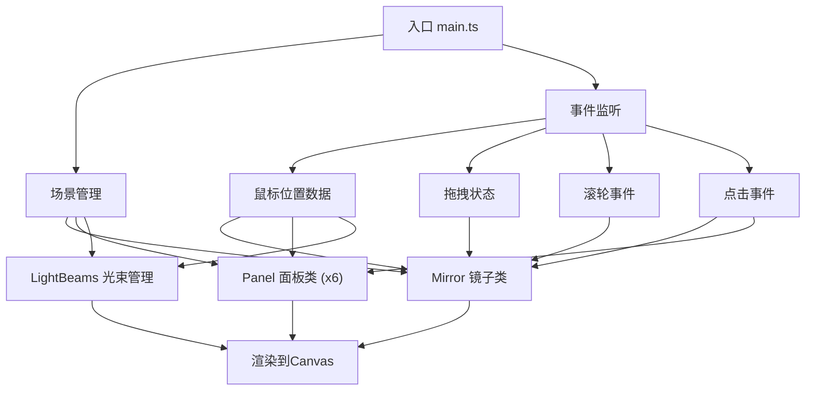

## 1. 架构设计

本项目为纯前端Canvas交互式视觉应用，采用模块化架构设计，各组件职责单一，数据流向清晰。



## 2. 技术栈描述

- **前端框架**：原生 TypeScript (无UI框架)
- **构建工具**：Vite 5.x
- **渲染技术**：HTML5 Canvas 2D API
- **动画方案**：requestAnimationFrame 实现60fps渲染循环
- **包管理器**：npm

## 3. 项目文件结构

```
├── package.json          # 项目依赖和脚本配置
├── vite.config.js        # Vite 构建配置
├── tsconfig.json         # TypeScript 编译配置
├── index.html            # 入口HTML文件
└── src/
    ├── main.ts           # 主入口：场景初始化、事件管理、动画循环
    ├── mirror.ts         # 镜子类：六边形镜面、发光边框、环形光波
    ├── panel.ts          # 面板类：弧形面板、流动光纹渲染
    └── lightBeams.ts     # 光束类：镜子与面板间的连接光束
```

## 4. 模块接口定义

### 4.1 Mirror 类接口
```typescript
class Mirror {
  x: number;           // 中心X坐标
  y: number;           // 中心Y坐标
  rotation: number;    // 旋转角度(弧度)
  scale: number;       // 缩放比例(0.5-2)
  targetScale: number; // 目标缩放比例
  isFlashing: boolean; // 是否处于缩放闪烁状态
  
  update(mouseX: number, mouseY: number, deltaTime: number): void;
  draw(ctx: CanvasRenderingContext2D): void;
  triggerRipple(): void;     // 触发环形光波
  setTargetScale(scale: number): void; // 设置目标缩放
  containsPoint(px: number, py: number): boolean; // 点是否在镜子内
  getBorderColor(): string;  // 获取当前边框颜色
}
```

### 4.2 Panel 类接口
```typescript
class Panel {
  centerX: number;    // 关联的镜子中心X
  centerY: number;    // 关联的镜子中心Y
  angle: number;      // 面板角度(弧度)
  distance: number;   // 距中心距离
  width: number;      // 面板宽度
  height: number;     // 面板高度
  hueShift: number;   // 色相偏移
  flowSpeed: number;  // 流动速度
  isWaving: boolean;  // 是否处于波动状态
  
  update(mouseX: number, mouseY: number, deltaTime: number): void;
  draw(ctx: CanvasRenderingContext2D): void;
  triggerWave(): void; // 触发剧烈波动
  getCenterPoint(): {x: number, y: number}; // 获取面板中心点
}
```

### 4.3 LightBeams 类接口
```typescript
class LightBeams {
  mirror: Mirror;
  panels: Panel[];
  
  update(deltaTime: number): void;
  draw(ctx: CanvasRenderingContext2D): void;
}
```

### 4.4 数据流向
1. **输入层**：main.ts 监听鼠标事件（移动、拖拽、滚轮、点击）
2. **状态更新层**：事件数据传递给 Mirror 和 Panel 实例更新内部状态
3. **渲染层**：每帧调用 draw 方法按顺序渲染：背景 → 面板 → 光束 → 镜子

## 5. 性能优化策略

### 5.1 渲染优化
- 使用 `requestAnimationFrame` 实现与显示器同步的渲染循环
- 缓存复杂形状的路径计算结果，避免每帧重复计算
- 合理使用 `save()`/`restore()` 管理Canvas状态，减少状态切换开销

### 5.2 动画优化
- 使用增量时间(deltaTime)计算动画，确保不同帧率下速度一致
- 缩放动画采用缓动函数(easeOutCubic)实现平滑过渡
- 光纹流动使用渐变偏移而非逐像素操作，提升性能

### 5.3 内存管理
- 事件监听器在组件销毁时正确移除
- 避免在渲染循环中创建新对象，复用临时变量

## 6. 关键算法

### 6.1 六边形顶点计算
```
顶点角度 = 起始角度 + i * (π/3)，i = 0~5
顶点坐标 = (centerX + radius * cos(angle), centerY + radius * sin(angle))
```

### 6.2 颜色渐变算法
- 边框颜色：在#ff9ff3、#48dbfb、#feca57三色间使用正弦函数插值
- 色相偏移：`hue = (baseHue + mouseX / windowWidth * 360) % 360`
- 流速控制：`speed = 0.1 + (mouseY / windowHeight) * 0.4`

### 6.3 缓动函数
```typescript
function easeOutCubic(t: number): number {
  return 1 - Math.pow(1 - t, 3);
}
```

### 6.4 光纹波形生成
使用多层正弦波叠加生成自然的波浪效果：
```
y = sin(x * freq1 + time) * amp1 + sin(x * freq2 + time * 1.3) * amp2
```
