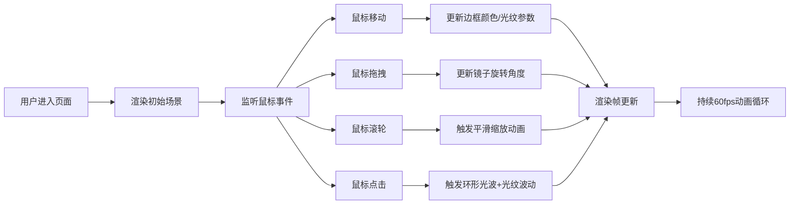

## 1. 产品概述

幻镜·流光梳妆台是一个基于Web的交互式视觉艺术项目，用户可以通过鼠标与一面魔法六边形镜子进行互动，体验光影流动的沉浸式视觉效果。

- 核心目的：打造一个具有高度视觉冲击力的交互式光影艺术作品，让用户通过简单的鼠标操作体验动态光影之美
- 目标用户：艺术爱好者、设计从业者、普通网民
- 产品价值：展示Web技术在创意视觉领域的可能性，提供放松愉悦的视觉体验

## 2. 核心功能

### 2.1 用户角色
无需用户登录或区分角色，所有访问者均可直接体验完整功能。

### 2.2 功能模块
1. **主交互场景**：六边形魔镜、6块环绕弧形面板、光束连接
2. **镜子交互**：拖拽旋转、滚轮缩放、点击触发光波
3. **光纹动画**：面板上流动的彩色光纹，随鼠标位置变化
4. **视觉特效**：发光边框、虹彩光泽、柔和阴影、渐变背景

### 2.3 功能详情
| 模块名称 | 功能描述 |
|---------|---------|
| 镜子渲染 | 半透明六边形镜面，12根发光边框线条，虹彩光泽，柔和阴影 |
| 拖拽旋转 | 鼠标拖拽控制镜子角度，响应延迟≤40ms |
| 滚轮缩放 | 鼠标滚轮控制镜子大小（0.5x-2x），3秒平滑过渡 |
| 点击光波 | 点击镜子触发环形光波动画，半径0→600px，持续1.2秒 |
| 弧形面板 | 6块环绕镜子的弧形面板，宽150px高400px |
| 流动光纹 | 面板上波浪状渐变色带，宽度20-40px随机，2px发光外轮廓 |
| 鼠标影响 | 水平位置控制色相偏移（0-360°），垂直位置控制流速（0.1-0.5x） |
| 光束连接 | 10条半透明细线连接镜子与面板，颜色随边框同步变化 |
| 边框动画 | 边框颜色在#ff9ff3、#48dbfb、#feca57间循环渐变，周期5秒 |

## 3. 核心流程

用户进入页面后，看到深邃星空背景下中央的魔法镜和环绕的弧形面板，光束连接其间。用户可以：
1. 鼠标悬停：边框旋转变色，光纹随鼠标位置变化
2. 鼠标拖拽：镜子跟随旋转
3. 鼠标滚轮：镜子平滑缩放
4. 点击镜子：触发环形光波，面板光纹剧烈波动

## 4. 用户界面设计

### 4.1 设计风格
- **主色调**：深紫(#1a0f2e)到暗蓝(#0d0b1a)的辐射渐变背景
- **强调色**：粉紫(#ff9ff3)、青蓝(#48dbfb)、金黄(#feca57)循环渐变
- **光影风格**：所有元素带有柔和发光效果和阴影，营造深邃星空感
- **动效风格**：流畅平滑的过渡动画，光纹流动带有有机波浪感

### 4.2 页面布局
| 区域 | 元素 | 设计要点 |
|-----|------|---------|
| 全屏背景 | 辐射渐变 | 从#1a0f2e到#0d0b1a，中心亮边缘暗 |
| 中央 | 六边形魔镜 | 半透明(0.3)，12根发光边框，虹彩光泽 |
| 环绕区域 | 6块弧形面板 | 均匀分布在镜子六个方向，宽150px高400px |
| 连接区域 | 光束细线 | 10条1px宽半透明(0.3)线条 |

### 4.3 响应式设计
- 采用Canvas全屏渲染，自动适配窗口大小变化
- 所有坐标基于视口中心计算，确保在不同分辨率下布局一致
- 触摸设备支持：触摸拖拽旋转，双指缩放

### 4.4 视觉动画规范
- **帧率目标**：稳定55fps以上
- **响应延迟**：鼠标交互响应≤40ms
- **动画时间**：
  - 边框颜色渐变周期：5秒
  - 缩放平滑过渡：3秒
  - 环形光波持续：1.2秒
  - 光纹波动恢复：0.5秒
  - 缩放闪烁：2次白色闪光
